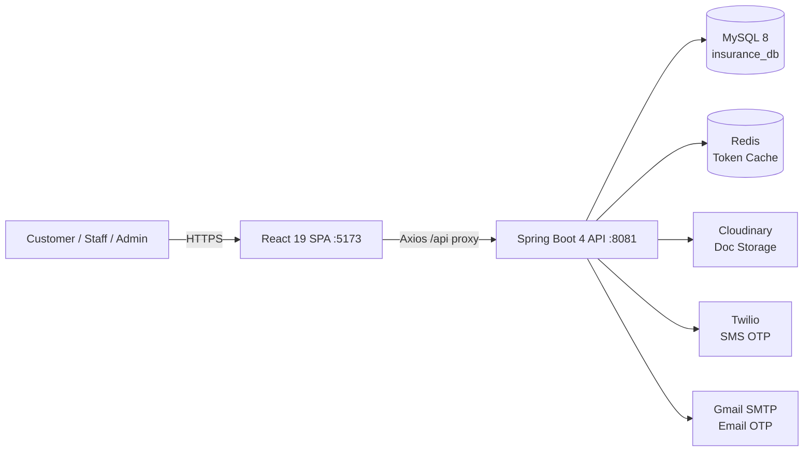

# InsuranceFlow: Enterprise Policy & Claim Management System

> A comprehensive, full-stack insurance platform providing self-service policy administration, deterministic premium pricing, and role-based claim workflows.

## Overview
InsuranceFlow is a production-shaped digital insurance platform designed to eliminate manual, disconnected insurance processes. It empowers customers to browse products, generate instant exact-amount quotes, securely purchase policies, and raise claims with document evidence. Behind the scenes, it provides an orchestrated, role-based workflow where internal staff assess claims based on product specialization, and administrators govern the product catalog and pricing rules.

## What This Project Demonstrates
- **Advanced Architecture Patterns**: Utilizes Strategy (Premium Calculation), Factory, Adapter, and layered services.
- **Enterprise Security Model**: Implements stateless JWT access tokens, opaque rotating refresh tokens (HttpOnly), dual OTP verification (Email/SMS), rate limiting via Bucket4j, and comprehensive role-based access control (RBAC).
- **Full-Stack Proficiency**: Seamlessly bridges a modern React 19 SPA with a robust Spring Boot 4 backend, maintaining strict DTO validation and a typed, component-driven frontend architecture.
- **Data Integrity**: Enforces strict business rules like exact-amount premium matching, duplicate-policy guards, remaining-cover claim checks, and complete audit histories for pricing and claims.

## System Architecture



## The Role Model
| Role | Primary Actions |
|---|---|
| **Customer** | Browses the catalog, generates quotes, purchases policies, pays premiums, and submits claims with document evidence. |
| **Internal Staff** | Monitors a specialized claim review queue (e.g., Health, Motor), assesses claims, issues policies, and recommends claim approval/rejection. |
| **Admin** | Governs the system catalog (Products, Plans, Coverage Options, Pricing Rules), manages user accounts, and makes final claim decisions. |

## Quick Start (4 Steps)

> [!IMPORTANT]
> Requires Java 17, Node 20+, Docker (for Redis/MySQL), and Maven. See [`docs/11_Developer_Guide/Setup.md`](./docs/11_Developer_Guide/Setup.md) for detailed prerequisites and environment variables.

### 1. Start Infrastructure (Redis & ELK Stack)
```bash
cd insurance-policy-claim-management-system
# Starts Redis on port 6379 and the ELK Stack (Elasticsearch, Logstash, Kibana on 5601)
docker-compose up -d
```

### 2. Start Backend (Spring Boot)
```bash
# Ensure MySQL 8 is running locally on port 3306
# Copy env.properties.example to env.properties and fill credentials
./mvnw spring-boot:run
```

### 3. Start Frontend (React + Vite)
```bash
cd insurance-policy-claim-management-app-ui
npm install
npm run dev
```

### 4. Load Seed Data
The backend `DataInitializer` automatically creates the seed admin user `admin@insurance.com` / `Admin@123`. 
For extended test data, execute the SQL scripts found in [`demo-data/`](./demo-data/).

## Documentation Navigation: Who Should Read What?
| Audience | Read These Files |
|---|---|
| **Recruiters** | [`docs/10_Evaluation/Project_Summary.md`](./docs/10_Evaluation/Project_Summary.md) (One-page overview) |
| **Interviewers** | [`docs/01_System_Architecture/High_Level_Architecture.md`](./docs/01_System_Architecture/High_Level_Architecture.md), [`docs/10_Evaluation/Interview_Questions.md`](./docs/10_Evaluation/Interview_Questions.md) |
| **Developers** | [`docs/README.md`](./docs/README.md) (Master Hub), [`docs/11_Developer_Guide/Setup.md`](./docs/11_Developer_Guide/Setup.md) |

## Tech Stack Summary
| Layer | Technologies |
|---|---|
| **Backend** | Java 17, Spring Boot 4.0.6, Spring Security, JWT (jjwt 0.12.6), Spring Data JPA, Hibernate, Bucket4j |
| **Frontend** | React 19, Vite 8, React Router 7, Bootstrap 5.3, Axios, react-hook-form, Framer Motion, jsPDF |
| **Infrastructure** | MySQL 8, Redis, Cloudinary HTTP SDK, Twilio SDK, Gmail SMTP |

## Key Project Numbers
- **16** Entities / **17** Tables
- **~60** REST Endpoints
- **13** Controllers
- **3** Auth Roles (Admin, Staff, Customer)
- **5** Product Types (HEALTH, MOTOR, LIFE, TRAVEL, INSURANCE)

## Essential Links
- 📖 [Full Documentation (`docs/`)](./docs/README.md)
- 🧪 [Audited Postman Collection (`postman/`)](./insurance-policy-claim-management-system/postman/Insurance_Policy_Claim_Management_AUDITED.postman_collection.json)
- 💾 [Demo Data SQL (`demo-data/sql/`)](./demo-data/sql/)
- 🖼️ [UI Screenshots (`screenshots/`)](./screenshots/)
