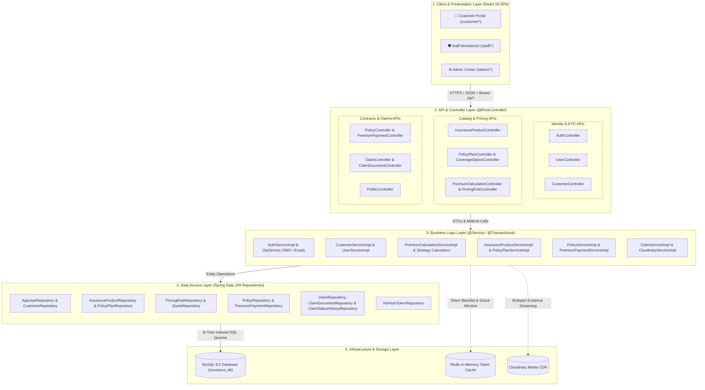
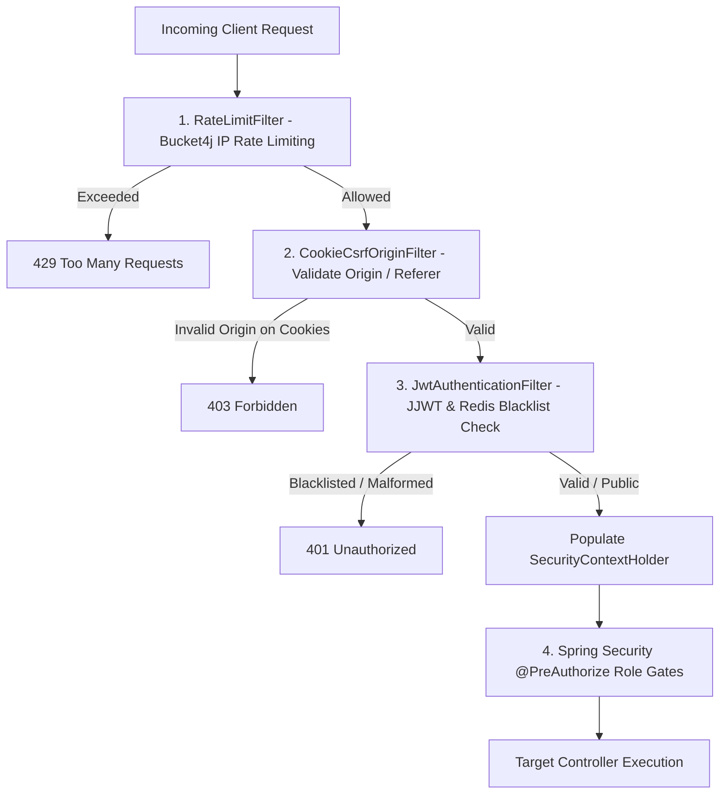
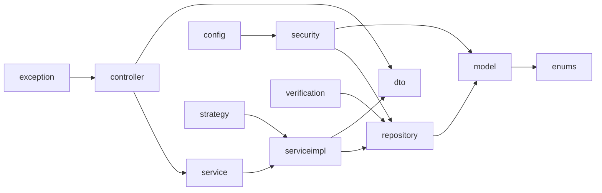

# 🏛️ Architecture & Infrastructure Diagrams

[⬅️ Back to Diagrams Hub](./README.md)

---

## 1. 4-Tier Layered System Architecture

---

## 2. Servlet Security Filter Chain Pipeline

---

## 3. Package Dependency Architecture

