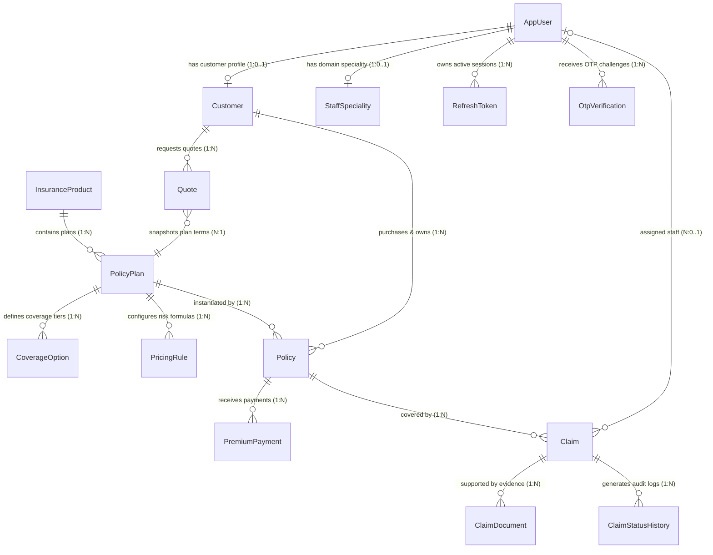

# 🗄️ Entity-Relationship (ER) & Schema Diagrams

[⬅️ Back to Diagrams Hub](./README.md)

---

## 1. Master System ER Diagram



---

## 2. Table Schemas, Constraints & Keys

```
┌─────────────────────────────────────────────────────────────┐
│                        USERS                                │
├─────────────────────────────────────────────────────────────┤
│ PK  id               BIGINT AUTO_INCREMENT                  │
│     full_name        VARCHAR(255) NOT NULL                  │
│ UK  email            VARCHAR(255) NOT NULL UNIQUE           │
│ UK  mobile_number    VARCHAR(50)  NOT NULL UNIQUE           │
│     password         VARCHAR(255) NOT NULL (BCrypt Hash)    │
│     role             VARCHAR(50)  NOT NULL (ENUM)           │
│     is_active        BOOLEAN      NOT NULL                  │
│     email_verified   BOOLEAN DEFAULT FALSE                  │
│     phone_verified   BOOLEAN DEFAULT FALSE                  │
│     token_version    BIGINT DEFAULT 0                       │
│     created_date     DATETIME                               │
│     updated_date     DATETIME                               │
│ IDX idx_user_role (role)                                    │
│ IDX idx_user_is_active (is_active)                          │
└─────────────────────┬────────────────────┬──────────────────┘
                      │                    │
           1:0..1     │         1:0..1     │
                      ▼                    ▼
┌───────────────────────────┐ ┌───────────────────────────┐
│        CUSTOMERS          │ │    STAFF_SPECIALITIES      │
├───────────────────────────┤ ├───────────────────────────┤
│ PK id        BIGINT AUTO  │ │ PK id       BIGINT AUTO   │
│ FK user_id   BIGINT UNIQUE│ │ FK user_id  BIGINT UNIQUE │
│    date_of_birth  DATE    │ │    product_speciality      │
│    address   TEXT         │ │    VARCHAR(50) NOT NULL    │
│    city      VARCHAR(255) │ └───────────────────────────┘
│    state     VARCHAR(255) │
│    pin_code  VARCHAR(20)  │
│    nominee_name VARCHAR   │
│    nominee_relation VARCHAR│
│    created_date  DATETIME │
│    updated_date  DATETIME │
│ IDX idx_customer_user_id  │
│ IDX idx_customer_city     │
│ IDX idx_customer_state    │
└──────────────┬────────────┘
               │ 1:N
               ▼
┌─────────────────────────────────────────────────────────────┐
│                      INSURANCE_PRODUCTS                     │
├─────────────────────────────────────────────────────────────┤
│ PK  id              BIGINT AUTO_INCREMENT                   │
│ UK  product_name    VARCHAR(100) NOT NULL UNIQUE            │
│     product_type    VARCHAR(50)  NOT NULL (ENUM)            │
│     description     TEXT NOT NULL                           │
│     is_active       BOOLEAN NOT NULL DEFAULT TRUE           │
│     created_date    DATETIME                                │
│     updated_date    DATETIME                                │
│ IDX idx_product_type, idx_product_is_active                 │
└──────────────┬──────────────────────────────────────────────┘
               │ 1:N
               ▼
┌─────────────────────────────────────────────────────────────┐
│                        POLICY_PLANS                         │
├─────────────────────────────────────────────────────────────┤
│ PK  id                  BIGINT AUTO_INCREMENT               │
│ FK  product_id          BIGINT NOT NULL                     │
│     plan_name           VARCHAR(100) NOT NULL               │
│     plan_version        INT NOT NULL DEFAULT 1              │
│     supported_premium_type VARCHAR(20) NOT NULL (ENUM)      │
│     terms_conditions    TEXT(3000) NOT NULL                 │
│     is_active           BOOLEAN NOT NULL DEFAULT TRUE       │
│     created_date        DATETIME                            │
│     updated_date        DATETIME                            │
│ IDX idx_plan_product_id, idx_plan_is_active                 │
└──────────────┬──────────────────────────────────────────────┘
               │
   ┌───────────┼────────────┬──────────────────┐
   │ 1:N       │ 1:N        │ 1:N              │ 1:N
   ▼           ▼            ▼                  ▼
┌──────────────┐ ┌──────────────┐ ┌──────────────────────────┐
│POLICY_PLAN   │ │COVERAGE_     │ │    PRICING_RULES          │
│_DURATIONS    │ │OPTIONS       │ ├──────────────────────────┤
├──────────────┤ ├──────────────┤ │PK id  BIGINT AUTO        │
│FK plan_id    │ │PK id  BIGINT │ │FK plan_id  BIGINT NOT NULL│
│   duration   │ │FK plan_id    │ │   base_risk_rate DECIMAL  │
│   INT        │ │   BIGINT NN  │ │   processing_fee DECIMAL  │
│(element      │ │   coverage_  │ │   gst  DECIMAL(5,2)       │
│ collection   │ │   amount     │ │   remarks  VARCHAR(500)   │
│ join table)  │ │   DECIMAL NN │ │   effective_from DATETIME │
└──────────────┘ │   label      │ │   effective_to  DATETIME  │
                 │   VARCHAR NN │ │   status  VARCHAR(20) NN  │
                 │   display_   │ │   created_date  DATETIME  │
                 │   order INT  │ │UK uk_coverage_amount_plan │
                 │   is_active  │ │IDX idx_pricing_plan_id    │
                 │   BOOLEAN NN │ │IDX idx_pricing_status     │
                 └──────────────┘ └──────────────────────────┘

┌─────────────────────────────────────────────────────────────┐
│                          QUOTES                             │
├─────────────────────────────────────────────────────────────┤
│ PK  id               BIGINT AUTO_INCREMENT                  │
│ FK  customer_id      BIGINT NOT NULL                        │
│ FK  plan_id          BIGINT NOT NULL                        │
│     plan_version     INT NOT NULL                           │
│     pricing_rule_id  BIGINT NOT NULL                        │
│     coverage         DECIMAL(15,2) NOT NULL                 │
│     duration         INT NOT NULL                           │
│     premium_type     VARCHAR(20) NOT NULL (ENUM)            │
│     risk_rate        DECIMAL(10,4) NOT NULL                 │
│     processing_fee   DECIMAL(15,2) NOT NULL                 │
│     gst              DECIMAL(10,2) NOT NULL                 │
│     premium          DECIMAL(15,2) NOT NULL                 │
│     total            DECIMAL(15,2) NOT NULL                 │
│     status           VARCHAR(20) NOT NULL (ENUM)            │
│     created_at       DATETIME                               │
│     expires_at       DATETIME NOT NULL                      │
│ IDX idx_quote_customer_id, idx_quote_plan_id, idx_quote_status │
└─────────────────────────────────────────────────────────────┘

┌─────────────────────────────────────────────────────────────┐
│                        POLICIES                             │
├─────────────────────────────────────────────────────────────┤
│ PK  id                   BIGINT AUTO_INCREMENT              │
│ UK  policy_number        VARCHAR(50) NOT NULL UNIQUE        │
│ FK  customer_id          BIGINT NOT NULL                    │
│ FK  plan_id              BIGINT NOT NULL                    │
│     selected_coverage    DECIMAL(15,2) NOT NULL             │
│     premium_type         VARCHAR(20) NOT NULL (ENUM)        │
│     policy_duration      INT NOT NULL                       │
│     premium_rate_used    DECIMAL(15,4) NOT NULL             │
│     processing_fee_used  DECIMAL(15,2) NOT NULL             │
│     gst_used             DECIMAL(15,2) NOT NULL             │
│     calculated_premium   DECIMAL(15,2) NOT NULL             │
│     plan_version         INT NOT NULL                       │
│     pricing_rule_id      BIGINT NOT NULL                    │
│     quote_id             BIGINT                             │
│     start_date           DATE NOT NULL                      │
│     end_date             DATE NOT NULL                      │
│     policy_status        VARCHAR(20) NOT NULL (ENUM)        │
│     total_premium_paid   DECIMAL(15,2) NOT NULL DEFAULT 0   │
│     purchase_date        DATETIME                           │
│     created_date         DATETIME                           │
│     updated_date         DATETIME                           │
│     version              BIGINT (Optimistic Lock)           │
│ IDX idx_policy_customer_id, idx_policy_status, idx_policy_plan_id │
└──────────────┬──────────────────────────────┬───────────────┘
               │ 1:N                          │ 1:N
               ▼                              ▼
┌───────────────────────────┐ ┌───────────────────────────────┐
│     PREMIUM_PAYMENTS      │ │            CLAIMS             │
├───────────────────────────┤ ├───────────────────────────────┤
│ PK payment_id  BIGINT     │ │ PK id          BIGINT         │
│ FK policy_id   BIGINT NN  │ │ UK claim_number VARCHAR(50) NN│
│    amount      DECIMAL NN │ │ FK policy_id    BIGINT NN     │
│    payment_date DATETIME  │ │ FK assigned_staff_id BIGINT   │
│    payment_mode VARCHAR   │ │    claim_amount  DECIMAL NN   │
│ UK transaction_reference  │ │    claim_reason  TEXT NN      │
│    VARCHAR NN UNIQUE      │ │    incident_date DATETIME NN  │
│    payment_status VARCHAR │ │    claim_status  VARCHAR NN   │
│    created_date DATETIME  │ │    staff_remarks VARCHAR      │
│ IDX idx_payment_policy_id │ │    admin_remarks VARCHAR      │
│ IDX idx_payment_status    │ │    created_date  DATETIME     │
└───────────────────────────┘ │    updated_date  DATETIME     │
                               │    version  BIGINT (Opt.Lock)│
                               │ IDX idx_claim_status         │
                               │ IDX idx_policy_id            │
                               └───────────────┬───────────────┘
                                               │ 1:N
                              ┌────────────────┴──────────────┐
                              │                               │
                              ▼                               ▼
               ┌───────────────────────────┐  ┌────────────────────────────┐
               │    CLAIM_DOCUMENTS        │  │   CLAIM_STATUS_HISTORIES   │
               ├───────────────────────────┤  ├────────────────────────────┤
               │ PK id          BIGINT     │  │ PK id          BIGINT      │
               │ FK claim_id    BIGINT NN  │  │ FK claim_id    BIGINT NN   │
               │    document_name VARCHAR  │  │    previous_status VARCHAR  │
               │    document_type VARCHAR  │  │    new_status   VARCHAR NN  │
               │    document_reference     │  │    remarks      TEXT        │
               │    VARCHAR (URL)          │  │    updated_by   VARCHAR NN  │
               │    public_id   VARCHAR    │  │    updated_date DATETIME    │
               │    uploaded_date DATETIME │  │ IDX idx_csh_claim_id       │
               │ IDX idx_claim_doc_claim_id│  │ IDX idx_csh_updated_by     │
               └───────────────────────────┘  │ IDX idx_csh_new_status     │
                                               └────────────────────────────┘

┌─────────────────────────────────────────────────────────────┐
│                      REFRESH_TOKENS                         │
├─────────────────────────────────────────────────────────────┤
│ PK  id              BIGINT AUTO_INCREMENT                   │
│ FK  user_id         BIGINT NOT NULL                         │
│     token_hash      VARCHAR(64) NOT NULL (SHA-256)          │
│     expires_at      DATETIME NOT NULL                       │
│     revoked         BOOLEAN NOT NULL                        │
│     token_version   BIGINT NOT NULL                         │
│     created_at      DATETIME NOT NULL                       │
│ IDX refresh_token_user (user_id)                            │
│ IDX refresh_token_hash (token_hash)                         │
│ IDX refresh_token_expires (expires_at)                      │
└─────────────────────────────────────────────────────────────┘
```
