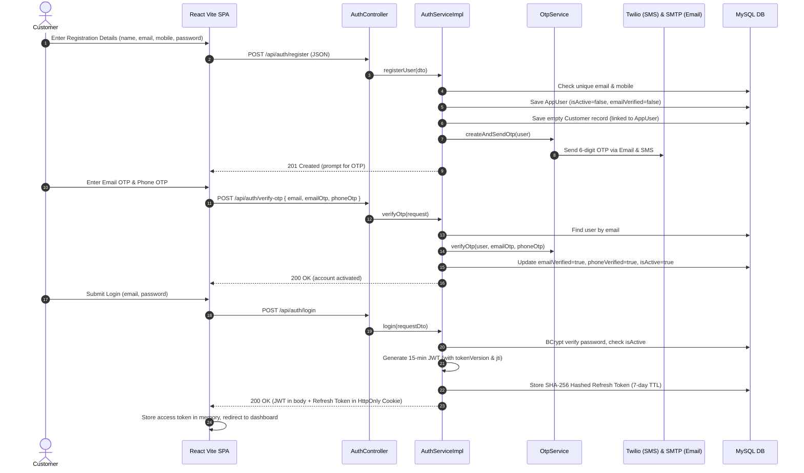
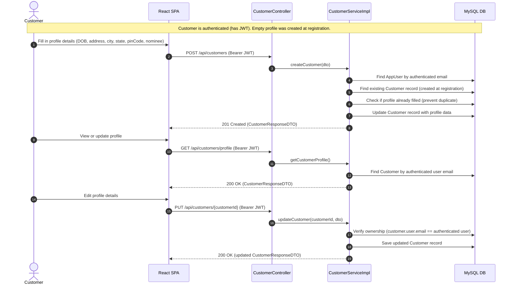
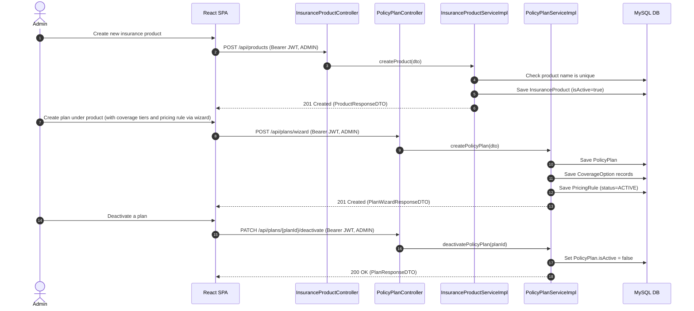
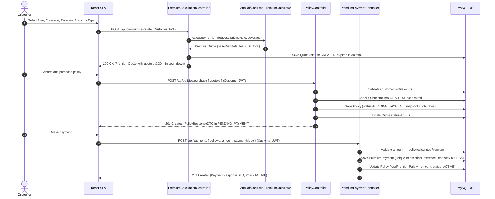
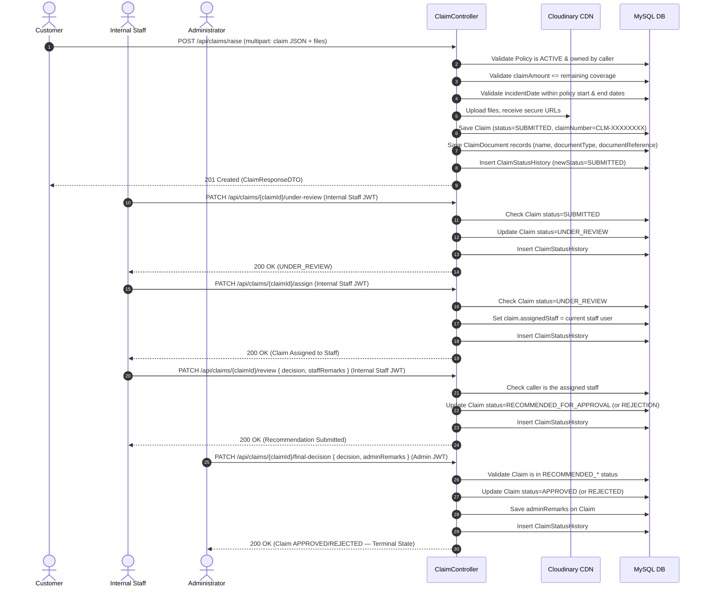
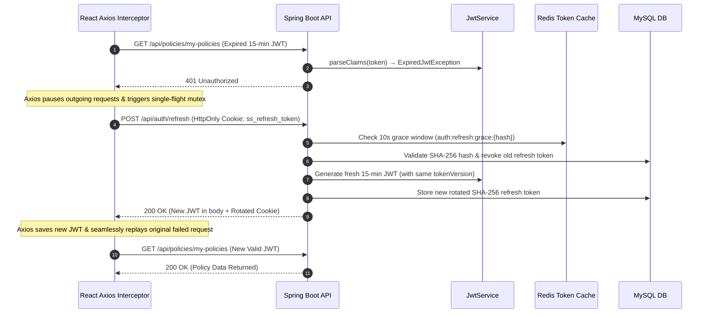

# ⚡ Sequence Diagrams (Core Interaction Flows)

[⬅️ Back to Diagrams Hub](./README.md)

---

## 1. Authentication & Registration Sequence

---

## 2. Customer Profile Creation Sequence

---

## 3. Product & Plan Creation Sequence (Admin)

---

## 4. Quote → Policy Purchase → Payment Sequence

---

## 5. Claim Submission & Two-Tier Adjudication Sequence

---

## 6. Silent Token Refresh (Axios Single-Flight Mutex)

