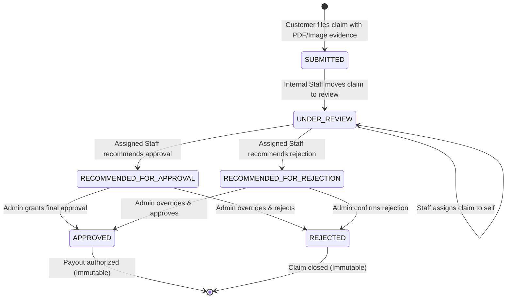
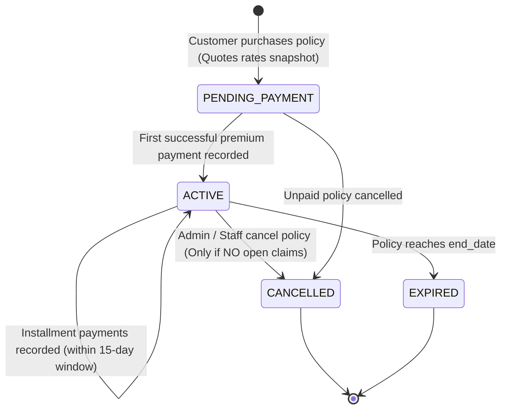
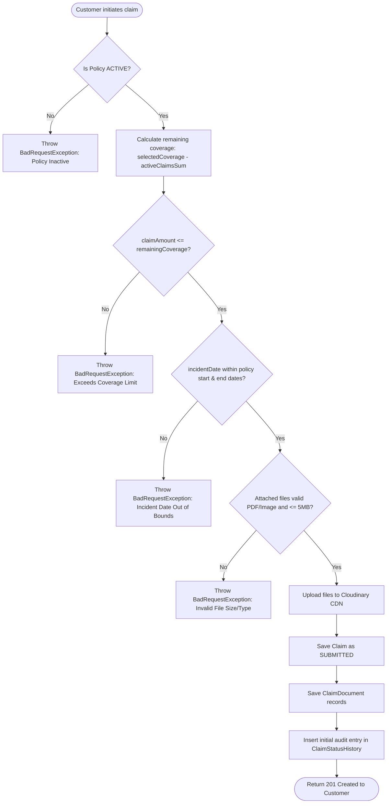

# 🔄 State & Activity Diagrams

[⬅️ Back to Diagrams Hub](./README.md)

---

## 1. Claim Adjudication State Machine (Segregation of Duties)

---

## 2. Policy Lifecycle State Transitions

---

## 3. Claim Submission Activity Diagram (Customer Workflow)

