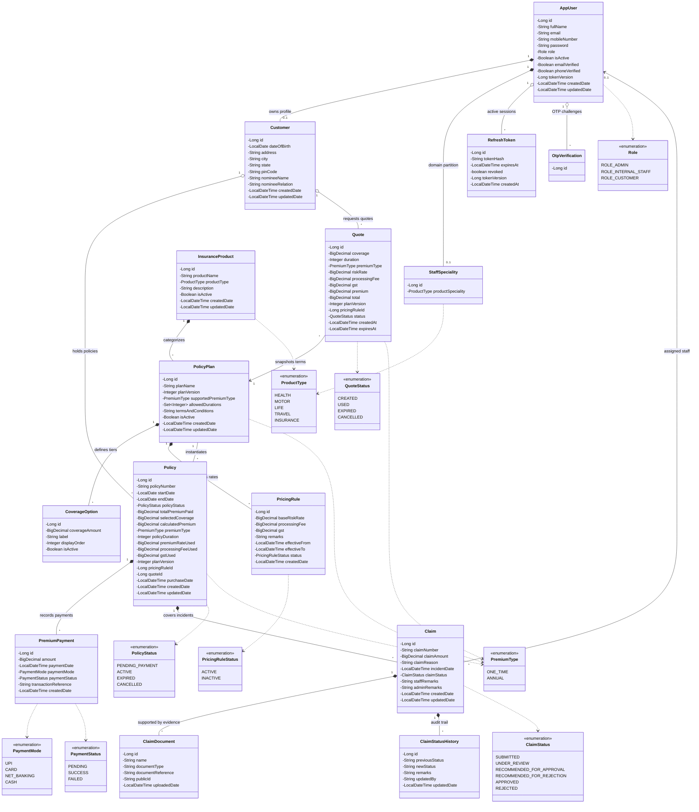
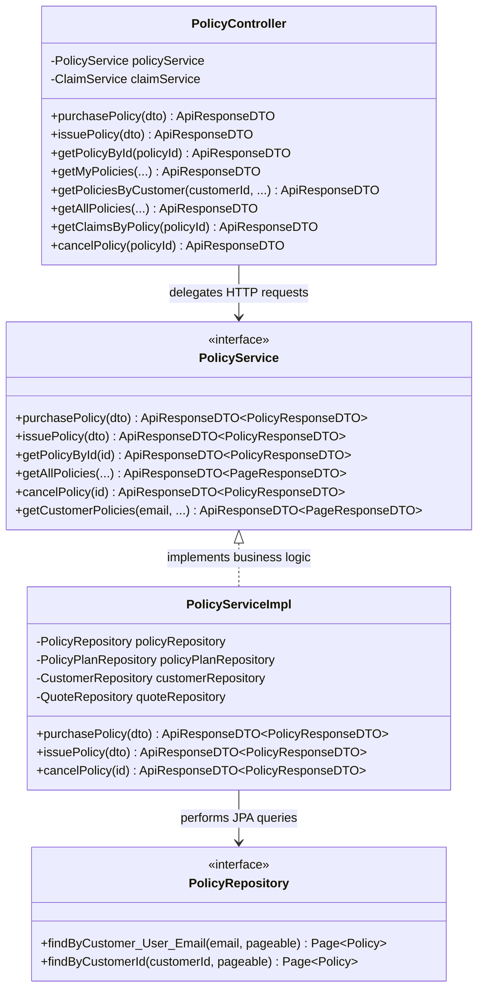
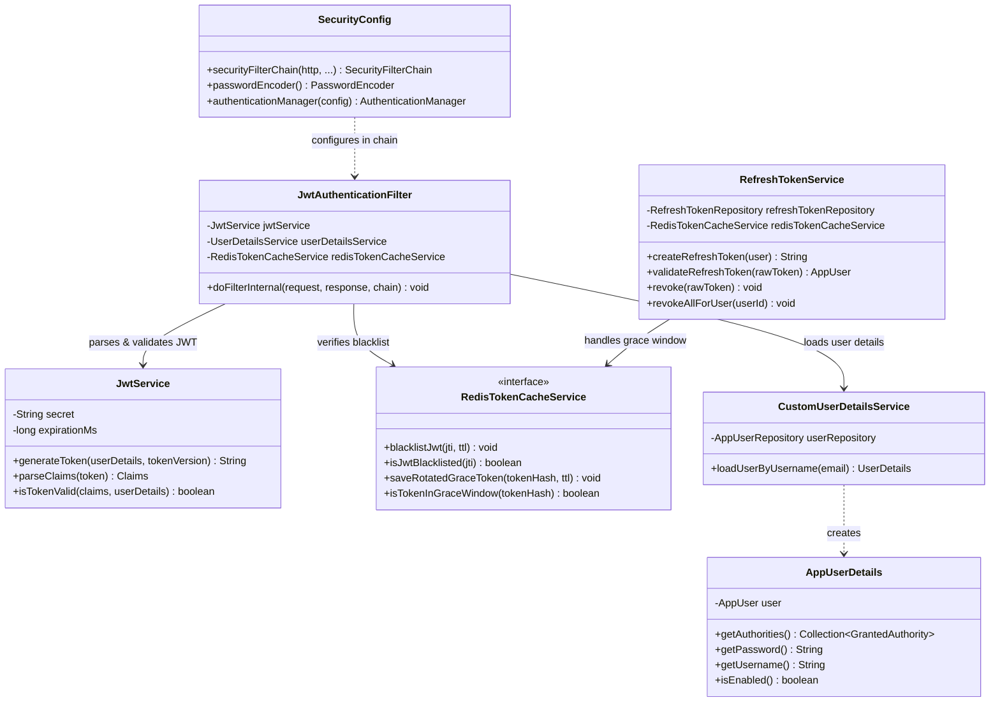
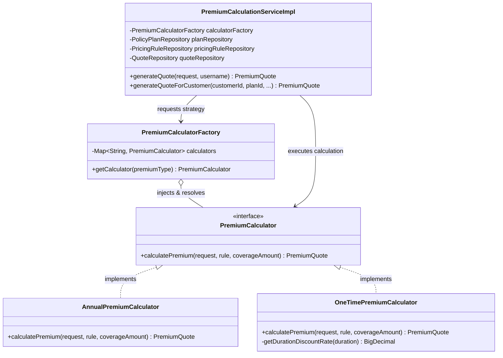
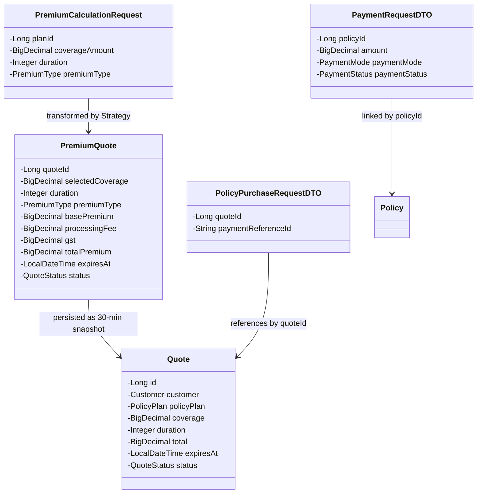
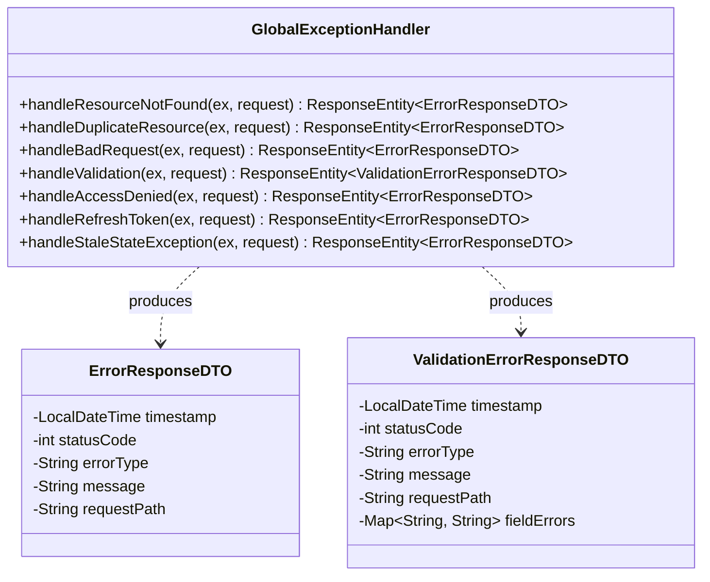

# 📐 Class Diagrams & Software Design Patterns

[⬅️ Back to Diagrams Hub](./README.md)

---

## 🏛️ 1. Master Domain Model Class Diagram (JPA Entities & Enums)

---

## ⚙️ 2. Layered Service Architecture Class Diagram

---

## 🔐 3. Security & Token Infrastructure Class Diagram

---

## 📐 4. Strategy Pattern (Actuarial Pricing Engine)

---

## 📦 5. Quote & Policy Binding Flow

---

## 🚨 6. Global Exception Handling Pattern

