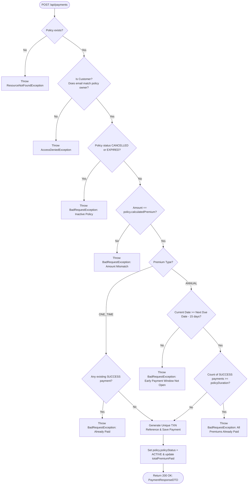
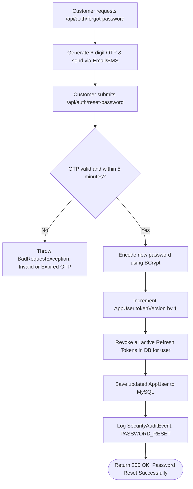
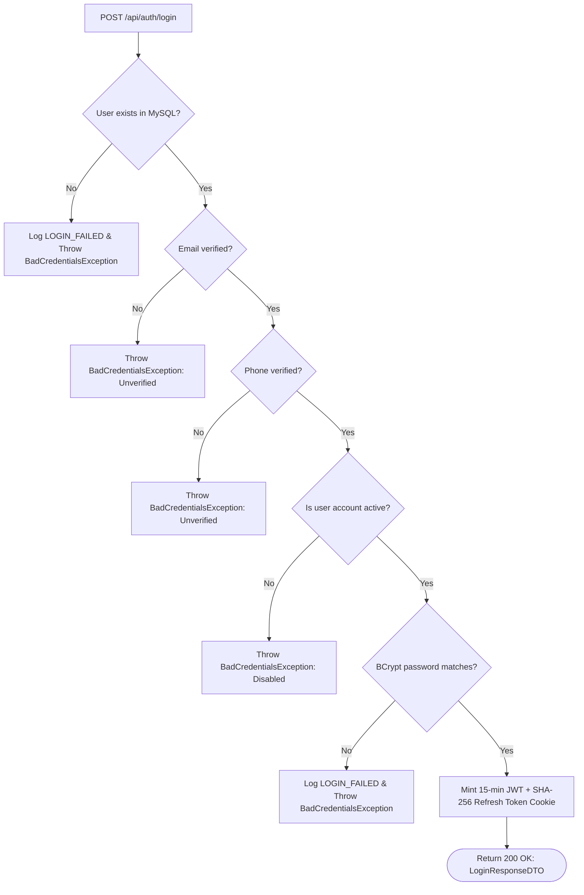

# 🔀 System Logic Flowcharts

[⬅️ Back to Diagrams Hub](./README.md)

---

## 1. Premium Payment Validation Flowchart

---

## 2. Password Reset & Session Invalidation Flowchart

---

## 3. Login & Authentication Decision Flow

