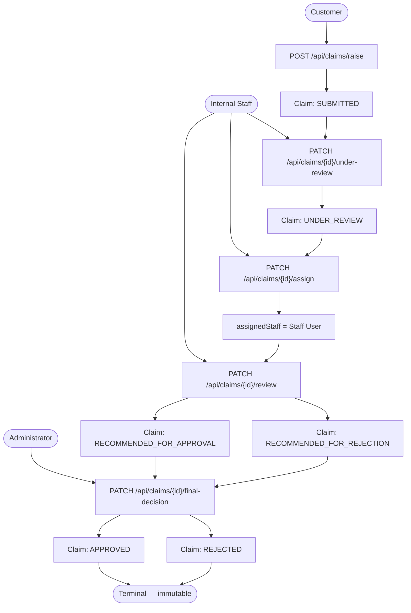
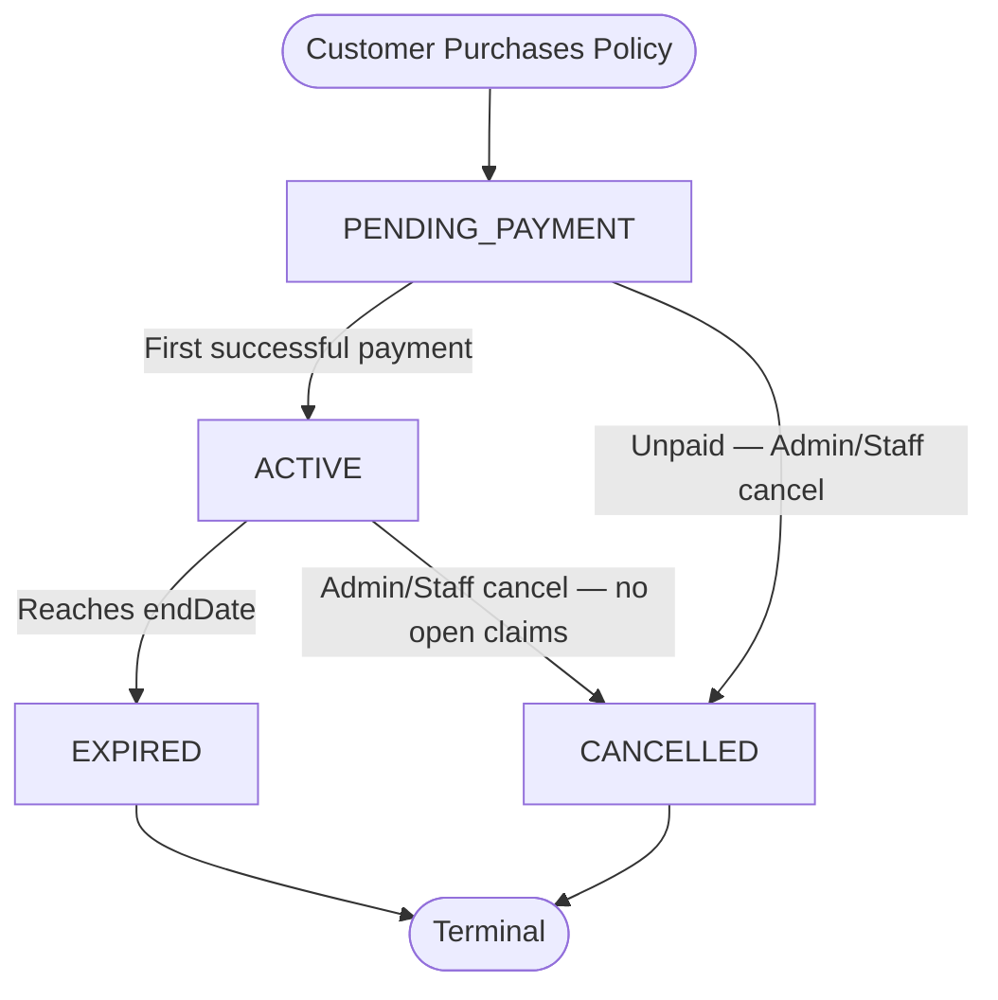

# 👤 Use Case Diagrams

[⬅️ Back to Diagrams Hub](./README.md)

---

## 1. System Use Cases by Actor

```mermaid
flowchart LR
    subgraph Actors
        Cust(Customer)
        Staff(Internal Staff)
        Admin(Administrator)
        Public(Public / Unauthenticated)
    end

    subgraph Auth ["🔐 Authentication"]
        UC1[Register Account]
        UC2[Verify OTP]
        UC3[Login]
        UC4[Logout]
        UC5[Forgot Password]
        UC6[Reset Password]
        UC7[Refresh Token]
    end

    subgraph Profile ["👤 Profile Management"]
        UC10[Complete KYC Profile]
        UC11[View Own Profile]
        UC12[Update Own Profile]
    end

    subgraph Catalog ["📦 Product & Plan Catalog"]
        UC20[Browse Active Products]
        UC21[Browse Active Plans]
        UC22[Create Product]
        UC23[Update Product]
        UC24[Activate / Deactivate Product]
        UC25[Create Plan via Wizard]
        UC26[Update Plan]
        UC27[Activate / Deactivate Plan]
        UC28[Manage Coverage Options]
        UC29[Manage Pricing Rules]
    end

    subgraph Quotes ["💰 Quotation"]
        UC30[Calculate Premium Quote]
    end

    subgraph Policies ["📄 Policy Management"]
        UC40[Purchase Policy from Quote]
        UC41[Issue Policy Manually]
        UC42[View Own Policies]
        UC43[View Policy Details]
        UC44[Cancel Policy]
        UC45[View All Policies System-Wide]
    end

    subgraph Payments ["💳 Payments"]
        UC50[Record Premium Payment]
        UC51[View Own Payment History]
        UC52[View Payments by Policy]
        UC53[View All Payments System-Wide]
    end

    subgraph Claims ["⚖️ Claims"]
        UC60[Raise Claim with Documents]
        UC61[Upload Additional Documents]
        UC62[View Own Claims]
        UC63[View Claim Details & History]
        UC64[Move Claim to Under Review]
        UC65[Assign Claim to Self]
        UC66[Submit Claim Recommendation]
        UC67[Make Final Claim Decision]
        UC68[View All Claims in Domain]
    end

    subgraph UserMgmt ["👥 User Management"]
        UC70[Create Staff Member]
        UC71[List All Users]
        UC72[Activate/Deactivate User]
    end

    subgraph PublicAPI ["🌐 Public"]
        UC80[View Platform Statistics]
        UC81[View Swagger API Docs]
    end

    %% Customer
    Cust --> UC1
    Cust --> UC2
    Cust --> UC3
    Cust --> UC4
    Cust --> UC5
    Cust --> UC6
    Cust --> UC7
    Cust --> UC10
    Cust --> UC11
    Cust --> UC12
    Cust --> UC20
    Cust --> UC21
    Cust --> UC30
    Cust --> UC40
    Cust --> UC42
    Cust --> UC43
    Cust --> UC44
    Cust --> UC50
    Cust --> UC51
    Cust --> UC52
    Cust --> UC60
    Cust --> UC61
    Cust --> UC62
    Cust --> UC63

    %% Internal Staff
    Staff --> UC3
    Staff --> UC4
    Staff --> UC7
    Staff --> UC20
    Staff --> UC21
    Staff --> UC30
    Staff --> UC41
    Staff --> UC43
    Staff --> UC45
    Staff --> UC52
    Staff --> UC53
    Staff --> UC63
    Staff --> UC64
    Staff --> UC65
    Staff --> UC66
    Staff --> UC68

    %% Admin
    Admin --> UC3
    Admin --> UC4
    Admin --> UC7
    Admin --> UC20
    Admin --> UC21
    Admin --> UC22
    Admin --> UC23
    Admin --> UC24
    Admin --> UC25
    Admin --> UC26
    Admin --> UC27
    Admin --> UC28
    Admin --> UC29
    Admin --> UC30
    Admin --> UC40
    Admin --> UC41
    Admin --> UC43
    Admin --> UC44
    Admin --> UC45
    Admin --> UC52
    Admin --> UC53
    Admin --> UC63
    Admin --> UC67
    Admin --> UC68
    Admin --> UC70
    Admin --> UC71
    Admin --> UC72

    %% Public
    Public --> UC80
    Public --> UC81
```

---

## 2. Claim Adjudication — Segregation of Duties

---

## 3. Policy Lifecycle — Allowed State Transitions

