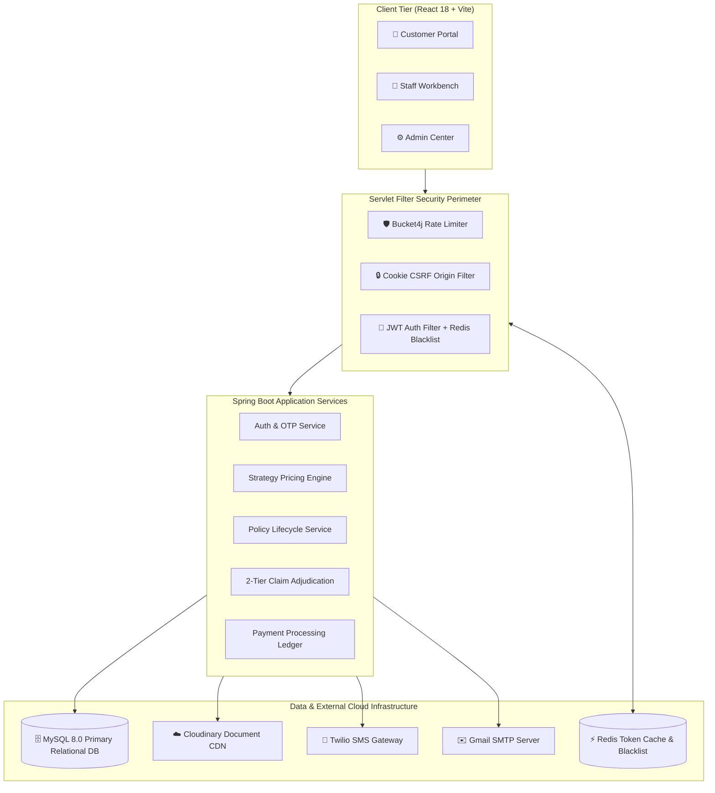

# 🎨 Master Architecture & Visual Diagrams Hub
> **Presentation Mode:** Dedicated showcase directory for technical reviewers, solution architects, and interview panels.

---

## 🧭 Visual Diagram Index

| Category | Diagram File | Core Concepts Displayed |
|:---|:---|:---|
| **01 Architecture** | [01_Architecture_Diagrams.md](./01_Architecture_Diagrams.md) | 4-Tier Layered Architecture, Security Filter Pipeline, Microservices & Data Infrastructure |
| **02 ER & Data** | [02_ER_Diagrams.md](./02_ER_Diagrams.md) | Complete Entity-Relationship Model, Foreign Keys, 1:1 KYC & Speciality, 1:N Policies & Claims |
| **03 Sequences** | [03_Sequence_Diagrams.md](./03_Sequence_Diagrams.md) | Auth/OTP Sequence, Quote $\rightarrow$ Purchase $\rightarrow$ Pay Flow, Dual-Staff Claim Lifecycle, Silent Refresh |
| **04 State Machines** | [04_State_and_Activity_Diagrams.md](./04_State_and_Activity_Diagrams.md) | 6-State Claim Lifecycle State Machine, Policy Lifecycle (`PENDING` $\rightarrow$ `ACTIVE` $\rightarrow$ `CANCELLED`) |
| **05 Design Patterns** | [05_Class_and_Design_Patterns.md](./05_Class_and_Design_Patterns.md) | Strategy Pattern (`PremiumCalculator`), Factory Pattern, Builder Pattern, DTO Mapping |
| **06 Flowcharts** | [06_Flowcharts.md](./06_Flowcharts.md) | Payment Validation Flowchart, Login & Token Versioning Flow, Password Reset Flow |
| **07 Use Cases** | [07_Use_Case_Diagram.md](./07_Use_Case_Diagram.md) | All use cases by actor (Customer, Internal Staff, Admin), Claim Adjudication Segregation of Duties, Policy Lifecycle |

---

## ⚡ Quick High-Level System Architecture Showcase

---

## 🎯 Reviewer Quick Tips:
* To show the **Actuarial Pricing Engine**, open [05_Class_and_Design_Patterns.md](./05_Class_and_Design_Patterns.md).
* To show the **Anti-Fraud Segregation of Duties**, open [04_State_and_Activity_Diagrams.md](./04_State_and_Activity_Diagrams.md).
* To show the **Token Refresh & Blacklisting Security**, open [03_Sequence_Diagrams.md](./03_Sequence_Diagrams.md).
