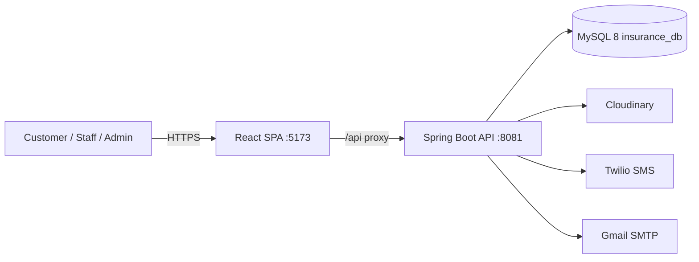

# Architecture Overview

> A 5-minute summary of the system architecture. The deep details live in
> `01_System_Architecture/`.

## Purpose

Give the reader the mental model before they open the detailed architecture docs.

## The System in One Paragraph

A **React single-page application** (Vite, port 5173) talks to a **Spring Boot
REST API** (port 8081, `/api`) that persists to **MySQL 8** (`insurance_db`).
The API is stateless for authorization (JWT access tokens) with **opaque
refresh tokens in cookies**, enforces **role-based access** for customer, staff,
and admin, and integrates with **Cloudinary** (claim documents), **Twilio**
(SMS OTP), and **Gmail SMTP** (email OTP / reset links).



## Layered Backend

```
HTTP request → Security filter chain (JWT, rate limit, audit)
  → Controller (DTO in) → Service (business rules) → ServiceImpl
  → Repository (Spring Data JPA) → MySQL
  ← Response wrapper (ApiResponseDTO) back to client
```

Premium calculation uses the **Strategy pattern** (`OneTimePremiumCalculator` /
`AnnualPremiumCalculator` selected by a factory). Every claim and pricing change
writes an **audit/history record**.

## Frontend Shape

- Central routing in `src/App.jsx` with guard components: `ProtectedRoute`,
  `GuestRoute`, `RoleProtectedRoute`, `DashboardRedirect`.
- Three role namespaces: `/admin/*`, `/staff/*`, `/customer/*`.
- Auth state via `AuthContext` + an in-memory `tokenStore`; Axios interceptors
  attach the Bearer token and transparently **refresh on 401** (single-flight,
  one retry).
- Role-based theming (admin blue, staff violet, customer teal) with light/dark
  modes.

## Security Posture

- BCrypt password hashing.
- HS256 JWT access tokens with `tokenVersion` revocation.
- Rotating refresh tokens (SHA-256 hashed in DB, HttpOnly cookie, reuse →
  whole-family revocation, 7-day TTL).
- Dual OTP (email + SMS), 5-min expiry, attempts & rate limits (Bucket4j).
- CORS allowlist, CSRF posture for cookie-based refresh, secrets in gitignored
  `env.properties`.

## Where to Go Next

| Topic | Doc |
|---|---|
| Full high-level architecture | `../01_System_Architecture/High_Level_Architecture.md` |
| Backend deep-dive | `../01_System_Architecture/Backend_Architecture.md`, `../06_Backend/` |
| Frontend deep-dive | `../01_System_Architecture/Frontend_Architecture.md`, `../05_Frontend/` |
| Database | `../01_System_Architecture/Database_Architecture.md`, `../04_Database/` |
| Security | `../01_System_Architecture/Security_Architecture.md`, `../06_Backend/Security.md` |
| Domain & business rules | `../02_Business_Domain/` |
| Endpoints | `../03_API/` |
| Run it | `../11_Developer_Guide/Setup.md` |
