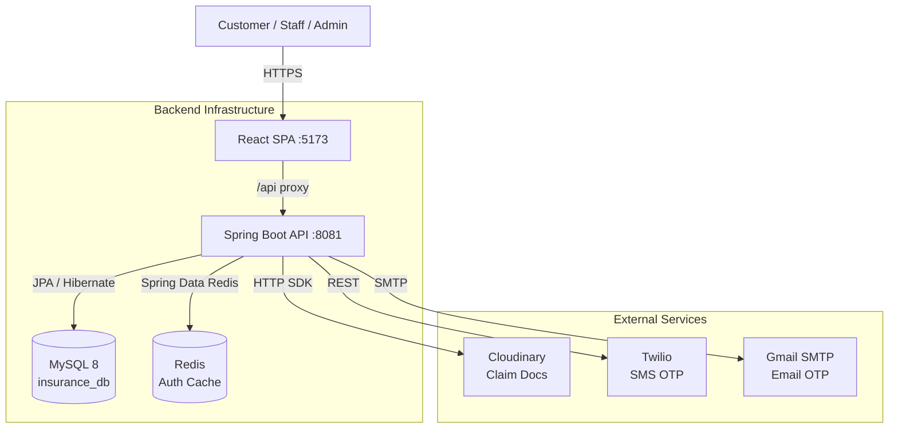

# Architecture Overview
> A 5-minute summary of the InsuranceFlow system architecture, data flow, and security posture.

---

## Purpose
Give the reader a clear, high-level mental model of how the frontend, backend, database, and external services interact before they dive into the detailed architectural documentation.

---

## Overview
InsuranceFlow utilizes a modern decoupled architecture:
- A **React SPA** (Vite, port 5173) serves the UI.
- A **Spring Boot REST API** (port 8081, `/api`) handles all business logic.
- **MySQL 8** stores transactional data (16 entities).
- **Redis** manages token caching and blacklisting.
- **External APIs** handle specialized tasks: Cloudinary (document storage), Twilio (SMS), Gmail (Email).

---

## System Architecture



---

## Request Lifecycle (Backend Flow)

When a request arrives at the backend, it traverses strict architectural layers:

```mermaid
flowchart LR
    Req[HTTP Request] --> Filter[Security Filter Chain\n(JWT, Rate Limit, CORS)]
    Filter --> Controller[Controller\n(Validates DTOs)]
    Controller --> Service[Service Interface\n(Business Logic)]
    Service --> Repo[Repository\n(Spring Data JPA)]
    Repo --> DB[(MySQL)]
    DB --> Repo
    Repo --> Service
    Service --> Controller
    Controller --> Res[HTTP Response\n(ApiResponseDTO)]
```

### Key Implementation Patterns
- **Strategy Pattern**: Premium calculation is dynamically routed to `OneTimePremiumCalculator` or `AnnualPremiumCalculator` via a Factory based on the `PremiumType`.
- **DTO Projection**: Entities NEVER leak to the frontend. `ModelMapper` converts rich DB entities into flat DTOs.
- **Audit Trails**: Every claim and pricing change writes immutable history records to `ClaimStatusHistory` and `PricingAuditLog`.

---

## Frontend Architecture Shape
- **Routing**: Centralized in `src/App.jsx`. Access is guarded by specialized wrappers (`ProtectedRoute`, `GuestRoute`, `RoleProtectedRoute`).
- **State**: Auth state is maintained via `AuthContext` and an in-memory `tokenStore`.
- **Interceptors**: Axios interceptors transparently attach the Bearer token to requests and automatically **refresh on 401** (single-flight, one retry) without interrupting the user.
- **Theming**: Role-based visual boundaries (Admin = Blue, Staff = Violet, Customer = Teal) implemented via CSS variables.

---

## Security Posture
- **Passwords**: Hashed with BCrypt.
- **Access Tokens**: Short-lived HS256 JWTs stored entirely in-memory on the client. Checked against a `tokenVersion` for instant remote revocation.
- **Refresh Tokens**: Opaque tokens SHA-256 hashed in the database, delivered securely as an `HttpOnly` cookie. Rotated on every use. Reuse triggers whole-family revocation.
- **MFA (OTP)**: Dual email + SMS OTP delivery. 5-minute expiry, strict attempt tracking, resend cooldowns.
- **Rate Limiting**: Applied per-IP and per-email via Bucket4j to prevent brute force attacks on authentication paths.

---

## Related Documents
| Topic | Document |
|---|---|
| **Full System Architecture** | `../01_System_Architecture/High_Level_Architecture.md` |
| **Backend Deep Dive** | `../01_System_Architecture/Backend_Architecture.md` |
| **Frontend Deep Dive** | `../01_System_Architecture/Frontend_Architecture.md` |
| **Database Design** | `../01_System_Architecture/Database_Architecture.md` |
| **Security Specifics** | `../01_System_Architecture/Security_Architecture.md` |
