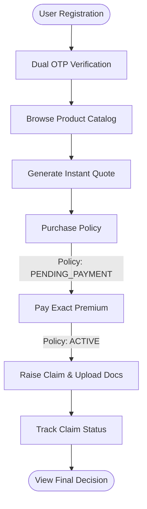

# Features
> The feature catalogue of InsuranceFlow, categorized by role and mapped to user journeys.

---

## Purpose
A quick, complete list of what the application can do, framed around the users who interact with it. Detailed behaviour and rules are documented in `02_Business_Domain/` and `08_Workflows/`.

---

## Role-Based Feature Table

| Role | Key Features | Why this matters |
|---|---|---|
| **Customer** | Instant Quotes, Policy Purchase, Premium Payment, Claim Submission (with Docs) | Enables 100% self-service, reducing operational overhead and call-center volume. |
| **Internal Staff** | Specialized Claim Queue, Claim Review & Recommendations, Policy Issuance | Ensures claims are reviewed by domain experts (e.g., Health vs. Motor) with a clear audit trail. |
| **Admin** | Catalog Management, Pricing Rule Governance, Final Claim Decisions, User Management | Centralizes business logic control, ensuring pricing is deterministically governed and auditable. |
| **Public / Any** | Registration, Dual OTP Verification, Forgot Password, System Stats | Secures entry into the system and provides transparency. |

---

## User Journey: Customer Policy Lifecycle

---

## Detailed Features

### Public / Common Features
- **Landing Page Stats**: Live platform statistics (products, plans, policies, claims) via `GET /api/public/stats`.
- **Robust Auth Lifecycle**: Registration with dual OTP verification (email + SMS), login, forgot/reset password, refresh & logout.
- **API Documentation**: Swagger/OpenAPI available at `/swagger-ui.html`.

### Customer (`ROLE_CUSTOMER`)
- **Profile Management**: Maintain personal details, address, and nominee information.
- **Catalog Browsing**: View active Products (HEALTH, MOTOR, etc.), Plans, and their Coverage Options.
- **Instant Quoting**: Generate a single-use quote with 30-minute validity.
- **Policy Acquisition**: Convert a quote into a policy (`PENDING_PAYMENT`).
- **Premium Payment**: Pay exactly the calculated premium to activate the policy (`ACTIVE`).
- **Claim Submission**: Raise claims detailing incident date, amount, reason, and uploading mandatory documents via Cloudinary.
- **Tracking & Documents**: View claim status history, download PDF receipts for policies, payments, and claims.
- **Policy Cancellation**: Cancel eligible policies (blocked if open claims exist).

### Internal Staff (`ROLE_INTERNAL_STAFF`)
- **Specialized Work Queues**: View a claim review queue automatically filtered by the staff's `productSpeciality`.
- **Claim Processing**: Assign claims, move to `UNDER_REVIEW`, and recommend `APPROVED` or `REJECTED`.
- **Customer Support**: Issue policies on behalf of customers and view customer payment histories.

### Admin (`ROLE_ADMIN`)
- **User Governance**: Create staff accounts, assign specialities, and activate/deactivate users.
- **Product & Plan Management**: Wizard-based plan creation tying together plans, coverage options, and pricing rules.
- **Pricing Rule Management**: Create/update rules with a strict **Pricing Audit Log** and premium preview tools.
- **Final Claim Authority**: Make the final `APPROVED` or `REJECTED` decision on recommended claims.

---

## Feature Security & Consistency
- **Auditability**: Every claim status change generates a `ClaimStatusHistory` record. Every pricing change generates a `PricingAuditLog`.
- **Consistency Guards**: Exact-amount premium validation, coverage matching, duplicate-policy blockers, and remaining-cover limit checks.

---

## Related Documents
- Feature deep-dives & rules → `../02_Business_Domain/Business_Rules.md`
- End-to-end flows → `../08_Workflows/`
- API specifics → `../03_API/`
