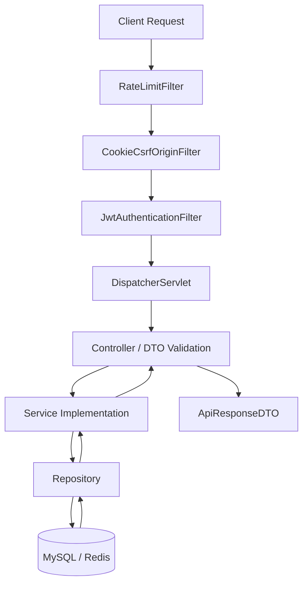
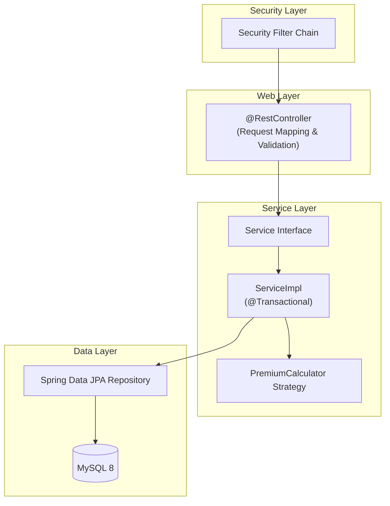
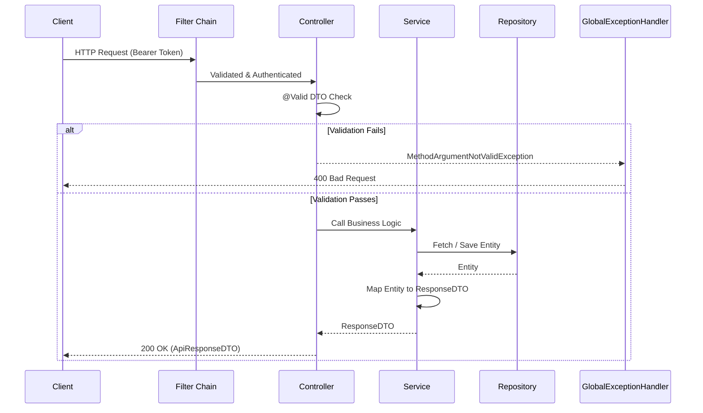

# Backend Architecture
> System overview of the Spring Boot backend: layered architecture, security filter chain, DTO mapping, and exception handling.

---

## Purpose
This document explains the organization and request flow of the backend module (`insurance-policy-claim-management-system`). It is intended for engineers building and maintaining controllers, services, and repositories.

---

## Overview
- **Tech Stack**: Java 17, Spring Boot 4.0.6, Spring Security.
- **Role**: Serves as the single source of truth for business logic, exposing a RESTful JSON API on port 8081.
- **Patterns Used**: Layered Architecture, DTO Pattern, Strategy Pattern for Premium Calculation.

---

## Business Context
The backend is the engine of the insurance system. It enforces business rules, calculates premiums, manages policy lifecycles, and ensures users only access what they are authorized to see. Robust validation and error handling protect the business from invalid data and malicious actors.

---

## Feature Flow

---

## System Flow (Layer Diagram)

---

## Sequence Diagram (Request Flow)

---

## Package Structure Responsibilities
| Package | Responsibility |
|---|---|
| `controller/` | Entry points for HTTP requests. Handles routing, DTO validation, and wrapping responses in `ApiResponseDTO`. |
| `service/` | Business logic interfaces. Defines contracts. |
| `serviceimpl/` | Implementation of services. Contains `@Transactional` business logic and ModelMapper mapping. |
| `repository/` | Spring Data JPA interfaces for database interaction. |
| `model/` | JPA Entities defining the database schema. |
| `dto/` | Request/Response Data Transfer Objects. |
| `security/` | JWT issuance, verification, and custom user details. |
| `exception/` | `GlobalExceptionHandler` and custom exception classes. |
| `verification/` | OTP, Email, and SMS service logic. |

---

## Validation Rules
| Level | What gets validated | Implementation |
|---|---|---|
| **DTO Level** | Format, length, presence (e.g., email format, not-null strings, max lengths). | `jakarta.validation` annotations (`@NotBlank`, `@Email`) handled by `@Valid` in controllers. |
| **Service Level** | Business rules, state transitions, ownership (e.g., "Is this policy already active?"). | Custom logic inside `ServiceImpl` methods, throwing custom exceptions. |
| **Database Level** | Referential integrity, uniqueness, data types. | JPA annotations (`@Column(unique=true)`) and database constraints. |

---

## Error Handling
Exceptions are caught globally by `GlobalExceptionHandler` (`@RestControllerAdvice`). It maps exceptions to a standardized `ErrorResponseDTO`.
- **400 Bad Request**: Validation failures (`MethodArgumentNotValidException`), custom `BadRequestException`.
- **401 Unauthorized**: Missing/invalid JWT, bad credentials.
- **403 Forbidden**: Valid JWT but insufficient role.
- **404 Not Found**: Resource lookup failed (`ResourceNotFoundException`).
- **409 Conflict**: Optimistic locking failure, duplicate entries (`ConflictException`).
- **500 Internal Server Error**: Unhandled exceptions.

---

## Design Decisions
| Decision | Rationale | Trade-offs |
|---|---|---|
| **Interface + Impl Pattern** | Decouples contract from implementation. Makes mocking easier in unit tests. | Adds a bit of boilerplate code. |
| **Layered Architecture** | Separates web concerns (Controllers) from business rules (Services) and persistence (Repositories). | Strict layering can seem verbose for simple CRUD operations. |
| **DTO Pattern** | Prevents over-posting, protects entities from direct exposure, and prevents lazy-loading exceptions during serialization. | Requires mapping code (handled by ModelMapper). |
| **ApiResponseDTO Envelope** | Ensures a consistent JSON structure for all API responses, making frontend parsing predictable. | Wraps simple responses in extra JSON layers. |

---

## Interview Notes
**Q1: Why do you use DTOs instead of returning entities directly?**
A: Returning entities can leak sensitive data (like passwords), expose internal database structure, and cause infinite recursion or lazy-loading exceptions when serialized to JSON. DTOs provide a tailored view for the API contract.

**Q2: Explain how you implemented the Strategy pattern in your backend.**
A: We used it for Premium Calculation. We have a `PremiumCalculator` interface with `AnnualPremiumCalculator` and `OneTimePremiumCalculator` implementations. A `PremiumCalculatorFactory` returns the correct strategy based on the `PremiumType` enum, allowing us to add new calculation methods without modifying existing code (Open/Closed Principle).

**Q3: How do you handle database transactions?**
A: Using the `@Transactional` annotation on service methods. It ensures that a series of database operations either completely succeed or completely roll back. Read-only methods use `@Transactional(readOnly = true)` for performance optimization.

**Q4: Where does request validation happen?**
A: Syntactic validation happens at the controller level using `@Valid` and DTO annotations. Semantic/business validation happens at the service level (e.g., checking if a user owns a claim).

**Q5: Describe your global exception handling mechanism.**
A: We use `@RestControllerAdvice` on a `GlobalExceptionHandler` class. It catches exceptions thrown anywhere in the application and translates them into a consistent JSON `ErrorResponseDTO` with appropriate HTTP status codes.

---

## Related Documents
- [High Level Architecture](High_Level_Architecture.md)
- [Folder Structure](Folder_Structure.md)

---

## Future Enhancements
- Implement MapStruct instead of ModelMapper for type-safe, compile-time DTO mapping.
- Add OpenAPI/Swagger for automated API documentation.
