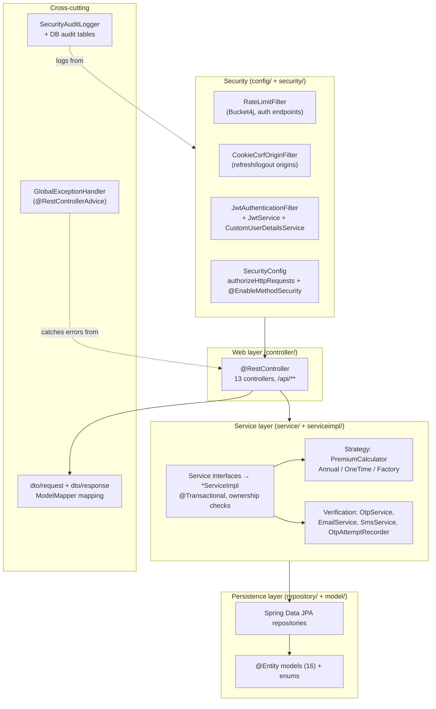

# Backend Architecture

> System overview of the Spring Boot backend: layered architecture, security filter chain, DTO mapping, premium-calculator strategy, verification services, exception handling, rate limiting, and audit logging.

## Purpose

Explains how the backend module (`insurance-policy-claim-management-system`) is organized and how a request flows through it, for engineers maintaining services, controllers, or security. This is an overview document; implementation detail lives in the [`06_Backend/`](../06_Backend/Package_Structure.md) docs.

## Overview

The backend is a **Spring Boot 4.0.6** REST API on Java 17, listening on port **8081** with the `/api` prefix. It exposes a JSON API consumed by the React SPA, persists to MySQL 8 (`insurance_db`), and orchestrates external services (Cloudinary, Twilio, Gmail SMTP). Authentication is **stateless JWT**; sessions are never stored server-side.

## Business Context

The backend is the single authority for the business: product/plan/pricing catalog management, premium calculation, policy lifecycle, payment recording, claim review, and user administration. Layering exists so security, business rules, data access, and delivery concerns stay independently testable and replaceable — and so that separation of duties (customer vs. staff vs. admin) is enforced in one place.

## Technical Design

### Layered architecture



### Spring Security filter chain position

`SecurityConfig` is stateless (`SessionCreationPolicy.STATELESS`), disables CSRF for the Bearer-token API, enables CORS, applies hardening headers (CSP, frame-deny, HSTS, referrer policy), and delegates `401`/`403` to `GlobalExceptionHandler`. Custom filters are positioned explicitly:

```text
HTTP request
  → CorsConfig (CORS, allowlisted origin)
  → RateLimitFilter            (before JwtAuthenticationFilter; Bucket4j on auth endpoints)
  → CookieCsrfOriginFilter     (before JwtAuthenticationFilter; Origin/Referer check on refresh/logout)
  → JwtAuthenticationFilter    (parse + verify JWT, load UserDetails, set SecurityContext)
  → authorizeHttpRequests      (method + role rules; /api/auth/** and /api/public/** permitAll)
  → @RestController
  → ServiceImpl (@Transactional)
  → Repository → Hibernate → MySQL
  → DTO wrapped in ApiResponseDTO<T>
```

Ordering is fixed in `SecurityConfig` via `addFilterBefore(...)`. Detail: [`../06_Backend/Security.md`](../06_Backend/Security.md).

### DTO mapping

Controllers bind validated request DTOs (`dto/request/`) and return response DTOs (`dto/response/`) wrapped in `ApiResponseDTO<T>`; paged endpoints use `PageResponseDTO<T>`. Entities are never serialized directly, so lazy associations and password/OTP fields cannot leak. Mapping uses **ModelMapper** (bean in `config/AppConfig.java`). Detail: [`../06_Backend/DTOs.md`](../06_Backend/DTOs.md).

### Premium calculation strategy

The strategy pattern isolates premium math behind the `PremiumCalculator` interface with two implementations — `AnnualPremiumCalculator` (recurring annual premium) and `OneTimePremiumCalculator` (upfront lump sum with duration discounts) — selected by `PremiumCalculatorFactory` keyed on `PremiumType`. Adding a new premium type means adding one `@Component`, no changes to consumers. Detail: [`../06_Backend/Premium_Calculation_Service.md`](../06_Backend/Premium_Calculation_Service.md).

### Verification services

The `verification/` package coordinates dual-channel OTP: `OtpService` generates 6-digit codes (via `SecureRandom`), `EmailService` delivers via Gmail SMTP, `SmsService` delivers via Twilio, and `OtpAttemptRecorder` tracks failed attempts. Detail: [`../03_API/Authentication_API.md`](../03_API/Authentication_API.md).

### Global exception handling

`GlobalExceptionHandler` (`@RestControllerAdvice`) maps every exception to a consistent `ErrorResponseDTO` (or `ValidationErrorResponseDTO` with a `fieldErrors` map): 400 for bad input, 401 for bad credentials/refresh-token failures, 403 for access denied, 404 for missing resources, 409 for duplicates and optimistic-lock conflicts, 500 for the rest. Detail: [`../06_Backend/Exception_Handling.md`](../06_Backend/Exception_Handling.md).

### Rate limiting

`RateLimitFilter` applies **Bucket4j** token buckets to unauthenticated auth endpoints (login, register, OTP, forgot/reset password, refresh). Buckets are keyed by client IP + email so rotating one alone cannot bypass the limit; a `429` response carries `Retry-After`. Limits are configured under `app.security.rate-limit.*`. Detail: [`../06_Backend/Security.md`](../06_Backend/Security.md).

### Audit logging

Security-relevant events (login success/failure, token rotation, refresh reuse, rate-limit triggers, CSRF rejections) are written to the dedicated `SECURITY_AUDIT` logger via `SecurityAuditLogger`, so they can be routed to a separate sink. Domain history is captured in DB audit tables (`pricing_audit_logs`, `claim_status_histories`). Detail: [`../06_Backend/Security.md`](../06_Backend/Security.md).

## Workflow

1. The SPA sends `POST /api/...` with `Authorization: Bearer <JWT>`.
2. The filter chain runs (rate limit → origin check → JWT authentication), then `SecurityConfig` authorization rules gate the route by method and role.
3. The controller binds and validates the request DTO (`@Valid`), then delegates to a service interface.
4. The service implementation (typically `@Transactional`) enforces business rules, reads the authenticated principal from the `SecurityContext`, and queries repositories.
5. Repositories return entities; the service maps them to response DTOs via ModelMapper and wraps them in `ApiResponseDTO<T>`.
6. The controller returns the envelope; any exception along the way is normalized by `GlobalExceptionHandler`.

## Code References

| Concern | File (repo-root-relative path) |
|---|---|
| Entry point | `insurance-policy-claim-management-system/src/main/java/com/insurance/demo/DemoApplication.java` |
| Filter chain & RBAC rules | `insurance-policy-claim-management-system/src/main/java/com/insurance/demo/config/SecurityConfig.java` |
| Security properties | `insurance-policy-claim-management-system/src/main/java/com/insurance/demo/config/AppSecurityProperties.java` |
| Rate limiter | `insurance-policy-claim-management-system/src/main/java/com/insurance/demo/config/RateLimitFilter.java` |
| CSRF/origin filter | `insurance-policy-claim-management-system/src/main/java/com/insurance/demo/config/CookieCsrfOriginFilter.java` |
| JWT service | `insurance-policy-claim-management-system/src/main/java/com/insurance/demo/security/JwtService.java` |
| Audit logger | `insurance-policy-claim-management-system/src/main/java/com/insurance/demo/config/SecurityAuditLogger.java` |
| Exception handler | `insurance-policy-claim-management-system/src/main/java/com/insurance/demo/exception/GlobalExceptionHandler.java` |
| Premium strategies | `insurance-policy-claim-management-system/src/main/java/com/insurance/demo/service/strategy/PremiumCalculator.java`, `AnnualPremiumCalculator.java`, `OneTimePremiumCalculator.java`, `PremiumCalculatorFactory.java` |
| Verification | `insurance-policy-claim-management-system/src/main/java/com/insurance/demo/verification/OtpService.java`, `EmailService.java`, `SmsService.java` |
| Backend config (port 8081, env import) | `insurance-policy-claim-management-system/src/main/resources/application.properties` |

## Diagrams

- Inline layered-architecture diagram above.
- Security filter chain: [`../06_Backend/Security.md`](../06_Backend/Security.md).

## Best Practices

- Controllers stay thin; business rules and transactions live in services, so they are unit-testable with mocks.
- The service-interface/serviceimpl split keeps contracts stable while allowing implementation changes.
- Centralized security rules in `SecurityConfig` plus service-level ownership checks provide defense in depth against IDOR.
- Consistent `ApiResponseDTO<T>` envelope and a single global exception handler keep the API contract uniform.

## Future Improvements

- Distributed (Redis-backed) rate limiting for multi-instance deployments.
- OpenAPI-generated client contracts.
- Caching (Caffeine, then Redis) for hot read paths.
- See [`../10_Evaluation/Future_Enhancements.md`](../10_Evaluation/Future_Enhancements.md).

## See Also

- [`High_Level_Architecture.md`](High_Level_Architecture.md) — system context and request flow.
- [`Security_Architecture.md`](Security_Architecture.md) — threat model and security controls.
- [`Database_Architecture.md`](Database_Architecture.md) — persistence model and transactions.
- [`../06_Backend/Package_Structure.md`](../06_Backend/Package_Structure.md) — implementation detail.
