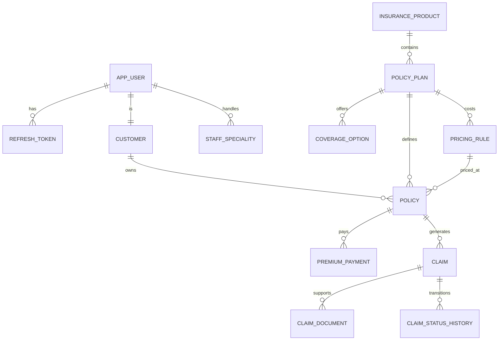

# Database Architecture
> System view of the MySQL persistence layer: schema groups, entity mapping, transactions, and audit history.

---

## Purpose
Explains how data is structured and persisted using MySQL and Spring Data JPA. Designed for engineers working on repositories, entities, or analyzing data flows.

---

## Overview
- **Database**: MySQL 8 (schema: `insurance_db`)
- **ORM**: Hibernate via Spring Data JPA.
- **Schema Management**: `ddl-auto=update` for development; models are the source of truth.
- **Key Features**: Strong referential integrity, optimistic locking, and comprehensive audit tables.

---

## Business Context
Insurance data is highly relational and requires strict integrity. A policy must link accurately to its product, plan, pricing rules, and the customer. Furthermore, because pricing changes over time and claims have legal implications, maintaining a historical audit trail of pricing and claim statuses is a critical business requirement.

---

## Functional Groups
The 16 entities are organized into four logical areas:

1. **Identity & Access**: `AppUser`, `Customer`, `StaffSpeciality`, `RefreshToken`, `OtpVerification`. Manages authentication, profiles, and roles.
2. **Catalog & Pricing**: `InsuranceProduct`, `PolicyPlan`, `CoverageOption`, `PricingRule`, `PricingAuditLog`. Defines what is sold and how much it costs.
3. **Sales & Lifecycle**: `Quote`, `Policy`, `PremiumPayment`. Handles the purchase process, premium calculation, and active policies.
4. **Claims Management**: `Claim`, `ClaimDocument`, `ClaimStatusHistory`. Manages incident reporting, evidence, and adjudication workflows.

---

## Schema Overview

---

## Technical Design

### Entity Naming Strategy
Hibernate's default Spring physical naming strategy is used. It automatically translates Java `camelCase` to MySQL `snake_case`.
- Class `AppUser` → Table `app_users`
- Field `fullName` → Column `full_name`

### Enum Mapping
All enums (`Role`, `ProductType`, `PolicyStatus`, etc.) are mapped using `@Enumerated(EnumType.STRING)`. This stores the string value (e.g., "ACTIVE") in the database rather than the integer ordinal (e.g., 1), preventing data corruption if enum values are reordered in Java.

### Transaction Strategy
Transactions are managed declaratively using Spring's `@Transactional`.
- **Writes**: `@Transactional(rollbackFor = Exception.class)` ensures that if any part of a complex operation fails (e.g., saving a claim and its history), the entire operation rolls back, preventing partial data states.
- **Reads**: `@Transactional(readOnly = true)` is used for fetch operations. This optimizes performance by bypassing Hibernate's dirty checking mechanism.

### Optimistic Locking
High-contention entities like `Policy` and `Claim` use a `@Version` field. When a record is read, its version number is noted. If two users try to update the same record simultaneously, the first commit increments the version. The second commit fails with an `ObjectOptimisticLockingFailureException` (mapped to HTTP 409 Conflict), preventing lost updates without the performance hit of database-level row locking.

---

## Design Decisions
| Decision | Rationale | Trade-offs |
|---|---|---|
| **Snapshot Pricing on Policy** | A policy links to a specific `PricingRule`. If the base price changes later, existing policies are unaffected because they reference the rule active at purchase time. | Requires maintaining historical `PricingRule` records. |
| **Soft Deletes (isActive)** | Products and Plans are never deleted via `DELETE` statements. They are toggled via an `isActive` boolean. This preserves historical referential integrity for old policies. | Queries must always include `WHERE is_active = true`. |
| **BigDecimal for Currency** | `BigDecimal` avoids floating-point precision errors inherent in `Double` or `Float`, ensuring accurate financial calculations. | Slightly more verbose syntax in Java. |
| **No FK on Audit Logs** | `PricingAuditLog` references IDs but does not enforce foreign keys. If a record is ever hard-deleted (admin intervention), the audit log remains intact without constraint violations. | Could result in orphaned IDs, but prioritizes audit retention. |

---

## Interview Notes
**Q1: How do you handle concurrent updates to a Claim record?**
A: We use Optimistic Locking via JPA's `@Version` annotation. It prevents "lost updates" by checking if the version number has changed since the record was read. If it has, it throws an exception, and the API returns a 409 Conflict.

**Q2: Why do you store Enums as Strings in the database?**
A: Using `@Enumerated(EnumType.STRING)` is safer. If we used ordinals, adding a new enum value in the middle of the list would change the integers assigned to subsequent values, completely corrupting the database data.

**Q3: Explain your database transaction strategy.**
A: We use `@Transactional` at the service layer. Operations that modify data run in standard read-write transactions. Operations that only read data use `readOnly = true`, which improves performance by disabling Hibernate's dirty checking.

**Q4: How do you maintain a history of price changes?**
A: We use an audit table (`pricing_audit_logs`). Whenever a `PricingRule` is updated, a new record is inserted into the audit table within the same transaction, capturing the old values, new values, and the user who made the change.

**Q5: Why did you use BigDecimal instead of Double for premiums?**
A: `Double` uses floating-point math, which cannot represent certain decimal values precisely (like 0.1), leading to rounding errors in financial calculations. `BigDecimal` provides exact precision, which is mandatory for money.

---

## Related Documents
- [High Level Architecture](High_Level_Architecture.md)
- [Backend Architecture](Backend_Architecture.md)
