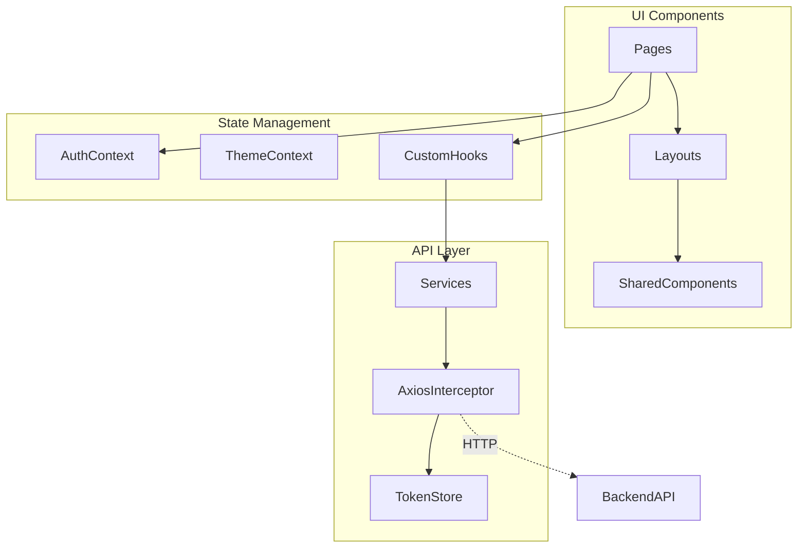
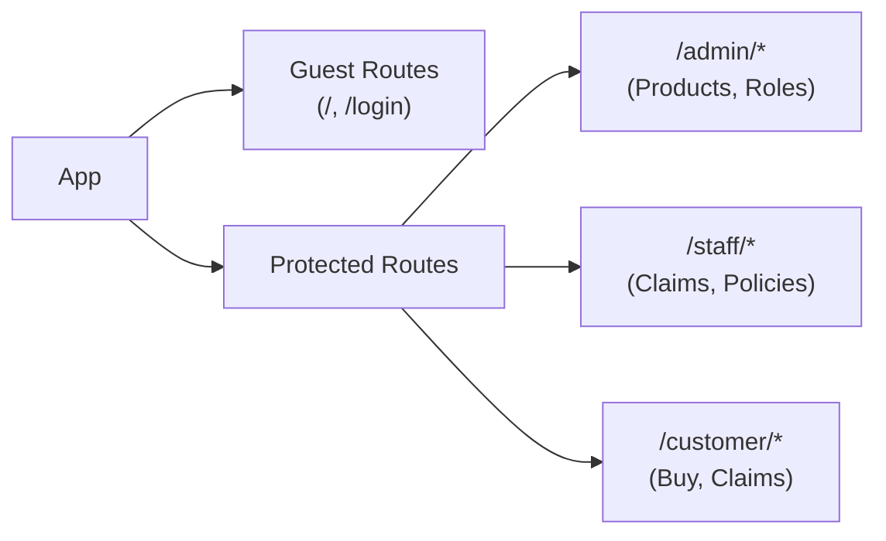
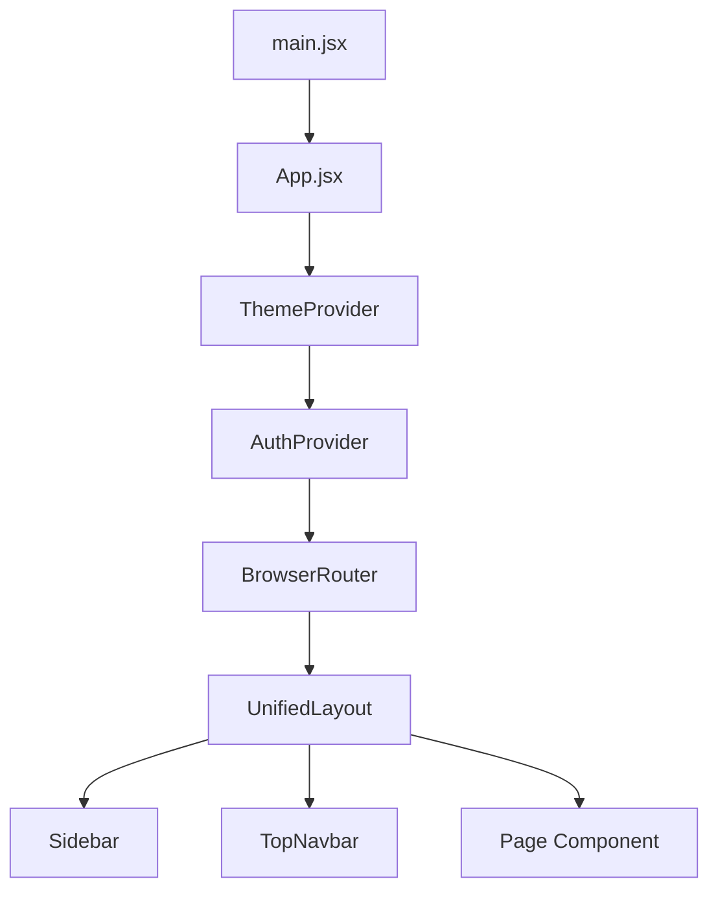
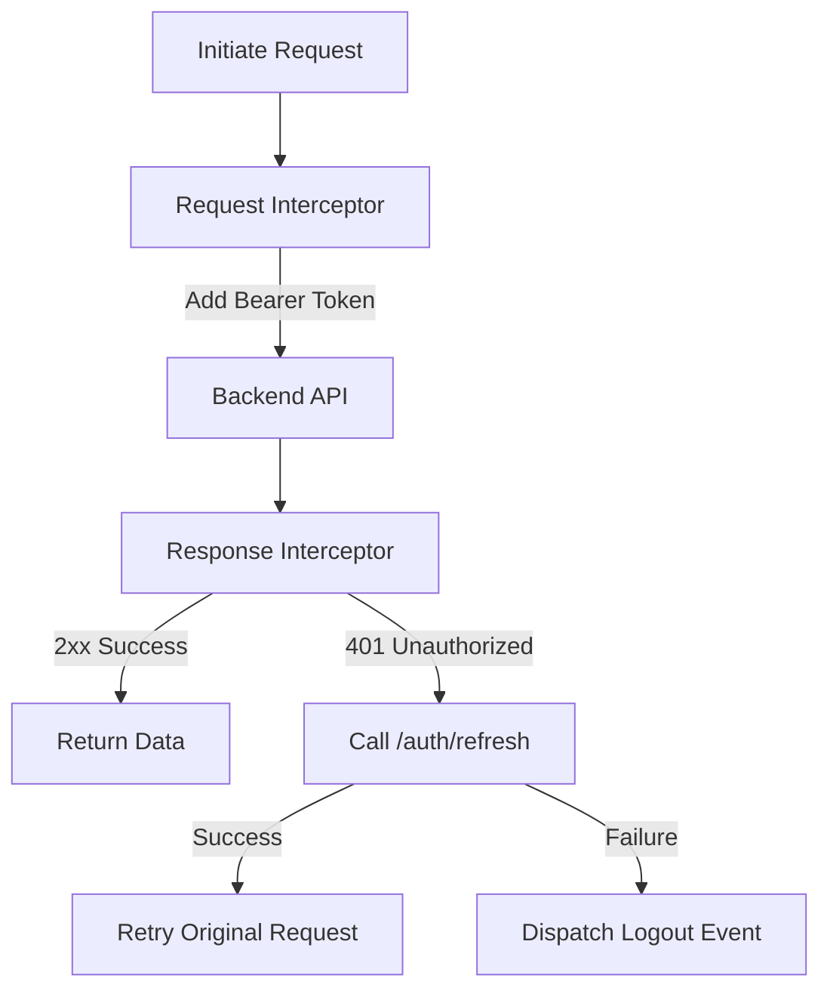

# Frontend Architecture
> System overview of the React SPA: routing, state management, API integration, and theming.

---

## Purpose
Explains how the frontend module (`insurance-policy-claim-management-app-ui`) is structured and how its components interact. Designed for UI developers to understand state flow, routing logic, and HTTP interception.

---

## Overview
- **Tech Stack**: React 19, Vite 8, React Router 7, Bootstrap 5.3, Axios.
- **State Management**: React Context (`AuthContext`, `ThemeContext`) and custom hooks (no Redux).
- **Routing**: Client-side routing with strong role-based guards.
- **Design**: Component-driven with role-based theming.

---

## Business Context
The frontend is the face of the application for three distinct user groups: Customers, Internal Staff, and Administrators. It must securely provide tailored workspaces while preventing unauthorized access to restricted features. The role-based theming ensures users always know which context they are operating in.

---

## Feature Flow
```mermaid
flowchart TD
    A[User accesses URL] --> B{Route Guard}
    B -- GuestRoute --> C[Public Pages (Login/Register)]
    B -- ProtectedRoute --> D{Has Token?}
    D -- No --> E[Redirect to Login]
    D -- Yes --> F{RoleProtectedRoute}
    F -- Role Match --> G[Render Page Component]
    F -- Role Mismatch --> H[Redirect to Unauthorized]
```

---

## System Flow (SPA Architecture)


---

## Route Structure


---

## Component Hierarchy


---

## API Layer & Axios Interceptors


---

## Role Theming
Visual cues are critical for preventing user error. The app uses `data-theme` on the root element.
- **Admin**: Blue (`#2563eb`) - Signifies control and configuration.
- **Staff**: Violet (`#7c3aed`) - Signifies internal processing and review.
- **Customer**: Teal (`#0d9488`) - Friendly, consumer-facing.

---

## Error Handling
- **401 Unauthorized**: Intercepted by Axios. Triggers a silent token refresh. If refresh fails, user is logged out and redirected to `/login`.
- **403 Forbidden**: Handled globally, redirects the user to an `/unauthorized` page or displays a toast.
- **500 Server Error**: Caught by the API adapter and displayed to the user via a global toast notification.

---

## Design Decisions
| Decision | Rationale | Trade-offs |
|---|---|---|
| **No Redux** | Application state is mostly server state. React Context is sufficient for global UI state (auth, theme). | Lacks time-travel debugging, but vastly reduces boilerplate. |
| **React Context** | Perfect for low-frequency updates like authentication status and current theme. | Not suited for high-frequency changing data. |
| **Axios Interceptors** | Centralizes token injection and silent refresh logic, keeping components completely ignorant of token management. | Can be complex to debug during concurrent failed requests. |
| **In-Memory Token Store** | Prevents XSS attacks from easily reading the JWT from `localStorage`. | Token is lost on hard reload (but silently restored via HttpOnly refresh cookie). |

---

## Interview Notes
**Q1: Why did you choose React Context over Redux for state management?**
A: Redux is overkill for this app. We only have two pieces of truly global state: Authentication and Theme. The rest of the state is either local UI state or server state, which we manage with custom hooks and API calls. Context provides a simpler, boilerplate-free solution.

**Q2: How do you handle JWT tokens on the frontend?**
A: The access token is stored in memory (`tokenStore.js`), not in `localStorage`, to prevent XSS theft. It is injected into requests via an Axios request interceptor. The refresh token is stored in an HttpOnly cookie.

**Q3: Explain the Axios interceptor logic for token refresh.**
A: The response interceptor catches 401 errors. If a 401 occurs, it pauses the request, calls the refresh endpoint using the HttpOnly cookie, updates the in-memory token, and then replays the original failed request.

**Q4: How is route protection implemented?**
A: We use wrapper components (`ProtectedRoute` and `RoleProtectedRoute`). If a user accesses a protected route without a token, they are redirected to login. If they lack the correct role, they are redirected to an unauthorized page.

**Q5: Why aren't you using lazy loading for routes?**
A: We prioritized instant navigation. Since the app is relatively small, the entire bundle size is manageable. As the application grows, we can introduce `React.lazy()` for code splitting at the route level.

---

## Related Documents
- [High Level Architecture](High_Level_Architecture.md)
- [Folder Structure](Folder_Structure.md)

---

## Future Enhancements
- Implement React Query (TanStack Query) to manage server state, caching, and background refetching.
- Implement route-level code splitting using `React.lazy()` and `Suspense`.
