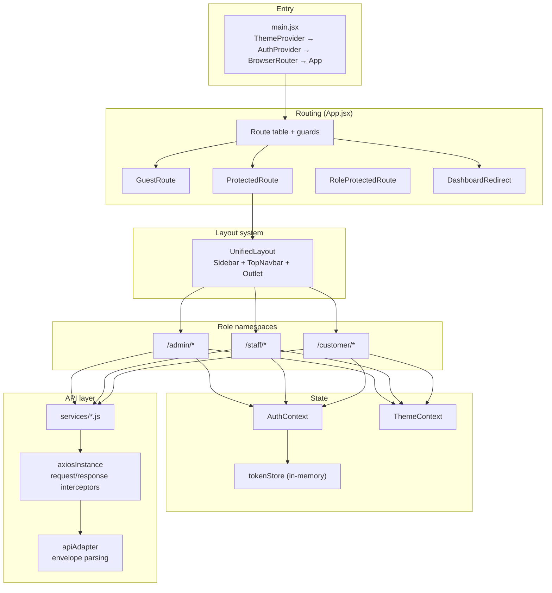

# Frontend Architecture

> System overview of the React single-page application: routing and role guards, layout system, state management, API integration, and theming.

## Purpose

Explains how the frontend module (`insurance-policy-claim-management-app-ui`) is structured and how its pieces connect, for engineers working on UI pages or on the API integration layer. This is an overview document; implementation detail lives in the [`05_Frontend/`](../05_Frontend/Routing.md) docs.

## Overview

The frontend is a **React 19 single-page application** built with Vite 8, React Router 7, Bootstrap 5.3 + bootstrap-icons, and Axios. It deliberately uses **no external state-management library** (no Redux/Zustand) and **no lazy-loaded routes** — state comes from Context + local hooks, and all pages are statically imported so navigation is instant. It has no shared backend state; every page renders from the REST API.

## Business Context

Customers, staff, and administrators need a single responsive portal with role-specific workspaces. The frontend enforces the same separation of duties as the backend: a customer never sees staff actions, a staff member never reaches admin-only pricing screens, and the visual theme changes per role so users immediately know which workspace they are in.

## Technical Design

### Application structure

### Routing and role guards

All routes are defined centrally in `src/App.jsx`. Three guard components wrap the route tree:

| Guard | Behavior |
|---|---|
| `GuestRoute` | Public pages (`/`, `/login`, `/register`, `/forgot-password`, `/verify-otp`); authenticated users are redirected to their role home. |
| `ProtectedRoute` | Requires an authenticated session; otherwise redirects to `/login`, preserving the intended destination. Shows a loading screen while the session is restored. |
| `RoleProtectedRoute` | Enforces one role per route block; the wrong role redirects to that user's own dashboard or `/unauthorized`. |
| `DashboardRedirect` | Maps `/dashboard` to the correct role home. |

Role namespaces mirror the backend roles: `/admin/*`, `/staff/*`, `/customer/*`. Roles are defined in `src/utils/roles.js` as `ROLE_ADMIN`, `ROLE_INTERNAL_STAFF`, `ROLE_CUSTOMER`. Detail: [`../05_Frontend/Routing.md`](../05_Frontend/Routing.md).

### Layout system

Authenticated pages render inside `UnifiedLayout` (`src/components/layouts/UnifiedLayout.jsx`), the main shell composed of `Sidebar` and `TopNavbar` with an `<Outlet/>`. Navigation items, portal title, and theme class are role-driven. Detail: [`../05_Frontend/Layout.md`](../05_Frontend/Layout.md).

### State management

- **AuthContext** (`src/context/AuthContext.jsx`) holds `{ token, user, isAuthenticated, isRestoring, login, logout }`. The access token is kept **in memory** in `src/api/tokenStore.js` (never `localStorage`), while non-sensitive session flags (`ss_user`, `ss_has_session`) mark that a session exists. On boot the context silently restores the session via the HttpOnly refresh cookie (`/auth/refresh`).
- **ThemeContext** (`src/context/ThemeContext.jsx`) manages light/dark theme applied via `data-theme` on `<html>`.
- Everything else is local component/hook state. Reusable hooks in `src/hooks/` (`useApiTable`, `useApiForm`, `useClientPagination`, PDF export hooks, and more) drive tables, forms, and reports.

Detail: [`../05_Frontend/State_Management.md`](../05_Frontend/State_Management.md).

### API integration layer

- `src/api/axiosInstance.js` — the single Axios instance. The request interceptor attaches the Bearer token, handles `FormData` content type, and starts the NProgress bar. The response interceptor parses the `ApiResponseDTO<T>` / `PageResponseDTO<T>` envelopes, and on a `401` performs a **single-flight refresh** (`POST /auth/refresh`, one shared promise, one retry) then replays the request. It dispatches window events: `auth:token-refreshed`, `auth:unauthorized`, `auth:forbidden`, `api:error`, consumed by `GlobalApiHandler`.
- `src/api/apiAdapter.js` — normalizes success and error envelopes so services receive plain payloads.
- `src/services/*.js` — one service per resource (auth, user, customer, product, plan, coverageOption, pricingRule, quote, policy, payment, claim, claimDocument, dashboard, public).
- `src/api/tokenStore.js` — in-memory access-token holder.

Detail: [`../05_Frontend/API_Integration.md`](../05_Frontend/API_Integration.md).

### Theming

Role-based theming implemented in `src/index.css`: admin blue `#2563eb`, staff violet `#7c3aed`, customer teal `#0d9488`, each with light and dark variants. Detail: [`../05_Frontend/Layout.md`](../05_Frontend/Layout.md).

## Workflow

1. `index.html` loads `main.jsx`, which mounts providers in order: `ThemeProvider`, `AuthProvider`, `BrowserRouter`, `App`.
2. `App` renders global handlers (`GlobalApiHandler`, `GlobalToaster`) and the route table with guards.
3. `GuestRoute` shows auth pages to anonymous users; `ProtectedRoute` requires a session; `RoleProtectedRoute` scopes `/admin/*`, `/staff/*`, `/customer/*`.
4. A page calls a `src/services/*.js` function; the service calls `axiosInstance`, which attaches the token and parses the envelope.
5. On `401` the instance silently refreshes the token once and retries; on failure it dispatches `auth:unauthorized` and the session ends.
6. `AuthContext` publishes the token/user; `ThemeContext` applies light/dark styling; `GlobalToaster` surfaces notifications.

## Code References

| Concern | File (repo-root-relative path) |
|---|---|
| Route table & guards | `insurance-policy-claim-management-app-ui/src/App.jsx` |
| App bootstrap / provider order | `insurance-policy-claim-management-app-ui/src/main.jsx` |
| Auth state | `insurance-policy-claim-management-app-ui/src/context/AuthContext.jsx` |
| In-memory token store | `insurance-policy-claim-management-app-ui/src/api/tokenStore.js` |
| HTTP layer & interceptors | `insurance-policy-claim-management-app-ui/src/api/axiosInstance.js` |
| Envelope parsing | `insurance-policy-claim-management-app-ui/src/api/apiAdapter.js` |
| Theme state | `insurance-policy-claim-management-app-ui/src/context/ThemeContext.jsx` |
| Main layout shell | `insurance-policy-claim-management-app-ui/src/components/layouts/UnifiedLayout.jsx` |
| Role constants | `insurance-policy-claim-management-app-ui/src/utils/roles.js` |

## Diagrams

- Inline application-structure diagram above.
- Detailed component / page inventories: [`../05_Frontend/Component_Architecture.md`](../05_Frontend/Component_Architecture.md).

## Best Practices

- Single Axios instance centralizes token handling, refresh-on-401, and event dispatch — pages never manage auth headers themselves.
- In-memory access token plus HttpOnly refresh cookie keeps the long-lived credential out of JavaScript-visible storage.
- Role-guarded namespaces plus role-driven theming give each actor an unambiguous, isolated workspace.
- Reusable hooks and service modules keep pages thin and consistent.

## Future Improvements

- Route-level code splitting once the route count grows.
- A typed API contract (e.g. OpenAPI-generated client) to replace hand-written services.
- See [`../10_Evaluation/Future_Enhancements.md`](../10_Evaluation/Future_Enhancements.md).

## See Also

- [`High_Level_Architecture.md`](High_Level_Architecture.md) — system context and request flow.
- [`Security_Architecture.md`](Security_Architecture.md) — how frontend token handling fits the security model.
- [`../05_Frontend/Routing.md`](../05_Frontend/Routing.md) — implementation detail.
