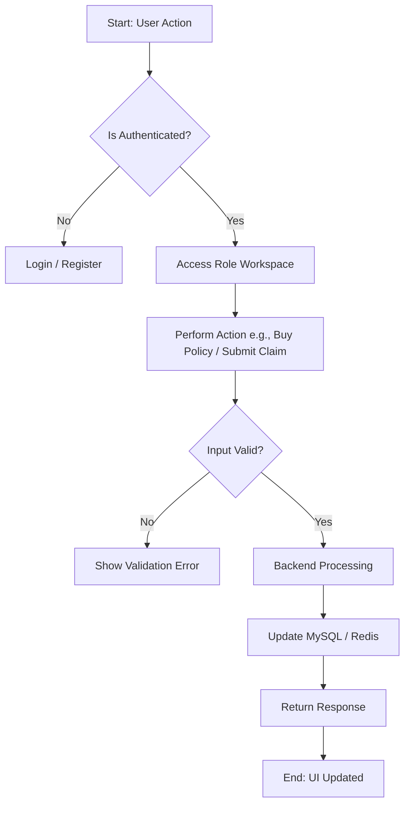
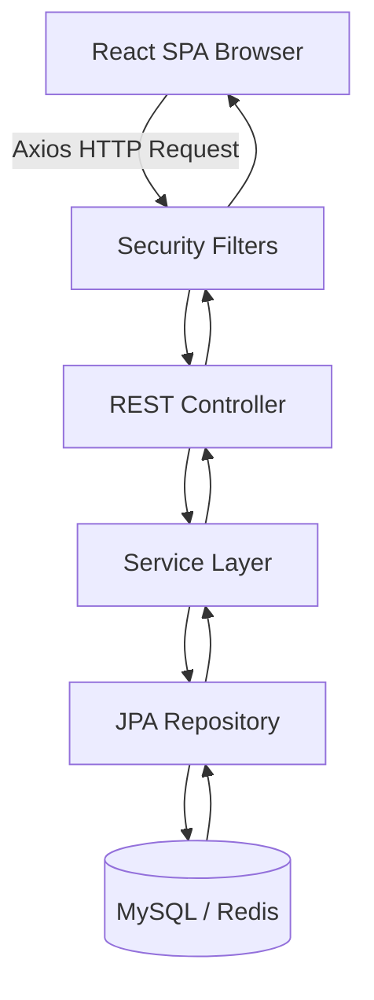
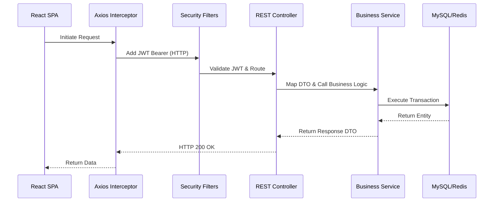
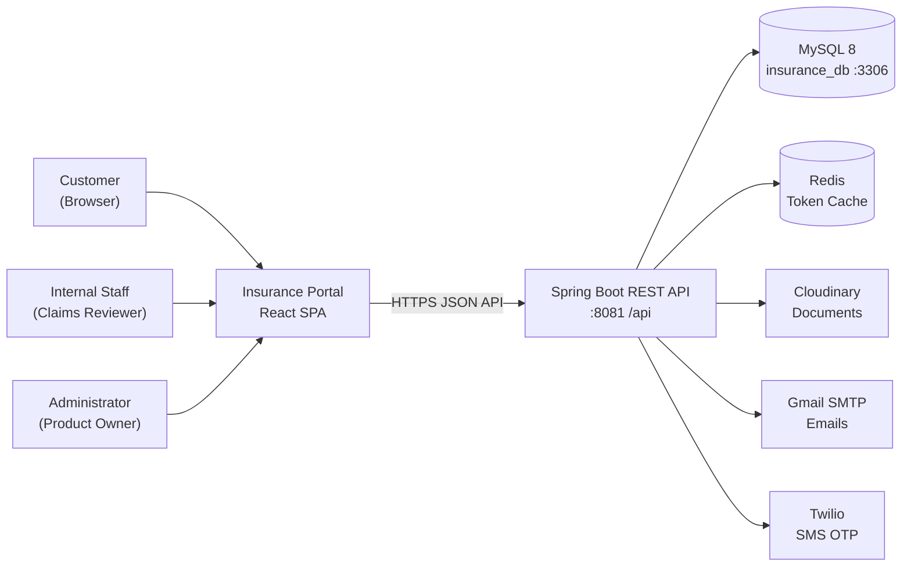
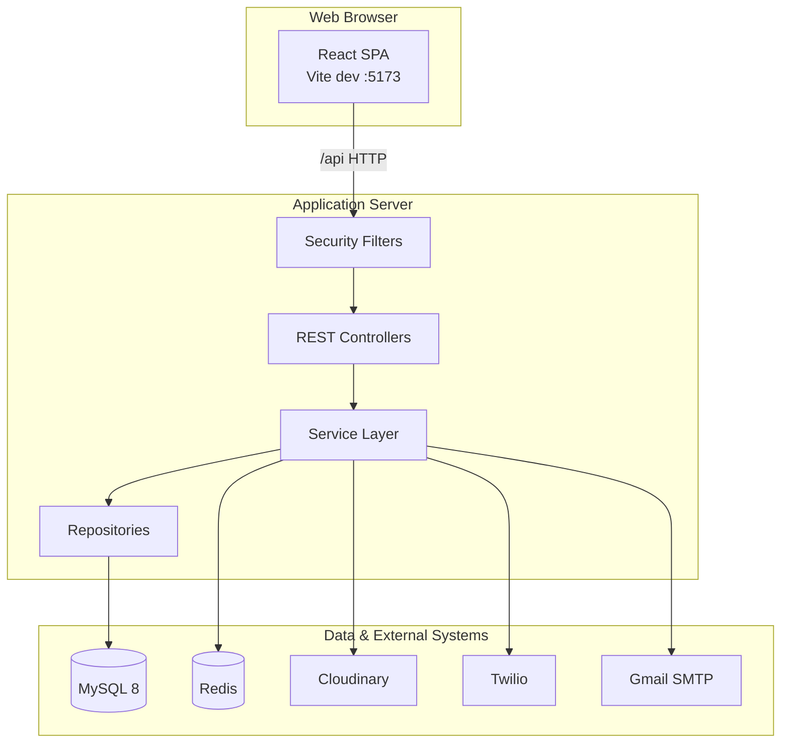
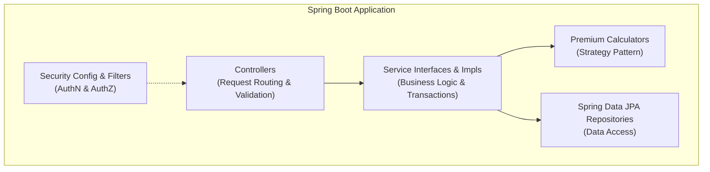
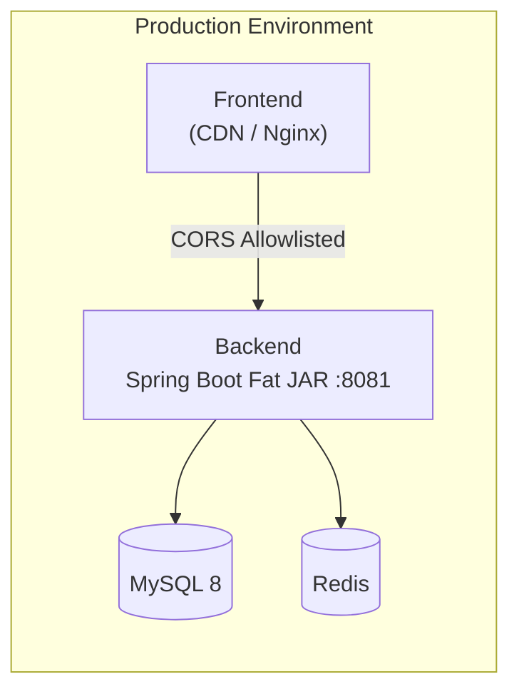

# High-Level Architecture
> The authoritative system overview of the Insurance Policy & Claim Management System, covering system context, containers, deployment topology, and the end-to-end request lifecycle.

---

## Purpose
This document provides a bird's-eye view of the entire system architecture. It is designed to help new engineers, technical reviewers, and evaluators understand how the system is put together, how data flows, and why certain architectural choices were made.

---

## Overview
- **Separation of Concerns**: A React single-page application (SPA) on the frontend communicating with a Spring Boot REST API on the backend.
- **Robust Persistence**: Relational data is stored in MySQL 8, while token caching and blacklisting are managed by Redis.
- **Secure by Design**: Utilizes stateless JWTs, HTTP-only refresh tokens, and dual OTP validation for high security.
- **Third-Party Integrations**: Cloudinary for document storage, Twilio for SMS, and Gmail SMTP for email notifications.

---

## Business Context
The InsuranceFlow system digitizes the core lifecycle of an insurance business. From the business perspective, this feature allows customers to browse plans, get quotes, buy policies, and submit claims. Internal staff can review claims, while administrators manage pricing and approve final claims. Strong identity verification and role-based access are critical because the system handles financial transactions and sensitive personal data.

---

## Feature Flow

---

## System Flow

---

## Sequence Diagram

---

## Architecture Diagram

### C4 Level 1 — System Context

### C4 Level 2 — Containers

### C4 Level 3 — Components (Backend Layers)

### Deployment Topology

---

## Request Lifecycle
1. **Initiation**: The user triggers an action in the React SPA.
2. **Interception**: The Axios interceptor attaches the JWT token from memory to the `Authorization: Bearer` header.
3. **Filtering**: The request hits the backend Spring Security filter chain (RateLimitFilter → CookieCsrfOriginFilter → JwtAuthenticationFilter).
4. **Validation**: The REST controller binds and validates the request body against the DTO.
5. **Business Logic**: The controller delegates to a `@Transactional` service where business rules are applied.
6. **Data Access**: The service interacts with MySQL via JPA repositories (and Redis for token checks).
7. **Response**: The entity is mapped to a Response DTO, wrapped in `ApiResponseDTO`, and returned to the client.

---

## Design Decisions
| Decision | Rationale | Trade-offs |
|---|---|---|
| **SPA + API Separation** | Decouples frontend and backend, allowing independent scaling, testing, and deployment. | Requires CORS configuration and careful token management. |
| **Stateless JWT** | Highly scalable, no need to query the database for every request's session state. | Harder to revoke instantly (mitigated by tokenVersion and Redis blacklisting). |
| **Spring Boot** | Enterprise-grade, mature ecosystem, excellent dependency injection, and JPA support. | Higher memory footprint compared to Go or Node.js. |
| **MySQL 8** | ACID compliance, strong relational integrity suitable for financial and policy data. | Schema rigidity compared to NoSQL databases. |
| **Redis** | In-memory key-value store provides sub-millisecond lookups for token blacklists and refresh tokens. | Adds infrastructure complexity. |

---

## Interview Notes
**Q1: Why did you separate the frontend and backend instead of using Thymeleaf/JSP?**
A: Separation allows independent scaling, parallel development, and modern UI capabilities with React. It also provides a clean REST API that can be consumed by mobile apps in the future.

**Q2: How does the system handle security without server-side sessions?**
A: We use stateless JWTs for access tokens (kept in memory) and DB/Redis-backed HTTP-only refresh tokens. We handle revocation by bumping a `tokenVersion` in the user's record and using Redis for blacklisting.

**Q3: What role does Redis play in your architecture?**
A: Redis is used for caching tokens—specifically storing refresh tokens and blacklisting JWTs for fast, scalable authentication checks without hitting MySQL on every request.

**Q4: How do you handle database transactions?**
A: We use Spring's `@Transactional` at the service layer. Write operations are in read-write transactions, while read operations use `@Transactional(readOnly = true)` to optimize performance.

**Q5: Describe the flow of a single HTTP request through your backend.**
A: The request passes through security filters (rate limiting, CSRF, JWT validation), hits a REST controller where DTOs are validated, delegates to a transactional service for business logic, uses a repository to query MySQL/Redis, and returns an `ApiResponseDTO`.

---

## Related Documents
- [Backend Architecture](Backend_Architecture.md)
- [Frontend Architecture](Frontend_Architecture.md)
- [Database Architecture](Database_Architecture.md)
- [Security Architecture](Security_Architecture.md)

---

## Future Enhancements
- Deploying the frontend via AWS CloudFront/S3 and the backend on AWS ECS.
- Introducing a distributed trace ID for cross-service logging.
