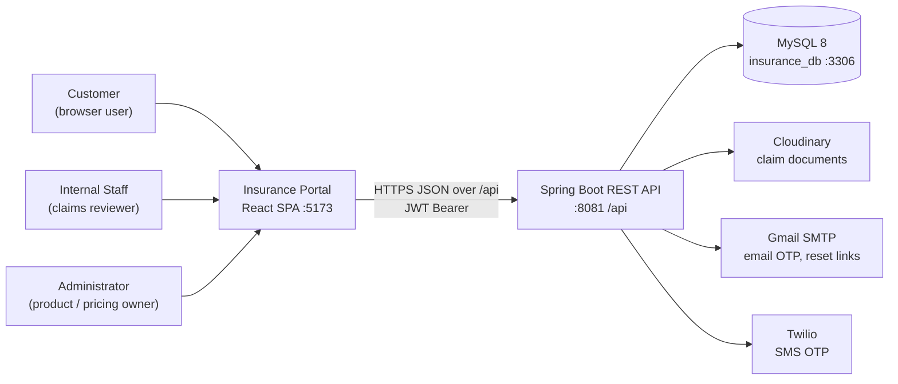
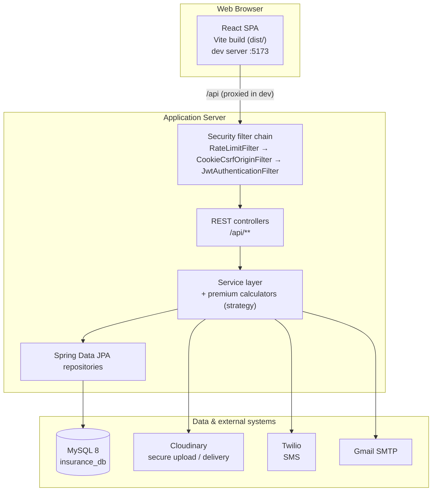
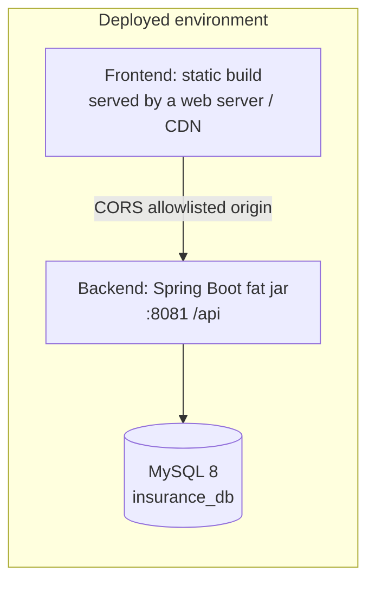

# High-Level Architecture

> Authoritative system overview of the Insurance Policy & Claim Management System: C4 context, containers, deployment topology, and the end-to-end request flow.

## Purpose

This document is the single authoritative source for the system-level architecture of the Insurance Policy & Claim Management System. It is written for new engineers, evaluators, and technical stakeholders who need to understand the whole system before diving into any layer. Every deeper topic is owned by another document in this tree; this page summarizes and links, it does not duplicate.

## Overview

The system is a two-module full-stack application:

- **Backend** — a Spring Boot REST API (`insurance-policy-claim-management-system`) exposing a JSON API under `/api`, listening on port **8081**.
- **Frontend** — a React single-page application (`insurance-policy-claim-management-app-ui`) built with Vite, running on port **5173** during development and served as a static build in production.
- **Database** — MySQL 8 with schema `insurance_db` on port **3306**.
- **External services** — Cloudinary (claim document storage), Twilio (SMS OTP), and Gmail SMTP (email OTP and password-reset links).

Three actor types interact with the system: **customers** (buy policies, raise claims, pay premiums), **internal staff** (issue policies, review claims in their product specialty, record payments), and **administrators** (manage products, plans, pricing rules, coverage options, users, and make final claim decisions).

## Business Context

The application digitizes the core lifecycle of an insurance business: product and plan definition, premium calculation and quoting, policy purchase and activation, premium payments, claim submission and review, and document management. Strong identity verification (dual email + SMS OTP), role-based separation of duties, and a complete audit trail are business-critical requirements because money movement and claim decisions depend on them.

## Technical Design

### C4 Level 1 — System context

### C4 Level 2 — Containers

### Deployment topology

The frontend is a **static build** (output of `npm run build`) and the backend is a **Spring Boot executable jar**. They are independently deployable artifacts.

During development the two are run separately (`npm run dev` on 5173 and `mvnw spring-boot:run` on 8081) with the Vite dev server proxying `/api` to the backend; in production the static build and the jar can be served from entirely separate hosts, connected only by the allowlisted CORS origin and the API base URL. See [`../11_Developer_Guide/Deployment.md`](../11_Developer_Guide/Deployment.md) for the build/run/deploy steps.

### Request flow narrative

A single authenticated request travels through a fixed chain:

1. The React SPA dispatches an HTTP call through the shared Axios instance, which attaches `Authorization: Bearer <JWT>` and drives the top progress bar.
2. The request reaches the backend, where the Spring Security filter chain runs in order: the Bucket4j rate limiter (auth endpoints), the CSRF/origin filter (cookie-authenticated auth endpoints), then the JWT authentication filter, which validates the token and loads the user into the `SecurityContext`.
3. `SecurityConfig` authorization rules gate the route by HTTP method and role (`ROLE_ADMIN`, `ROLE_INTERNAL_STAFF`, `ROLE_CUSTOMER`).
4. A `@RestController` binds and validates the request DTO, then delegates to the service layer.
5. Service implementations enforce business rules inside `@Transactional` boundaries, read the authenticated user from the security context, and call Spring Data JPA repositories.
6. Repositories run against MySQL; side effects (document upload, email, SMS) go to Cloudinary, Gmail SMTP, and Twilio.
7. Results are mapped to response DTOs, wrapped in the `ApiResponseDTO<T>` envelope, and returned; any thrown exception is normalized by `GlobalExceptionHandler` into a consistent `ErrorResponseDTO`.

## Workflow

1. A customer registers (`POST /api/auth/register`), verifies identity via the dual email + SMS OTP (`POST /api/auth/verify-otp`), and can then log in.
2. Login (`POST /api/auth/login`) returns a short-lived JWT in the body and sets an HttpOnly refresh-token cookie; every subsequent protected call carries the JWT as a Bearer token.
3. A customer browses products/plans, obtains a quote with a computed premium, purchases a policy, and pays to activate it.
4. On an incident, the customer raises a claim, uploads supporting documents to Cloudinary, and tracks status.
5. Staff review claims within their product specialty; the administrator renders the final decision. Every status change is recorded in `claim_status_histories`.
6. The access token expires and is silently renewed through `POST /api/auth/refresh` (single-flight on the frontend); logout revokes the refresh token and clears the cookie.

## Code References

| Concern | File (repo-root-relative path) |
|---|---|
| Backend entry point | `insurance-policy-claim-management-system/src/main/java/com/insurance/demo/DemoApplication.java` |
| Security filter chain & RBAC rules | `insurance-policy-claim-management-system/src/main/java/com/insurance/demo/config/SecurityConfig.java` |
| Backend configuration (port 8081, env import) | `insurance-policy-claim-management-system/src/main/resources/application.properties` |
| Real secrets (gitignored) | `insurance-policy-claim-management-system/env.properties` |
| Frontend route table & guards | `insurance-policy-claim-management-app-ui/src/App.jsx` |
| Frontend HTTP layer | `insurance-policy-claim-management-app-ui/src/api/axiosInstance.js` |

## Diagrams

- Inline Mermaid diagrams above (C4 context, containers, deployment topology).
- ER / schema diagrams live in [`../04_Database/ER_Diagram.md`](../04_Database/ER_Diagram.md).

## Best Practices

- The single-source-of-truth map keeps one authoritative document per topic; every deeper layer links here and here links back to it.
- Ports, roles, and endpoint prefixes are the facts used everywhere else — they are code-verified against `application.properties` and `SecurityConfig`.
- Static frontend / fat-jar backend separation means each artifact can be built, tested, and deployed independently.

## Future Improvements

- Horizontally scalable backend (multiple jar instances) behind a load balancer, with Redis-backed distributed rate limiting.
- Managed MySQL with read replicas for reporting.
- Structured logging with correlation IDs feeding a log aggregator.
- See [`../10_Evaluation/Future_Enhancements.md`](../10_Evaluation/Future_Enhancements.md).

## See Also

- [`../00_Project_Overview/Architecture_Overview.md`](../00_Project_Overview/Architecture_Overview.md) — project vision and feature set.
- [`Backend_Architecture.md`](Backend_Architecture.md) — backend layers, filter chain, request lifecycle.
- [`Frontend_Architecture.md`](Frontend_Architecture.md) — SPA structure, routing, state, API integration.
- [`Database_Architecture.md`](Database_Architecture.md) — schema, entities, naming strategy, transactions.
- [`Security_Architecture.md`](Security_Architecture.md) — threat model and defense-in-depth controls.
- [`../11_Developer_Guide/Deployment.md`](../11_Developer_Guide/Deployment.md) — build, run, and deploy.
