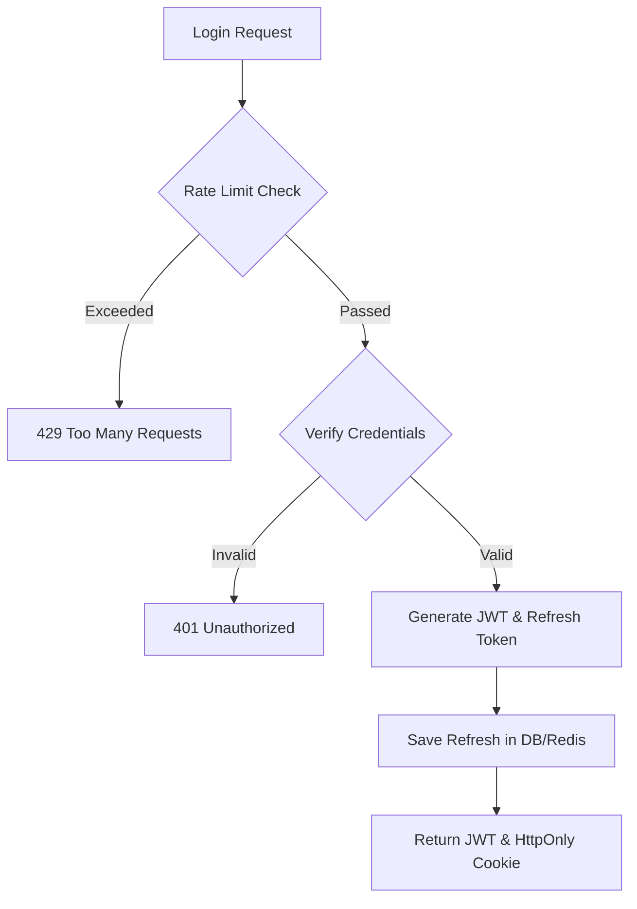
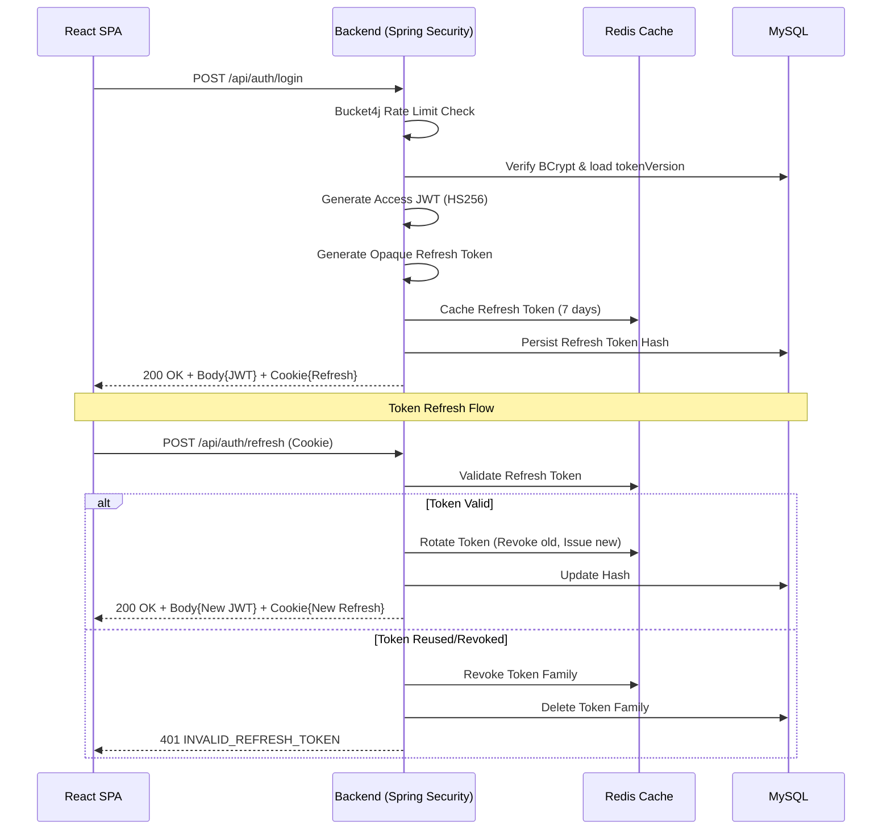

# Security Architecture
> Comprehensive overview of the system's security posture, detailing the threat model, authentication flows, and defense-in-depth controls.

---

## Purpose
This document maps out the security strategies employed to protect user data, prevent unauthorized access, and ensure transaction integrity. It is essential reading for any engineer touching authentication, authorization, or user sessions.

---

## Overview
Security in InsuranceFlow relies on a defense-in-depth approach. We do not rely on a single barrier. If one layer is breached, another stands in the way. Key components include stateless JWTs, opaque HTTP-only refresh tokens, Redis blacklisting, Bucket4j rate limiting, and Role-Based Access Control (RBAC).

---

## Business Context
Insurance systems deal with sensitive PII (Personally Identifiable Information) and financial transactions (premium payments, claim payouts). A breach could result in severe regulatory fines, financial loss, and reputational damage. Our security architecture is designed to meet enterprise standards, focusing on verifying identity, strictly controlling access, and maintaining a solid audit trail.

---

## Threat Model

| Threat | Attack Scenario | Defense Control |
|---|---|---|
| **Broken Authentication** | Credential stuffing, brute-forcing passwords. | BCrypt hashing, Bucket4j rate limiting, Dual OTP requirement. |
| **Session Hijacking / XSS** | Attacker steals access token via malicious script. | JWT stored in-memory (not localStorage). Refresh token is HttpOnly. |
| **Token Replay** | Attacker intercepts and reuses a refresh token. | Refresh token rotation. Reuse triggers family revocation. |
| **CSRF** | Attacker forces user to execute unwanted actions. | SameSite=Lax cookies, Origin/Referer filter checks. |
| **IDOR (Bypass)** | User modifies URL ID to view another's policy. | Service-level ownership checks (e.g., `policy.getCustomer().equals(currentUser)`). |
| **DDoS / Brute Force** | Hammering login or OTP endpoints. | IP + Email based rate limiting via Bucket4j. |

---

## Feature Flow (Authentication & Authorization)

---

## Sequence Diagram (Authentication Flow)

---

## Technical Design

### 1. Stateless JWT Access Tokens
Access tokens are signed with HMAC-SHA256 (jjwt). They contain the user's email, roles, and a `tokenVersion`. They expire quickly (15 mins). They are strictly stateless; the server does not store them, but does validate their signature and expiration.

### 2. Opaque Refresh Tokens & Rotation
Refresh tokens are 32-byte secure random strings. They are sent to the client ONLY as an `HttpOnly`, `Secure`, `SameSite=Lax` cookie. 
- **Rotation**: Every time a refresh token is used, a new one is issued and the old one is invalidated.
- **Reuse Detection**: If an invalidated refresh token is presented, the system assumes a compromise and revokes the entire token family (forcing the user to log in again).

### 3. Redis Caching & Blacklisting
To minimize database hits during authentication, valid refresh tokens are cached in Redis. Furthermore, upon logout or password reset, active JWTs are placed on a Redis Blacklist until they naturally expire.

### 4. Dual OTP Verification
Critical actions (registration, password reset) require a 6-digit OTP sent to both Email (Gmail SMTP) and SMS (Twilio). OTPs expire in 5 minutes and allow maximum 5 attempts.

### 5. Role-Based Access Control (RBAC)
Implemented via Spring Security `SecurityConfig`. Paths are restricted by role (e.g., `/api/admin/**` requires `ROLE_ADMIN`). Method-level security (`@PreAuthorize`) and service-level entity ownership checks provide deep authorization.

---

## Error Handling
- **401 Unauthorized**: Returned for bad credentials, expired JWTs, or revoked refresh tokens.
- **403 Forbidden**: Returned when a valid user tries to access an endpoint their role does not permit, or when CSRF/Origin checks fail.
- **429 Too Many Requests**: Returned by Bucket4j when rate limits are exceeded. Includes a `Retry-After` header.

---

## Design Decisions
| Decision | Rationale | Trade-offs |
|---|---|---|
| **JWT vs Sessions** | JWTs are stateless, allowing the backend to scale horizontally without session replication. | Cannot be easily invalidated before expiration (handled via Redis blacklist). |
| **Refresh Cookies vs LocalStorage** | HttpOnly cookies cannot be read by JavaScript, neutralizing XSS attacks targeting the long-lived refresh token. | Requires CSRF protection and strict CORS configuration. |
| **Dual OTP** | significantly increases identity assurance for financial systems. | Higher operational cost (SMS fees) and user friction. |
| **Bucket4j Rate Limiting** | Protects against brute-force and DoS attacks at the application level. | Adds slight latency; needs Redis for distributed environments. |
| **tokenVersion Claim** | Allows instant mass-revocation of all a user's tokens (e.g., on password reset) by simply incrementing a database integer. | Requires a DB lookup on every JWT validation (cached in Redis to mitigate). |

---

## Interview Notes
**Q1: Why did you choose JWT over traditional server-side sessions?**
A: JWTs provide stateless authentication, meaning our backend servers don't need to share session state or query the database on every request. This makes horizontal scaling much easier. 

**Q2: Since JWTs are stateless, how do you handle logout or immediate revocation?**
A: We use a Redis blacklist. When a user logs out, their current JWT is added to Redis with a TTL equal to its remaining lifespan. The `JwtAuthenticationFilter` checks this blacklist. We also use a `tokenVersion` in the DB/JWT for global revocation (like a password reset).

**Q3: Where do you store tokens on the frontend and why?**
A: The short-lived access token (JWT) is stored in memory. The long-lived refresh token is stored in an HttpOnly cookie. This protects the refresh token from XSS attacks, as JavaScript cannot access it.

**Q4: Explain Refresh Token Rotation and why it's important.**
A: Every time a client uses a refresh token to get a new JWT, the server issues a new refresh token and invalidates the old one. If an attacker steals a refresh token and uses it, the legitimate user's next attempt will use an invalidated token. The server detects this reuse, assumes a breach, and revokes all tokens for that user.

**Q5: What is IDOR and how did you prevent it?**
A: Insecure Direct Object Reference occurs when a user manipulates an ID in a request (e.g., `/api/claims/5`) to access someone else's data. We prevent this by enforcing ownership checks in the service layer, verifying that the logged-in user (`SecurityContextHolder`) is the owner of the requested entity.

**Q6: How did you implement rate limiting?**
A: We used the Bucket4j library implemented as a Servlet Filter (`RateLimitFilter`) before the authentication filter. It uses a token bucket algorithm keyed by the client's IP address and email.

**Q7: Why do you require both Email and SMS OTPs?**
A: As an insurance platform handling financial payouts, we need high identity assurance. Dual channel verification mitigates the risk of a single channel compromise (like SIM swapping or a hacked email account).

**Q8: How do you protect against CSRF since you use cookies?**
A: While our main API relies on Bearer tokens (immune to CSRF), our `/auth/refresh` and `/auth/logout` endpoints use cookies. We protect these using `SameSite=Lax` cookie attributes and a custom `CookieCsrfOriginFilter` that strictly validates the `Origin` and `Referer` headers against our allowlist.

---

## Related Documents
- [High Level Architecture](High_Level_Architecture.md)
- [Backend Architecture](Backend_Architecture.md)
