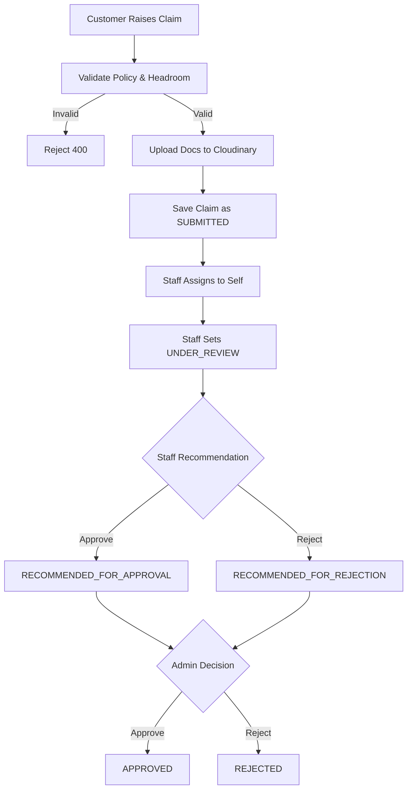
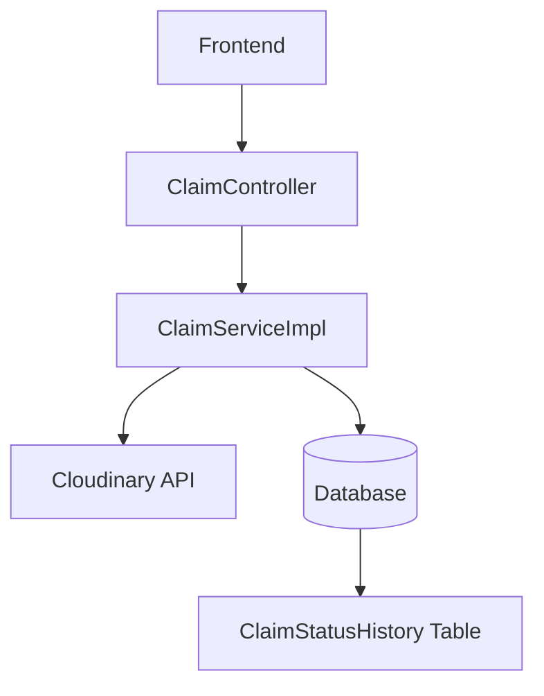
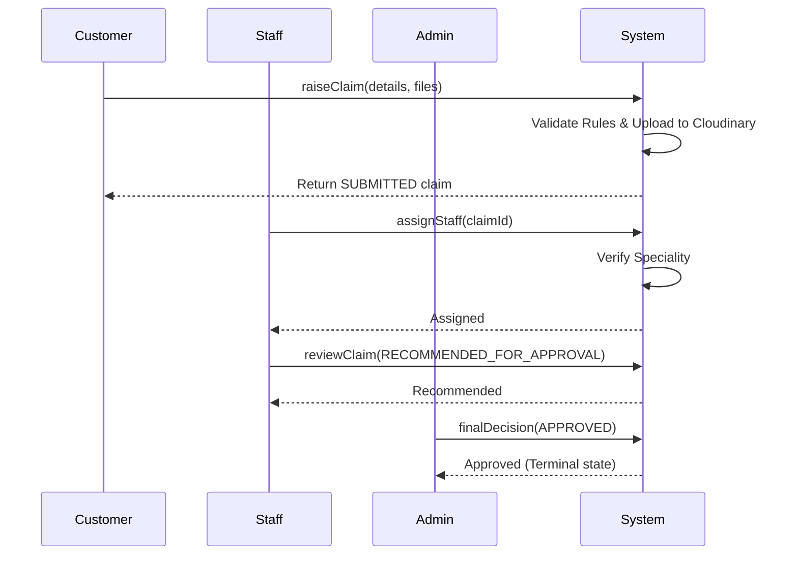
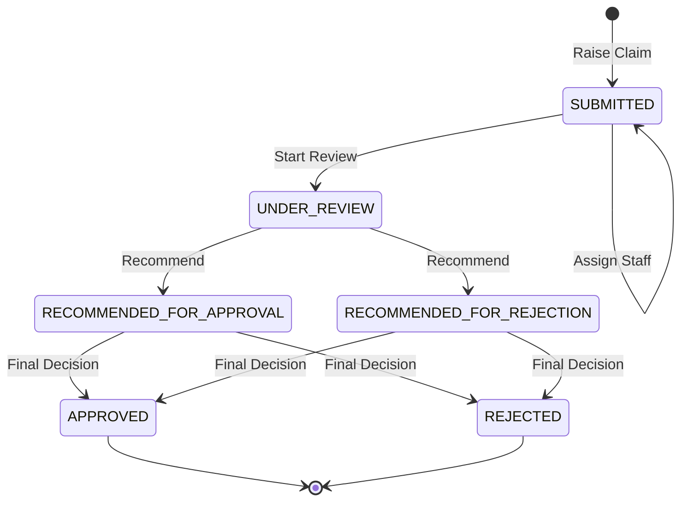

# Claim Workflow
> The end-to-end claim lifecycle: customer submission, staff investigation, admin decision, and immutable audit trailing.

---

## Purpose
Describes how a claim is created, validated, routed, decided, and audited. This enforces separation of duties and guarantees proper tracking of insurance demands.

---

## Overview
- Customer raises a claim with documents.
- Staff investigates and recommends approval/rejection.
- Admin reviews the recommendation and makes the final decision.
- Every state change is recorded in an immutable history table.

---

## Business Context
Claim payouts are the highest-risk financial operation in the system. The maker-checker design separates the staff who investigate from the admin who authorises payout, preventing fraud by ensuring no single actor can push a payout through alone.

---

## Feature Flow

---

## System Flow

---

## Sequence Diagram

---

## Architecture Diagram (if applicable)

---

## Database Design

| Entity | Notes |
|---|---|
| `Claim` | Holds amount, reason, incident date, optimistic lock version. `CLM-<8 hex>` ID. |
| `ClaimDocument` | Holds Cloudinary URLs (`secure_url`), linked to Claim. |
| `ClaimStatusHistory` | Append-only audit trail of every state change. |

---

## API Documentation (if applicable)
N/A - See dedicated API docs.

---

## Frontend Implementation (if applicable)
Handled via `ClaimDashboard`, file upload utilizes `multipart/form-data`.

---

## Backend Implementation
`ClaimServiceImpl.java` orchestrates state changes. `ClaimDocumentServiceImpl.java` handles Cloudinary uploads.

---

## Business Rules

| Rule | WHY it exists |
|---|---|
| Claim amount must not exceed `selectedCoverage - Σ(approved/open claims)`. | Prevents paying out more than the policy's sum assured. |
| Incident date must be between `startDate` and `endDate`. | Ensures the incident happened while the policy was strictly in force. |
| Staff can only assign/review claims matching their `productSpeciality`. | Ensures domain experts review relevant claims (e.g., motor expert reviews car accidents). |

---

## Validation Rules

### Eligibility Checklist (Raise-time)
1. **Documents Required**: ≥ 1 non-empty file (PDF/Image, ≤ 5MB).
2. **Amount**: `claimAmount > 0`.
3. **Policy State**: Policy must be owned by the caller and strictly `ACTIVE`.
4. **Limits**: Incident date cannot be in the future.

---

## Error Handling

| Scenario | HTTP Code | Error Message |
|---|---|---|
| Over claim limit | 400 | `EXCEEDS_LIMIT` |
| Invalid state transition | 400 | `MOVE_TO_UNDER_REVIEW_RESTRICTED` |
| Staff wrong speciality | 403 | `SPECIALITY_VIEW_DENIED` |

---

## Design Decisions

- **Why Maker-Checker?** 
  Separates investigation (Staff) from financial approval (Admin). This is a standard banking/insurance requirement to prevent internal fraud.
- **Why append-only history?** 
  `ClaimStatusHistory` records every status jump, the user who did it, and their remarks. This provides an undisputed timeline for regulatory audits.
- **Why Cloudinary?** 
  Offloads heavy blob storage and bandwidth from the primary relational database. We just store the secure URL reference.

---

## Security (if applicable)
Optimistic locking (`@Version`) on the `Claim` entity prevents concurrent updates (e.g., two staff members trying to assign a claim to themselves simultaneously).

---

## Code References

| Concern | Path |
|---|---|
| Services | `src/main/java/com/insurance/demo/serviceimpl/ClaimServiceImpl.java` |
| Enums | `src/main/java/com/insurance/demo/enums/ClaimStatus.java` |

---

## Interview Notes
1. **Explain the Maker-Checker principle.** It ensures that the person creating or modifying an entity (Maker) cannot be the person authorising it (Checker). Here, Staff recommend, Admins decide.
2. **How do you handle concurrent state modifications?** By using Optimistic Locking (`@Version` in JPA). If two users try to update the claim, the second transaction fails with an `OptimisticLockException`.
3. **How is file storage handled?** Uploaded to a CDN/Storage provider (Cloudinary). The DB only stores metadata and URLs.
4. **Why is Claim History append-only?** For auditability. Previous states and remarks are never overwritten, only new rows are added.
5. **How do you calculate remaining coverage?** Total Coverage minus the sum of all claims that are NOT rejected.
6. **Can an admin bypass staff recommendation?** No, the state machine strictly enforces that a claim must be in a `RECOMMENDED_*` state before an admin can act.

---

## Related Documents
- [Business Rules](../02_Business_Domain/Business_Rules.md)

---

## Future Enhancements
- Auto-expire policies at `endDate` to prevent claims on lapsed policies naturally.
- Revise headroom math to only deduct `APPROVED` claims.
