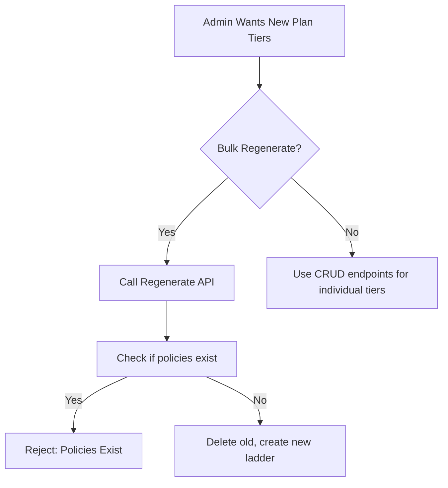

# Coverage Options
> The per-plan sum-assured ladder, strict exact-match requirements, and bulk generation features.

---

## Purpose
Explains how coverage slabs are defined, validated, and consumed by the quoting engine to enforce structured product offerings.

---

## Overview
A `CoverageOption` represents one purchasable sum-assured tier of a plan (e.g., "₹10 Lakhs", "₹25 Lakhs"). A customer can only quote and purchase a coverage amount that exactly equals an active option.

---

## Business Context
Coverage tiers prevent free-form negotiations in a self-service flow. A user cannot ask for "₹12,34,567" in coverage; they must pick an approved tier. This keeps pricing deterministic and aligns with standard insurance product structures.

---

## Feature Flow

---

## System Flow
N/A - Standard CRUD flow.

---

## Sequence Diagram
N/A - Standard CRUD sequence.

---

## Architecture Diagram (if applicable)
N/A

---

## Database Design

| Field | Validation | WHY? |
|---|---|---|
| `coverageAmount` | > 0, precision 15 scale 2 | The exact financial liability limit. |
| `displayOrder` | Integer | Ensures the UI can render tiers sequentially from lowest to highest. |

---

## API Documentation (if applicable)
- `POST /api/admin/policy-plans/{planId}/coverage-options/regenerate`: Autogenerates a ladder (e.g., from 5L to 50L in steps of 5L).

---

## Frontend Implementation (if applicable)
Rendered as a dropdown or selection cards on the Quote screen.

---

## Backend Implementation
Implemented in `CoverageOptionServiceImpl.java`.

---

## Business Rules

| Rule | WHY it exists |
|---|---|
| Coverage must be multiple of ₹50,000, max 5 Cr. | Prevents nonsensical or unsupported risk limits. |
| Cannot regenerate tiers if policies exist. | Protects historical contracts from having their backing tier deleted. |

---

## Validation Rules
Exact match validation at quote time: `requested_coverage == coverage_option.amount`.

---

## Error Handling
Throws 400 Bad Request if bounds or multiple rules are violated during creation.

---

## Design Decisions

- **Why separate entity?** 
  Instead of a simple list of numbers in the plan table, making it a full entity allows us to add metadata (`label`, `displayOrder`, `isActive`) and selectively disable tiers (e.g., turn off the ₹50L tier if it's too risky, without affecting the others).
- **Why ordered by displayOrder?** 
  Relational databases don't guarantee row order. An explicit order column ensures the frontend "Coverage Ladder" always looks logical (lowest to highest).

---

## Security (if applicable)
Customers only see `isActive=true` options. Admin can see and manage all.

---

## Code References

| Concern | Path |
|---|---|
| Service | `src/main/java/com/insurance/demo/serviceimpl/CoverageOptionServiceImpl.java` |

---

## Interview Notes
(Implicit in documentation - specific to design decisions).

---

## Related Documents
- [Insurance Domain](../02_Business_Domain/Insurance_Domain.md)

---

## Future Enhancements
- Soft-deactivate mode for regeneration to preserve historical data instead of a hard delete block.
