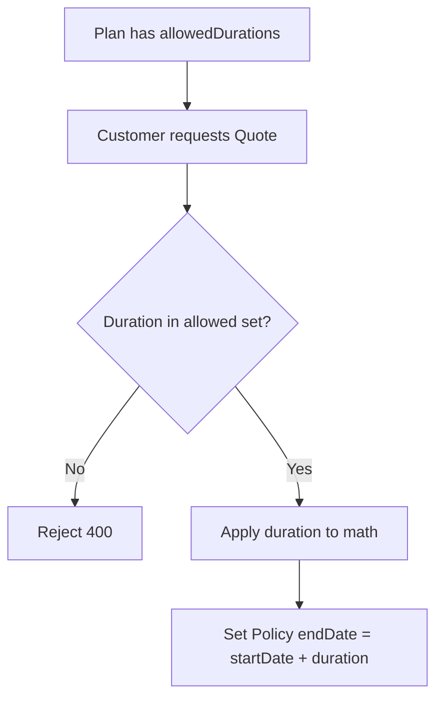

# Duration Model
> How policy durations are represented, validated, and how they scale premiums through one-time discounts.

---

## Purpose
Explains the duration dimension of plans and policies, detailing how they are stored via an ElementCollection and how they influence the contract length and price.

---

## Overview
Durations are expressed in **years**. Each `PolicyPlan` declares a set of supported durations (e.g., {2, 3, 5}). Duration drives the policy's `endDate` and dictates the multi-year discount applied to ONE_TIME premiums.

---

## Business Context
Policy terms in years are the commercial unit of an insurance offer. The same coverage can be sold for different lengths, with longer lump-sum commitments rewarded by bigger upfront discounts.

---

## Feature Flow

---

## System Flow
N/A

---

## Sequence Diagram
N/A

---

## Architecture Diagram (if applicable)
N/A

---

## Database Design

| Feature | Implementation | WHY? |
|---|---|---|
| Durations | `@ElementCollection` in `policy_plan_durations` | Avoids creating a complex full Entity for a simple list of integers. |

---

## API Documentation (if applicable)
N/A

---

## Frontend Implementation (if applicable)
N/A

---

## Backend Implementation
Implemented in `PolicyPlan` entity and `PremiumCalculationServiceImpl`.

---

## Business Rules

| Rule | WHY it exists |
|---|---|
| Cannot remove a duration if policies exist. | Prevents breaking historical policy references to that duration. |

---

## Validation Rules
Requested duration must exist in the plan's `allowedDurations` Set.

---

## Error Handling
400 Bad Request on invalid duration selection.

---

## Design Decisions

- **Why ElementCollection not a separate table?** 
  Because a duration is simply an integer (years). It has no independent lifecycle, no status, and no metadata. Using `@ElementCollection` creates a clean mapping table without the overhead of an explicit JPA Entity.

---

## Security (if applicable)
N/A

---

## Code References

| Concern | Path |
|---|---|
| Entity | `src/main/java/com/insurance/demo/model/PolicyPlan.java` |

---

## Interview Notes
(Implicit in design decisions).

---

## Related Documents
- [Premium Calculation](../02_Business_Domain/Premium_Calculation.md)

---

## Future Enhancements
- Fractional years (e.g., 6 months).
