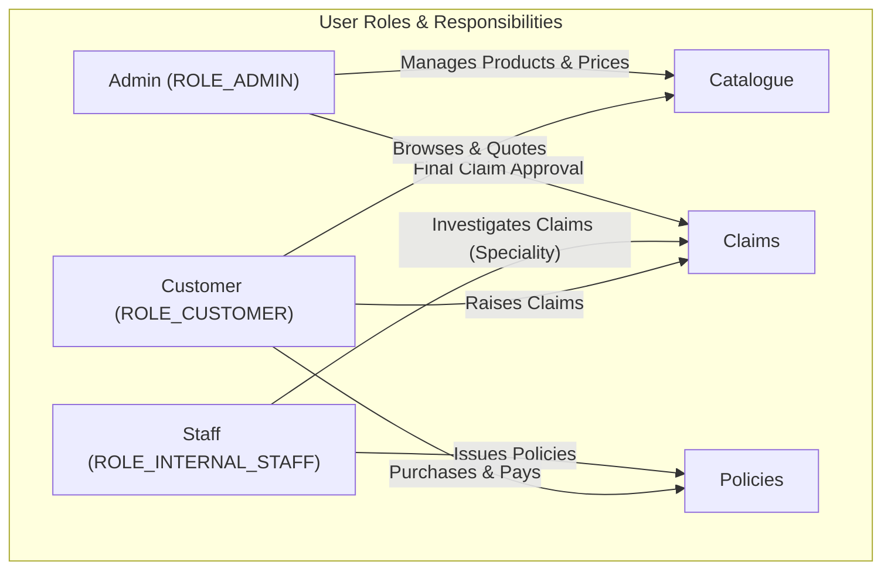
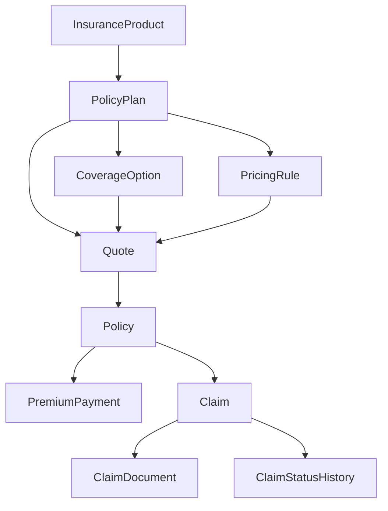
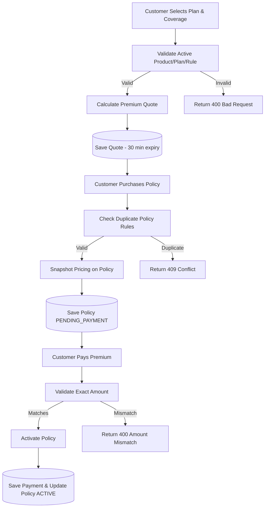
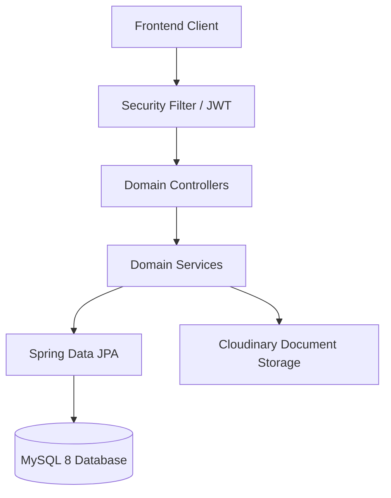
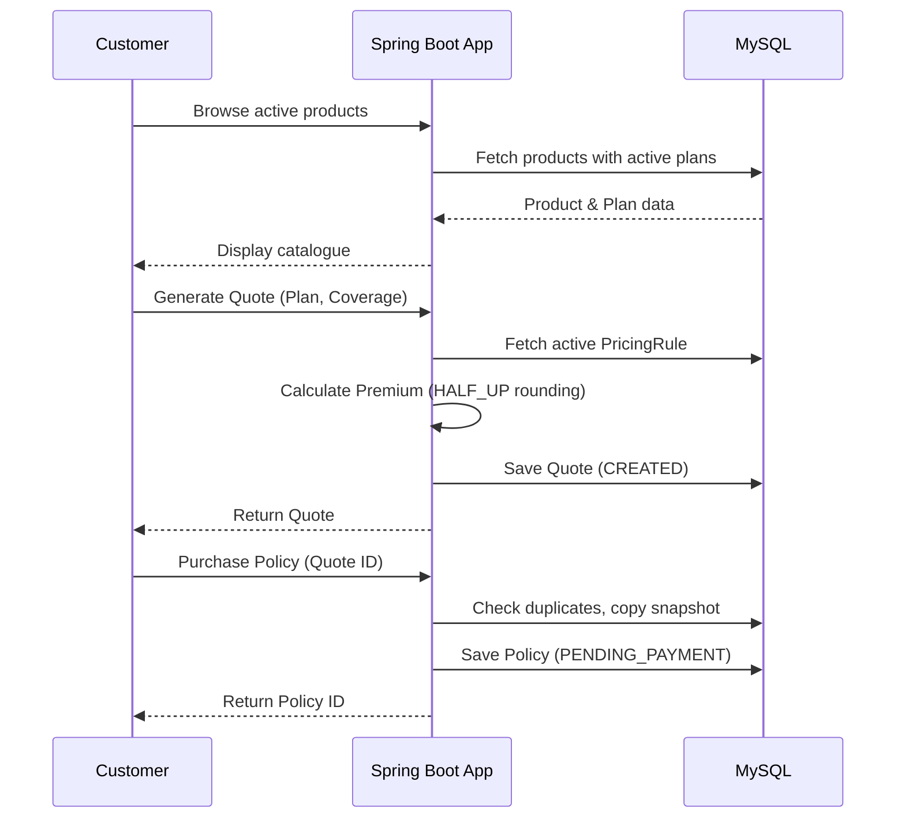
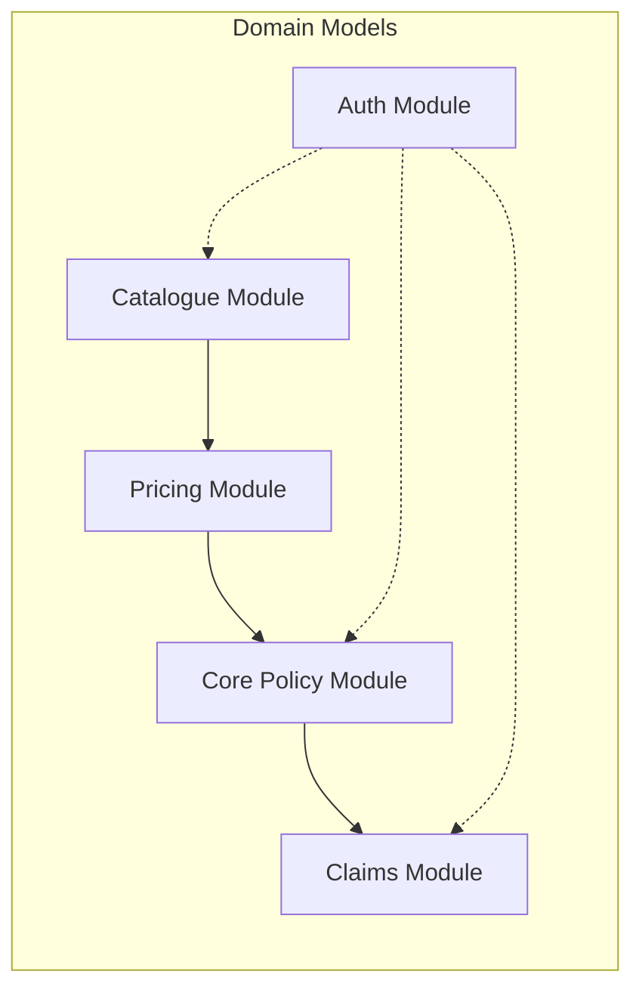

# Insurance Domain
> The core conceptual framework modelling insurance products, quoting, policy issuance, payments, and claim lifecycles for the InsuranceFlow system.

---

## Domain Glossary

| Term | Plain-English Definition |
|---|---|
| **Insurance Product** | A broad category of insurance offered by the company (e.g., Health, Motor, Life). |
| **Policy Plan** | A specific offering under a product with defined rules and durations (e.g., "Comprehensive Motor Plan"). |
| **Coverage Option** | The maximum payout amount a customer can buy (e.g., ₹10 Lakhs, ₹50 Lakhs). |
| **Pricing Rule** | The mathematical factors (risk rate, fee, GST) used to calculate the premium for a plan. |
| **Premium** | The amount of money the customer must pay to activate and maintain the insurance. |
| **Quote** | A temporary 30-minute snapshot showing the calculated premium for a chosen plan and coverage. |
| **Policy** | The legally binding contract between the customer and the company, active after payment. |
| **Premium Payment** | The actual monetary transaction recorded against a policy to activate or renew it. |
| **Claim** | A formal request by the customer for a payout following an incident covered by the policy. |
| **Claim Document** | Evidence files (PDF/images) uploaded by the customer to support their claim. |
| **Claim Status History** | The immutable audit trail showing exactly who changed a claim's status and when. |
| **Sum Assured** | Another term for the selected coverage amount; the maximum liability of the company. |
| **Duration** | The time period (in years) the policy contract is valid for. |
| **Premium Type** | Whether the policy is paid once (`ONE_TIME`) or yearly (`ANNUAL`). |
| **Customer** | The end-user who buys policies, pays premiums, and raises claims. |
| **Internal Staff** | A company employee who investigates claims and issues policies for their specific product speciality. |
| **Admin** | A super-user who manages the product catalogue, sets prices, and makes final claim payout decisions. |
| **Maker-Checker** | A security principle where the person who investigates (staff) cannot be the person who approves (admin). |
| **Snapshotting** | Copying pricing data directly onto a policy so future price changes don't affect existing contracts. |
| **Base Risk Rate** | The actuarial multiplier applied to the coverage amount to determine the base premium. |

---

## Purpose
Introduces the business vocabulary of the system for developers, architects, testers, and evaluators. It maps every business concept to its authoritative entity and service, providing a conceptual map of the whole domain.

---

## Overview
The platform is a three-role insurance back-office and customer portal:
- Admins configure the catalogue and approve claims.
- Staff investigate claims and issue policies.
- Customers buy coverage and raise claims.

---

## Business Context
Insurance products are discrete offer families. Customers must not accidentally double-buy, must see only active products, must have their money reconciled exactly to a computed premium, and must have a transparent claim path.

---

## Feature Flow

---

## System Flow

---

## Sequence Diagram

---

## Architecture Diagram (if applicable)

---

## Database Design

| Concept | Entity / Table | Constraints & Notes | WHY this design? |
|---|---|---|---|
| User | `AppUser` (`users`) | Unique email & mobile. | Single unified identity table for all roles. |
| Customer Profile | `Customer` (`customers`) | 1:1 with `AppUser`. | Separates core auth from rich business profile data. |
| Insurance Product | `InsuranceProduct` (`insurance_products`) | Unique `productName` (lowercase). | Organises plans logically; soft delete preserves history. |
| Policy Plan | `PolicyPlan` (`policy_plans`) | FK to product. | Contains allowed durations and premium types. |
| Coverage Slab | `CoverageOption` (`coverage_options`) | FK to plan. | Restricts users to canonical, approved sum-assured tiers. |
| Pricing Inputs | `PricingRule` (`pricing_rules`) | FK to plan. | Separated from plan to allow pricing history/versioning. |
| Quote | `Quote` (`quotes`) | 30-min validity. | Locks price temporarily to prevent racing condition on purchase. |
| Policy Contract | `Policy` (`policies`) | Full premium snapshot. | Completely isolates the contract from future catalogue price changes. |
| Claim | `Claim` (`claims`) | FK to policy. | Tracks demand against a specific active policy. |

---

## API Documentation (if applicable)
N/A - Domain overview. See specific workflow documents for APIs.

---

## Frontend Implementation (if applicable)
Implemented across multiple React pages: `Products.jsx`, `Plans.jsx`, `QuoteGenerator.jsx`, `PolicyDashboard.jsx`, `ClaimFiling.jsx`. Uses `react-hook-form` for complex submissions.

---

## Backend Implementation
Implemented across `serviceimpl/*ServiceImpl.java` files. Money logic relies heavily on `BigDecimal` with exact precision configurations. Enums represent statuses stored as strings for database readability.

---

## Business Rules

| Rule | WHY it exists |
|---|---|
| Money uses `BigDecimal` with precision 15, scale 2. Rates use scale 4. All rounding is `HALF_UP`. | Prevents floating-point errors; ensures exact reconciliation. |
| Identifiers use standardized prefixes (`POL-`, `CLM-`, `TRX-`). | Instantly identifies the entity type in support tickets/logs. |
| Soft deactivation (`isActive=false`) instead of hard deletes. | Preserves historical data integrity for a highly regulated industry. |

---

## Validation Rules
N/A - Domain overview.

---

## Error Handling
Exceptions are managed by a `@RestControllerAdvice` translating domain exceptions (e.g., `PolicyNotFoundException`, `DuplicateResourceException`) into standard HTTP 4xx/5xx statuses with descriptive business error messages.

---

## Design Decisions

- **Why this domain model?** 
  Separating the catalogue (Products/Plans/Coverage/Pricing) from the contracts (Quotes/Policies) ensures clear boundaries between "what we sell" and "what was sold".
- **Why snapshot pricing?** 
  By copying `baseRiskRate`, `processingFee`, and `gst` directly onto the `Policy` entity, we guarantee that if an admin raises prices tomorrow, an existing customer's annual renewal or contract terms remain unchanged. This is a critical legal requirement in insurance.
- **Why separate entities for Coverage and Pricing?** 
  Allows independent versioning. A plan can have stable coverage tiers for years while its pricing rules are updated annually.

---

## Security (if applicable)
Authentication relies on short-lived JWTs and opaque HttpOnly refresh tokens. Role-Based Access Control (RBAC) ensures only customers buy, only staff recommend, and only admins approve.

---

## Code References

| Concern | Path |
|---|---|
| Entities | `src/main/java/com/insurance/demo/model/*.java` |
| Enums | `src/main/java/com/insurance/demo/enums/*.java` |

---

## Interview Notes
1. **How do you handle money in Java?** Use `BigDecimal`, set specific scales, and use `RoundingMode.HALF_UP`. Never use `double` or `float` for currency.
2. **How do you prevent active policies from changing when prices update?** Snapshotting. The policy table has columns for the exact rates and fees used at the time of purchase.
3. **Why use soft deletes (`isActive` flag) instead of `DELETE` queries?** To maintain referential integrity. If a plan is deleted, the database would throw FK constraint errors for policies tied to that plan.
4. **How are custom IDs like `POL-1A2B3C` generated?** Usually via a utility class using secure random hex generation, attached during entity creation before saving.
5. **What is the difference between Authentication and Authorization in this domain?** Authentication is logging in (getting the JWT). Authorization is ensuring a `ROLE_CUSTOMER` cannot access the admin pricing endpoints.

---

## Related Documents
- [Premium Calculation](../02_Business_Domain/Premium_Calculation.md)
- [Claim Workflow](../02_Business_Domain/Claim_Workflow.md)

---

## Future Enhancements
- Policy renewal as an explicit first-class flow rather than a re-purchase.
- Distributed rate limiting (Redis-backed).
