# Payment Workflow
> How premium payments are recorded, validated against exact amounts, and trigger policy activation.

---

## Purpose
Describes the money-movement layer of the platform, focusing on exact-amount enforcement, transaction references, and payment queries.

---

## Overview
A `PremiumPayment` is a recorded money movement against a policy. A `SUCCESS` payment is the ONLY mechanism that moves a policy from `PENDING_PAYMENT` to `ACTIVE`.

---

## Business Context
Exact-amount matching guarantees a customer pays precisely the quoted, GST-inclusive premium. Unique transaction references prevent double-charging.

---

## Feature Flow

```mermaid
flowchart TD
    Start[Submit Payment] --> Val[Check Policy Status]
    Val --> Amt[Check Amount == calculatedPremium]
    Amt --> Ref[Check Unique TRX Reference]
    Ref --> Mode[Check ONE_TIME vs ANNUAL rules]
    Mode --> Save[Save Payment Row]
    Save --> Success{Status == SUCCESS?}
    Success -->|Yes| Act[Activate Policy & Add to Total Paid]
    Success -->|No| Leave[Leave Policy Pending/Failed]
```

---

## System Flow
N/A

---

## Sequence Diagram
N/A

---

## Architecture Diagram (if applicable)
N/A

---

## Database Design

| Field | Constraints | WHY? |
|---|---|---|
| `transactionReference` | Unique, `TRX-<hex>` | Idempotency key to prevent duplicate processing. |
| `paymentStatus` | PENDING, SUCCESS, FAILED | Records failed attempts for audit, not just successes. |

---

## API Documentation (if applicable)
- `POST /api/payments`: Records a payment outcome.

---

## Frontend Implementation (if applicable)
N/A

---

## Backend Implementation
Implemented in `PremiumPaymentServiceImpl.java`.

---

## Business Rules

| Mode | Modes Available |
|---|---|
| Payment | UPI, CARD, NET_BANKING, CASH |

---

## Validation Rules
Amount submitted must EXACTLY equal `policy.calculatedPremium`.

---

## Error Handling
400 Bad Request `AMOUNT_MISMATCH` if payment differs by even a cent.

---

## Design Decisions

- **Why exact-amount match?** 
  We don't allow partial payments or overpayments. This eliminates complex ledger reconciliation logic. You either pay the exact quote, or the payment is rejected.
- **Why TRX- prefix?** 
  Makes it instantly recognisable in logs, support tickets, and DB queries compared to claim or policy IDs.
- **Why record FAILED payments?** 
  If a customer claims they paid but the system didn't activate the policy, support needs to see the failed attempt to trace the issue with the payment gateway.

---

## Security (if applicable)
Users can only pay for policies they own.

---

## Code References

| Concern | Path |
|---|---|
| Service | `src/main/java/com/insurance/demo/serviceimpl/PremiumPaymentServiceImpl.java` |

---

## Interview Notes
(Implicit in design decisions).

---

## Related Documents
- [Policy Workflow](../02_Business_Domain/Policy_Workflow.md)

---

## Future Enhancements
- Outbound payment gateway integration (currently the platform just records the outcome).
