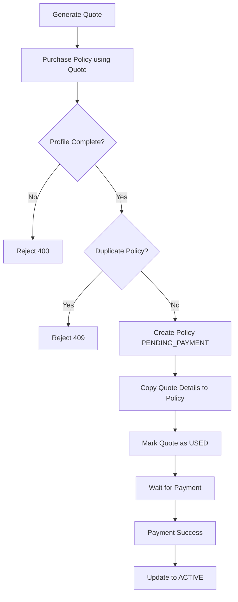
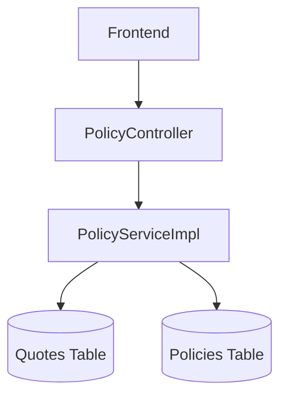
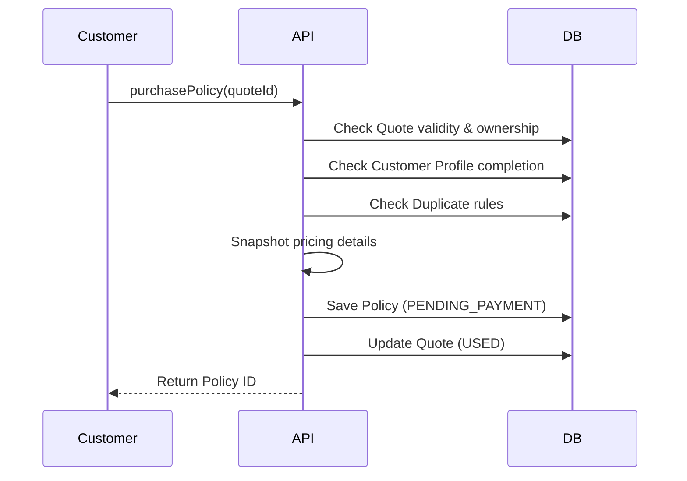
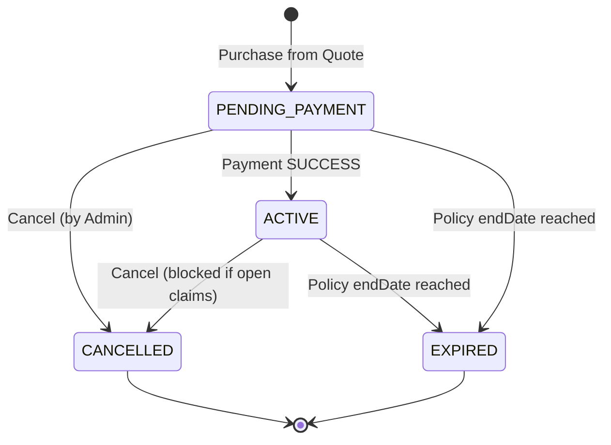

# Policy Workflow
> The full lifecycle from temporary quote to an in-force policy, handling exact snapshotting and status transitions.

---

## Purpose
Explains how a customer moves from a quote to an in-force policy and how the policy is priced, stored, activated, and terminated.

---

## Overview
A policy is a priced, dated contract for a specific customer. 
- It starts as `PENDING_PAYMENT`.
- Becomes `ACTIVE` upon successful payment.
- Can be cancelled (if no claims exist) or expire.

---

## Business Context
Policies are the revenue and liability core of the business. A policy must record EXACTLY what was sold at EXACTLY what price. This ensures claims and renewals are grounded in a frozen snapshot rather than live catalogue values.

---

## Feature Flow

---

## System Flow

---

## Sequence Diagram

---

## Architecture Diagram (if applicable)

---

## Database Design

| Field | Source | Meaning |
|---|---|---|
| `selectedCoverage` | Quote | Exact coverage purchased |
| `policyDuration` | Quote | Number of years |
| `calculatedPremium` | Quote | Total payable amount per transaction |
| `premiumRateUsed` | PricingRule | Base risk rate frozen at purchase |
| `processingFeeUsed` | PricingRule | Fee frozen at purchase |

---

## API Documentation (if applicable)
- `POST /api/policies/purchase`: Customer turns a quote into a policy.
- `POST /api/policies/issue`: Staff issues a policy on behalf of a customer.

---

## Frontend Implementation (if applicable)
Handled via `QuoteGenerator` and `PolicyDashboard`.

---

## Backend Implementation
Implemented in `com.insurance.demo.serviceimpl.PolicyServiceImpl`.

---

## Business Rules

| From | To | Actor | Condition | Result |
|---|---|---|---|---|
| None | PENDING_PAYMENT | Customer | Valid CREATED quote | Policy created, Quote USED |
| PENDING_PAYMENT | ACTIVE | System | Payment SUCCESS | Total premium updated, cover starts |
| ACTIVE | CANCELLED | Admin | No open claims | Policy cancelled |

---

## Validation Rules
See Business Rules document.

---

## Error Handling
Throws `DuplicateResourceException` (409) if the user already has a pending policy for that plan.

---

## Design Decisions

- **Why PENDING_PAYMENT state?** 
  Separating contract creation from money movement prevents distributed transaction failures. The policy exists as an intent to pay, giving us a target ID to record the payment against.
- **Why snapshot pricing?** 
  Insurance contracts are legally binding. If the company raises the GST or Base Risk Rate tomorrow, the existing customer's contract must mathematically remain identical to the day they bought it.

---

## Security (if applicable)
Staff can only issue policies for plans that match their specific `productSpeciality`.

---

## Code References

| Concern | Path |
|---|---|
| Service | `src/main/java/com/insurance/demo/serviceimpl/PolicyServiceImpl.java` |

---

## Interview Notes
1. **Explain Snapshotting.** Copying data (rates, fees) from a reference table into the transactional table (Policy) at creation time so it's immune to future catalogue updates.
2. **Why separate quote and policy creation?** A Quote is a lightweight estimate. A Policy requires heavy validation (profile checks, duplicate checks).
3. **How does payment activate the policy?** The Payment service fires a successful status update, and the Policy service transitions the state to `ACTIVE`.
4. **What happens if a user tries to use a quote twice?** The quote status is checked; if it's `USED`, it throws an exception.
5. **Can an active policy be cancelled anytime?** No. It is blocked if there are open or pending claims.

---

## Related Documents
- [Premium Calculation](../02_Business_Domain/Premium_Calculation.md)
- [Business Rules](../02_Business_Domain/Business_Rules.md)

---

## Future Enhancements
- Scheduled background job to automatically transition policies to `EXPIRED` at `endDate`.
