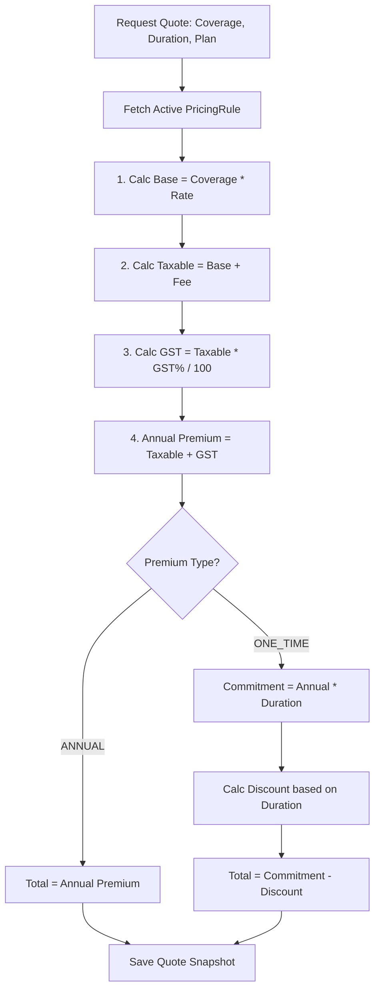
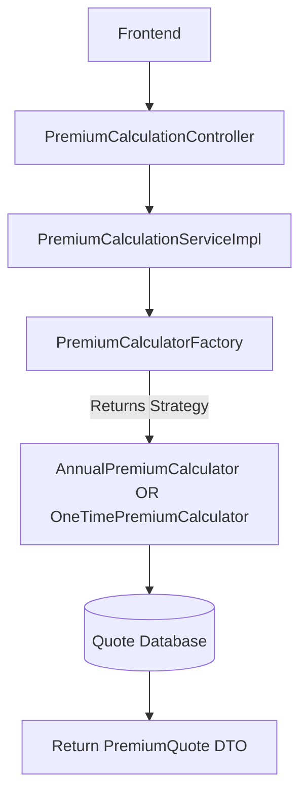
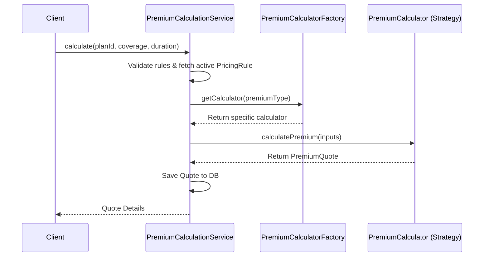
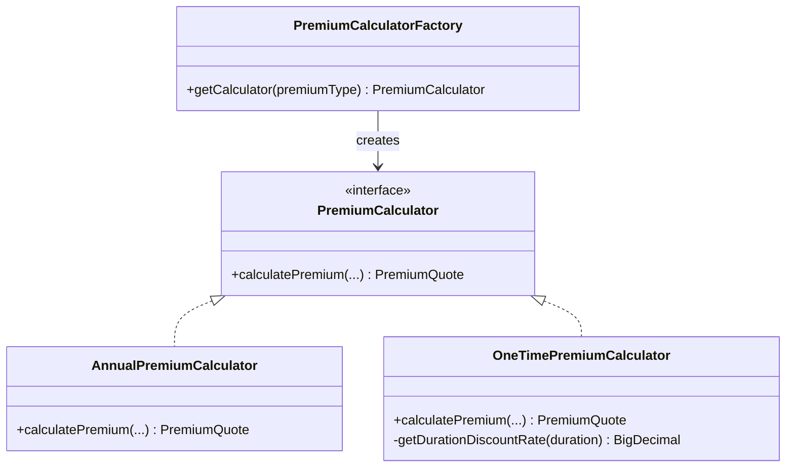

# Premium Calculation
> The authoritative premium mathematics: base risk premium, processing fee, GST, duration discounts, and exact HALF_UP rounding rules implemented via Strategy Pattern.

---

## Purpose
Single source of truth for how premiums are computed. All other documents — quotes, policies, payments, pricing previews — reference this document rather than re-deriving the math.

---

## Overview
A premium is computed from a coverage amount using the plan's active `PricingRule` inputs (`baseRiskRate`, `processingFee`, `gst`), the requested duration, and the plan's `PremiumType` (`ONE_TIME` or `ANNUAL`). 
- **ANNUAL**: Customer pays a calculated amount every year.
- **ONE_TIME**: Customer pays upfront for multiple years and receives a duration-based discount.

---

## Business Context
Deterministic, audit-safe pricing is non-negotiable in insurance. Every step rounds with `BigDecimal` and `RoundingMode.HALF_UP`, so the exact amount quoted is the exact amount a customer must pay — payment validation is an exact equality match against `calculatedPremium`.

---

## Feature Flow

---

## System Flow

---

## Sequence Diagram

---

## Architecture Diagram (if applicable)

---

## Database Design
N/A - This document focuses on mathematics. The resulting Quote snapshot is stored in the `quotes` table.

---

## API Documentation (if applicable)
- `POST /api/premium/calculate` (Customer)
- `POST /api/premium/admin/calculate` (Admin)
- Both return a `PremiumQuote` DTO.

---

## Frontend Implementation (if applicable)
Handled in `QuoteGenerator.jsx`.

---

## Backend Implementation
Implemented in `com.insurance.demo.service.strategy.*`.

---

## Business Rules

### Duration Discount Schedule
Applies ONLY to `ONE_TIME` policies.

| Duration (years) | Discount Rate |
|---|---|
| ≤ 1 | 0% |
| 2 | 2% |
| 3 | 5% |
| 5 | 8% |
| 7 | 10% |
| 10 | 12% |
| 15 | 15% |
| 20 | 18% |
| > 20 | 20% |

---

## Validation Rules
- Duration must be inside the plan's `allowedDurations`.
- Coverage must exactly match an active `CoverageOption`.
- There must be an active `PricingRule` for the plan.

---

## Error Handling
- Invalid coverage/duration triggers 400 Bad Request (`Invalid duration for this plan`, `Invalid coverage amount selected`).
- Missing pricing rule triggers 400 Bad Request (`No active pricing rule found for this plan`).

---

## Design Decisions

- **Why Strategy pattern?** 
  `ONE_TIME` and `ANNUAL` policies have distinct mathematical pipelines. By abstracting this into `PremiumCalculator` strategies, the core quoting service is decoupled from the math. Adding a new payment structure (e.g., `MONTHLY`) would just require a new strategy class, fulfilling the Open/Closed Principle.
- **Why HALF_UP rounding?** 
  Standard commercial rounding. Half rounds to the next highest number. This guarantees consistent, reproducible totals without fractional pennies getting lost in float precision.
- **Why snapshot at quote time?** 
  A quote must represent a legally binding offer valid for exactly 30 minutes. If the underlying `PricingRule` changes 5 minutes after a quote is generated, the quote must still honour the math calculated at generation time.

---

## Security (if applicable)
Customers can only quote active plans. Admins have a special endpoint to calculate quotes for inactive/testing plans.

---

## Code References

| Concern | Path |
|---|---|
| Strategy Interface | `src/main/java/com/insurance/demo/service/strategy/PremiumCalculator.java` |
| Annual Strategy | `src/main/java/com/insurance/demo/service/strategy/AnnualPremiumCalculator.java` |
| One Time Strategy | `src/main/java/com/insurance/demo/service/strategy/OneTimePremiumCalculator.java` |

---

## Interview Notes
1. **Explain the Strategy Pattern.** It defines a family of algorithms, encapsulates each one, and makes them interchangeable. Here, we use it to swap between Annual and One-Time premium math dynamically based on the plan type.
2. **How does the system handle currency precision?** Uses `BigDecimal` with scale 0 (whole rupees) and `RoundingMode.HALF_UP` for final amounts. Intermediate rates use precision 10, scale 4.
3. **What happens if a pricing rule is updated while a user holds a valid quote?** The quote remains valid for its 30-minute window because it holds a snapshot of the rates, not a live reference.
4. **Why is the Factory pattern used alongside Strategy?** The Factory (`PremiumCalculatorFactory`) resolves which strategy bean (`ONE_TIME_CALCULATOR` vs `ANNUAL_CALCULATOR`) to inject based on the `PremiumType` enum at runtime.
5. **How is the One-Time discount calculated?** `totalCommitment` (Annual Premium * Duration) minus `discountAmount` (Total Commitment * Discount Rate).
6. **Why don't we use floats or doubles for money?** They use base-2 floating point representation which cannot accurately represent base-10 decimals, leading to precision loss (e.g., 0.1 + 0.2 = 0.30000000000000004).

---

## Worked Examples

### 1. ONE_TIME, MOTOR
`coverage = 10,00,000`, `rate = 0.030`, `fee = 150`, `gstPct = 18`, `duration = 3`.
1. base = 10,00,000 × 0.030 = **30,000**
2. processingFee = **150**
3. taxable = 30,000 + 150 = **30,150**
4. gst = 30,150 × 18 / 100 = 5,427.0 → **5,427**
5. annualPremium = 30,150 + 5,427 = **35,577**
6. totalCommitment = 35,577 × 3 = **106,731**
7. discount (3 yr = 5%) = 106,731 × 0.05 = 5,336.55 → **5,337**
8. **totalPremium = 106,731 − 5,337 = 101,394**

### 2. ANNUAL, LIFE
`coverage = 50,00,000`, `rate = 0.008`, `fee = 200`, `gstPct = 0`, `duration = 10`.
1. base = 50,00,000 × 0.008 = **40,000**
2. processingFee = **200**
3. taxable = **40,200**
4. gst = 40,200 × 0 / 100 = **0**
5. annualPremium = **40,200**
6. totalCommitment = 40,200 × 10 = **402,000**
7. discount = **0**
8. **totalPremium (per year) = 40,200**

### 3. ONE_TIME, HEALTH
`coverage = 5,00,000`, `rate = 0.025`, `fee = 100`, `gstPct = 0`, `duration = 2`.
1. base = 5,00,000 × 0.025 = **12,500**
2. processingFee = **100**
3. taxable = **12,600**
4. gst = **0**
5. annualPremium = **12,600**
6. totalCommitment = 12,600 × 2 = **25,200**
7. discount (2 yr = 2%) = 25,200 × 0.02 = **504**
8. **totalPremium = 25,200 − 504 = 24,696**

---

## Related Documents
- [Business Rules](../02_Business_Domain/Business_Rules.md)
- [Policy Workflow](../02_Business_Domain/Policy_Workflow.md)

---

## Future Enhancements
- Move the discount schedule out of code and into the database/configuration to allow dynamic adjustments without recompiling.
- Explicit rounding-scale configuration at the application property level.
