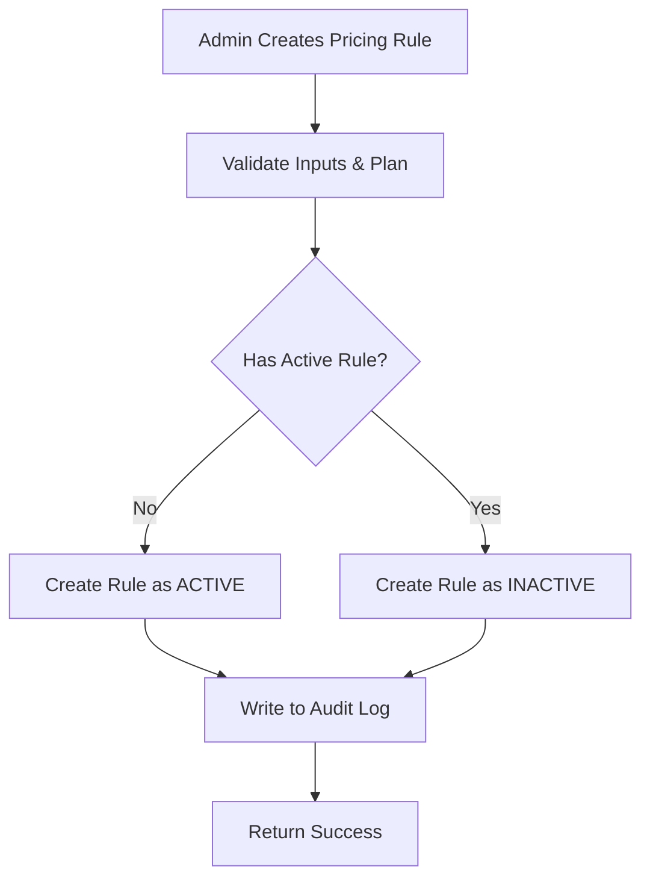
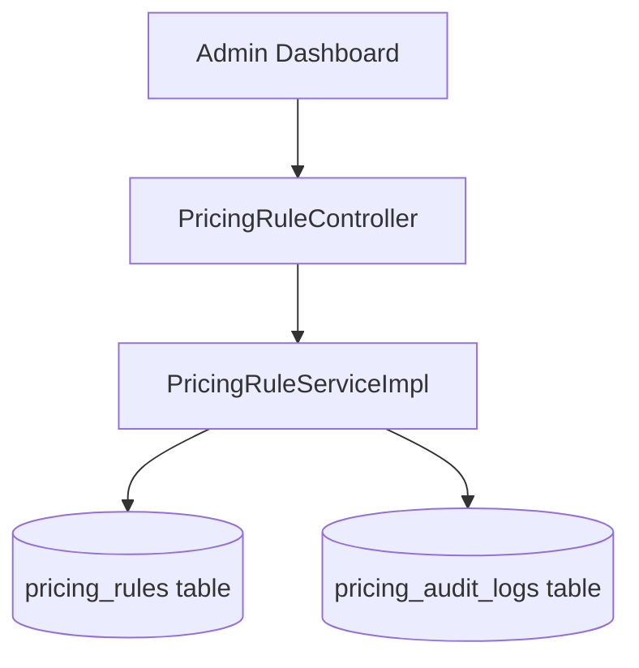
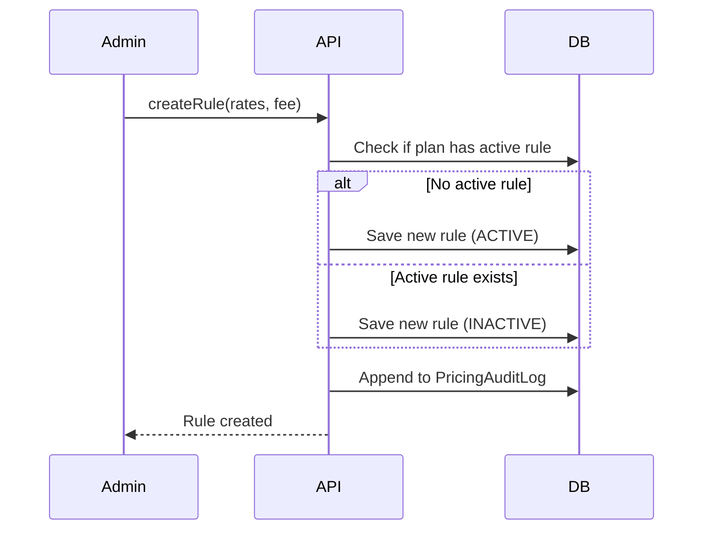

# Pricing Rules
> The lifecycle of actuarial inputs: one active rule per plan, pricing previews, and the immutable audit log.

---

## Purpose
Explains how pricing rules are created, activated, audited, and previewed by administrators to safely control product pricing.

---

## Overview
A `PricingRule` holds the three actuarial inputs to price coverage on a plan: `baseRiskRate`, `processingFee`, and `gst`. Each plan has **exactly one ACTIVE rule at a time**.

---

## Business Context
Pricing is the main revenue lever. Admins must be able to change prices without rewriting history. The one-active-rule invariant prevents ambiguous pricing.

---

## Feature Flow

---

## System Flow

---

## Sequence Diagram

---

## Architecture Diagram (if applicable)
N/A

---

## Database Design

| Entity | Notes | WHY? |
|---|---|---|
| `PricingRule` | Holds rates, effective dates, status. | Decoupled from plan to allow versioning. |
| `PricingAuditLog` | JSON snapshot of old/new configurations. | Regulatory requirement for price changes. |

---

## API Documentation (if applicable)
- `POST /api/admin/pricing-rules/preview`: Allows admin to simulate a premium calculation before activating the rule.

---

## Frontend Implementation (if applicable)
Handled in `AdminPricingDashboard`.

---

## Backend Implementation
Implemented in `PricingRuleServiceImpl.java`.

---

## Business Rules

| Rule | WHY it exists |
|---|---|
| One active rule per plan. | Quote engine needs a single, unambiguous mathematical source of truth. |
| Cannot activate a rule if another is active. | Forces the admin to explicitly deactivate the old one first, preventing accidents. |

---

## Validation Rules
- Cannot delete a rule if it is referenced by existing quotes or policies.

---

## Error Handling
Activating a rule when one is already active throws a 400 Bad Request.

---

## Design Decisions

- **Why separate PricingRule from PolicyPlan?** 
  Plans are stable (e.g., "Silver Health"). Prices change yearly due to inflation. Separating them allows adding a new PricingRule without creating a whole new plan.
- **Why one active rule per plan?** 
  Ensures absolute determinism when a customer requests a quote.
- **Why keep an audit history?** 
  Insurance is regulated. If a customer questions their premium, support can trace exactly who changed the rate and when using the `PricingAuditLog`.

---

## Security (if applicable)
All pricing modification endpoints are strictly locked to `ROLE_ADMIN`.

---

## Code References

| Concern | Path |
|---|---|
| Service | `src/main/java/com/insurance/demo/serviceimpl/PricingRuleServiceImpl.java` |

---

## Interview Notes
1. **How do you handle price changes without breaking old policies?** By keeping the old pricing rules in the database as INACTIVE and snapshotting their values onto the policy at purchase time.
2. **Why do we need an Audit Log for pricing?** For regulatory compliance and transparency, proving exactly what rates were active at any given historical moment.
3. **How does the preview endpoint work?** It's a lightweight estimation endpoint that runs the basic premium math without validating plan limits or saving a quote to the DB.
4. **How do you enforce the 'one active rule' invariant?** The database queries the plan's rules. If an active one exists, activation of a new one is rejected at the service layer until the old one is explicitly deactivated.

---

## Related Documents
- [Premium Calculation](../02_Business_Domain/Premium_Calculation.md)

---

## Future Enhancements
- Scheduled job to auto-activate rules when their `effectiveFrom` date arrives.
