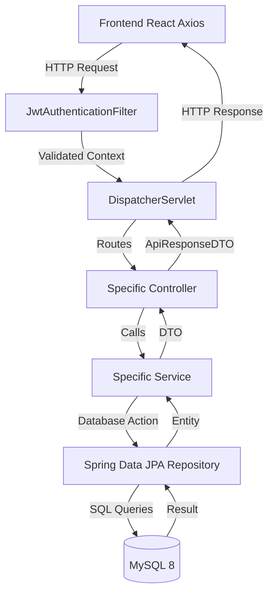
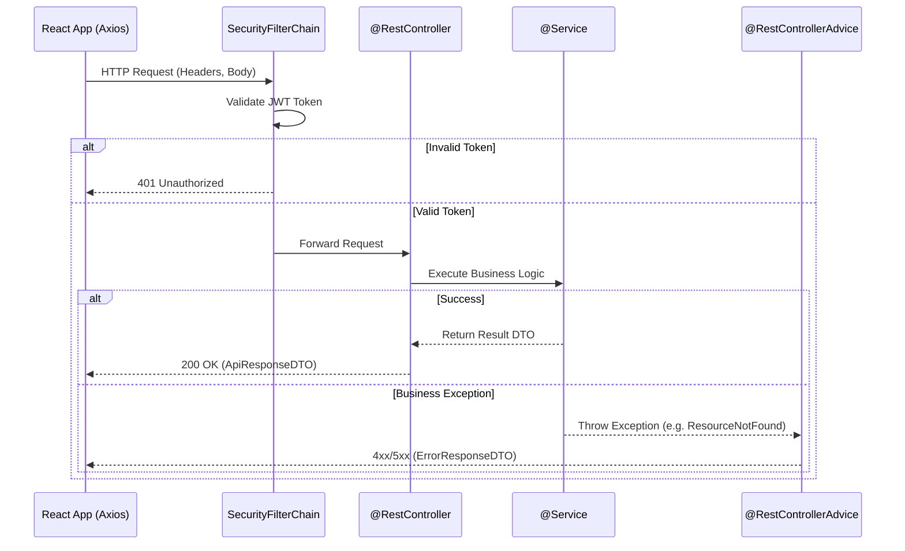

> The central nervous system of InsuranceFlow, defining the standardized request, response, and error handling patterns across the entire API suite.

---

## Purpose
This document explains the overarching API architecture for InsuranceFlow. It defines how the frontend communicates with the backend, the uniform structure of API responses, and how errors are handled globally. It is essential reading for any developer working on either the React frontend or the Spring Boot backend to ensure consistent data exchange.

---

## Overview
- **RESTful Design**: Standard HTTP methods and resource-oriented URLs.
- **Uniform Responses**: Every API returns a consistent `ApiResponseDTO` envelope.
- **Global Error Handling**: Centralized `@RestControllerAdvice` translates exceptions into `ErrorResponseDTO`.
- **JWT Authentication**: Secured endpoints expect a `Bearer` token in the `Authorization` header.
- **Cross-Origin Resource Sharing (CORS)**: Configured globally to allow frontend dev server (port 5173) and production domains.

---

## Business Context
For a complex system like insurance management, standardizing API communication prevents integration bugs and reduces frontend boilerplate. Having a uniform response wrapper means the frontend always knows where to look for data (`data` field) or error details (`message`, `errors` fields). It also ensures a consistent user experience during failures.

---

## Feature Flow
```mermaid
flowchart TD
    A[Client Action] --> B{Valid Request?}
    B -- No --> C[Frontend Validation Error]
    B -- Yes --> D[Axios Request with Bearer Token]
    D --> E[Spring Security Filter Chain]
    E -- Auth Failed --> F[401/403 ErrorResponseDTO]
    E -- Success --> G[Controller]
    G --> H[Service Layer]
    H --> I[Repository]
    I --> J[Database]
    J --> K[Return Entity/DTO]
    K --> L[Wrap in ApiResponseDTO]
    L --> M[Frontend Receives Response]
    
    H -. Exception .-> N[@RestControllerAdvice]
    N --> O[ErrorResponseDTO]
    O --> M
```

---

## System Flow


---

## Sequence Diagram


---

## Database Design
N/A - This document focuses on the API transport layer, not database schemas.

---

## API Documentation (if applicable)

### Global Request/Response Format
All successful responses are wrapped in `ApiResponseDTO`.

**Example:**
```json
{
  "success": true,
  "message": "Operation completed successfully",
  "data": {
    "id": 1,
    "status": "ACTIVE"
  },
  "timestamp": "2026-08-05T20:08:57+05:30"
}
```

### Global Error Format
All errors are handled and return `ErrorResponseDTO`.

**Example:**
```json
{
  "success": false,
  "message": "Validation Failed",
  "errors": {
    "email": "Must be a valid email address",
    "password": "Password is required"
  },
  "errorCode": "VALIDATION_ERROR",
  "timestamp": "2026-08-05T20:08:57+05:30"
}
```

### API Endpoint Groups

| Group | Prefix | Purpose | Security Level |
|---|---|---|---|
| Auth | `/api/auth` | Login, Registration, OTP, Tokens | Public |
| Users | `/api/users` | Profile management | Authenticated |
| Products | `/api/products` | View available insurance types | Public/Authenticated |
| Admin Products | `/api/admin/products` | Manage products | Admin |
| Plans | `/api/plans` | View specific plans | Public/Authenticated |
| Admin Plans | `/api/admin/plans` | Manage plans | Admin |
| Policies | `/api/policies` | Customer policy operations | Customer |
| Premium | `/api/premium` | Quote calculation | Authenticated |
| Admin/Staff Policies| `/api/admin/policies`, `/api/staff/policies` | Management | Admin, Staff |
| Claims | `/api/claims` | Claims processing | Customer, Staff, Admin |
| Documents | `/api/document` | File uploads to Cloudinary | Authenticated |
| Payments | `/api/payments` | Payment processing | Customer |
| Pricing Rules | `/api/admin/pricing-rules` | Dynamic pricing configuration | Admin |

---

## Frontend Implementation
- **Location**: `src/api/axios.js`
- **Details**: Axios interceptors are used to inject the `Authorization: Bearer <token>` header automatically. A response interceptor is used to globally handle 401s and trigger token refresh or logout.

---

## Backend Implementation
- **Location**: `com.insurance.demo.dto.ApiResponseDTO`, `com.insurance.demo.dto.ErrorResponseDTO`, `com.insurance.demo.exception.GlobalExceptionHandler`
- **Details**: `@RestControllerAdvice` catches all custom exceptions (e.g., `ResourceNotFoundException`, `UnauthorizedException`) and formats them uniformly.

---

## Business Rules
| Rule | Reason |
|---|---|
| Consistent envelope | Allows frontend to parse responses blindly without per-endpoint logic. |
| Meaningful HTTP Status | 2xx for success, 4xx for client error, 5xx for server error. Respects standard semantics. |
| Secure by default | CORS restricted, JWT validated early in the filter chain to prevent unauthenticated access. |

---

## Validation Rules
- **Input**: Hibernate Validator (`@Valid`, `@NotBlank`, etc.) triggers `MethodArgumentNotValidException`.
- **Handling**: `GlobalExceptionHandler` extracts field errors into the `errors` map of `ErrorResponseDTO`.

---

## Error Handling
- **400 Bad Request**: Validation errors or malformed requests.
- **401 Unauthorized**: Missing or invalid JWT.
- **403 Forbidden**: Valid JWT but insufficient role permissions.
- **404 Not Found**: Resource ID doesn't exist in the database.
- **500 Internal Server Error**: Unexpected backend failures.

---

## Design Decisions
1. **Why ApiResponseDTO wrapper?**
   It provides a predictable schema for the frontend, making error handling and data extraction uniform across all features.
2. **Why GlobalExceptionHandler?**
   Centralizes error logic, avoiding `try-catch` blocks in every controller method.
3. **Why Swagger / OpenAPI?**
   Provides interactive documentation and a reliable contract between frontend and backend teams during development.

---

## Security
- **Authentication**: Bearer token in the `Authorization` header.
- **CORS**: Configured globally to allow specific origins (e.g., `http://localhost:5173`), preventing cross-origin attacks from malicious domains.

---

## Code References
| Component | Path |
|---|---|
| API Wrapper | `src/main/java/com/insurance/demo/dto/ApiResponseDTO.java` |
| Error Wrapper | `src/main/java/com/insurance/demo/dto/ErrorResponseDTO.java` |
| Exception Handler | `src/main/java/com/insurance/demo/exception/GlobalExceptionHandler.java` |
| CORS Config | `src/main/java/com/insurance/demo/config/WebConfig.java` |
| Frontend Axios | `src/services/api.js` |

---

## Interview Notes
1. **Q: Why use a global response wrapper instead of raw JSON?**
   **A:** It ensures consistency. The frontend always checks `success` and pulls data from `data` or errors from `message/errors`, standardizing API integration.
2. **Q: How does Spring handle validation errors globally?**
   **A:** By using `@RestControllerAdvice` and catching `MethodArgumentNotValidException`, we extract field-level errors and map them to our `ErrorResponseDTO`.
3. **Q: How is CORS handled in this application?**
   **A:** Through global configuration (`WebMvcConfigurer`) allowing specific origins like the React dev server port, necessary headers, and HTTP methods.
4. **Q: What is the purpose of the Axios interceptor on the frontend?**
   **A:** It automatically injects the JWT into headers and intercepts 401 responses to seamlessly attempt a token refresh before forcing a logout.

---

## Related Documents
- `../03_API/Authentication_API.md`
- `../03_API/Policy_API.md`

---

## Future Enhancements
- Implement API versioning (e.g., `/api/v1/`) to support future breaking changes safely.
