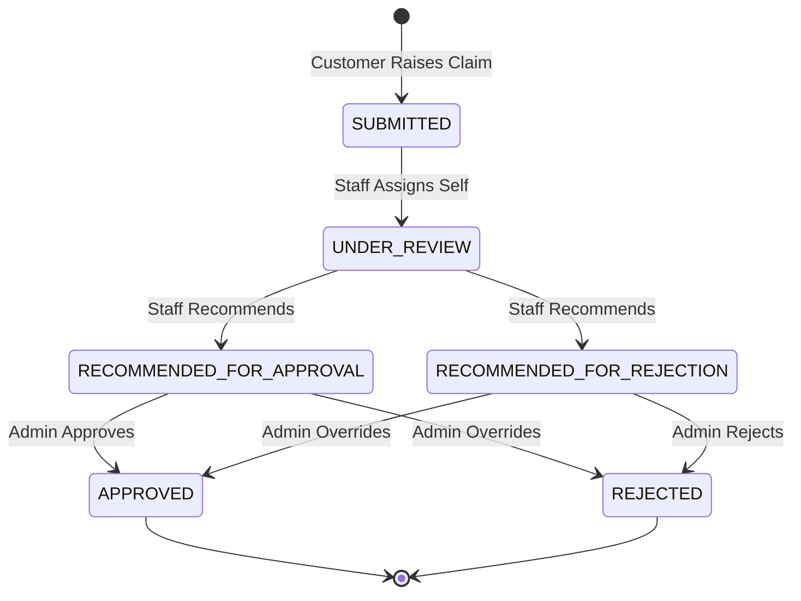

</Agent System Instructions>
<Claim API>
> Managing the truth: from customer incident submission through staff investigation to admin final approval.

---

## Purpose
This document explains the API for managing Insurance Claims. It details the state-machine transitions a claim undergoes, document upload procedures, and role-specific endpoints for processing claims.

---

## Overview
- **Customer Submission**: Customers can file claims against active policies and upload supporting documents.
- **Staff Processing**: Internal staff review claims, request details, and provide recommendations (Approve/Reject).
- **Admin Decision**: Admins review staff recommendations and make the final, binding decision.
- **Cloud Storage**: Claim documents are uploaded securely to Cloudinary.

---

## Business Context
Claims processing is the most critical operational workflow in an insurance system. It requires strict RBAC (Role-Based Access Control) to ensure segregation of duties: a customer submits, a staff member investigates, and a separate admin approves. This prevents fraud and errors.

---

## Feature Flow

---

## API Documentation

### 1. Raise Claim
| Field | Value |
|---|---|
| Purpose | Submits a new claim against a policy. |
| Method | POST |
| URL | `/api/claims/raise` |
| Auth Required | Yes (Customer) |
| Request Body | `multipart/form-data`: `policyId`, `amountClaimed`, `description`, `files[]` |
| Response | `ApiResponseDTO` with Claim ID |
| Validation | Policy must be ACTIVE. Amount cannot exceed policy coverage limit. |
| Possible Errors | `400 Policy inactive`, `400 Amount exceeds coverage` |
| Business Logic | Validates policy limits, creates Claim entity (SUBMITTED), uploads files to Cloudinary, links document URLs to claim. |
| Frontend Screen | Submit Claim Page |

### 2. Get My Claims
| Field | Value |
|---|---|
| Purpose | Fetch all claims filed by the customer. |
| Method | GET |
| URL | `/api/claims/my-claims` |
| Auth Required | Yes (Customer) |
| Request Body | None |
| Response | List of claims |
| Validation | JWT User context |
| Possible Errors | `401 Unauthorized` |
| Business Logic | Fetch where `userId == token.userId`. |
| Frontend Screen | Customer Dashboard |

### 3. Get Claim by ID
| Field | Value |
|---|---|
| Purpose | Fetch detailed view of a claim. |
| Method | GET |
| URL | `/api/claims/{id}` |
| Auth Required | Yes |
| Request Body | None |
| Response | Claim details + attached documents URLs |
| Validation | RBAC: Must be owner, staff, or admin. |
| Possible Errors | `403 Forbidden`, `404 Not Found` |
| Business Logic | Joins claim and document tables. |
| Frontend Screen | Claim Details Page |

### 4. Get Claim History
| Field | Value |
|---|---|
| Purpose | Fetch the audit trail / status changes of a claim. |
| Method | GET |
| URL | `/api/claims/{id}/history` |
| Auth Required | Yes |
| Request Body | None |
| Response | List of audit logs (Date, Old Status, New Status, Updated By) |
| Validation | RBAC check |
| Possible Errors | `403 Forbidden` |
| Business Logic | Queries `ClaimHistory` entity. |
| Frontend Screen | Claim Timeline UI |

### 5. Assign Claim (Staff)
| Field | Value |
|---|---|
| Purpose | Staff assigns a SUBMITTED claim to themselves. |
| Method | PATCH |
| URL | `/api/claims/{id}/assign` |
| Auth Required | Yes (Staff) |
| Request Body | None |
| Response | Updated Claim |
| Validation | Claim must be SUBMITTED. Role must be Staff. |
| Possible Errors | `400 Claim already assigned` |
| Business Logic | Updates `assignedStaffId`, status changes to `UNDER_REVIEW`. |
| Frontend Screen | Staff Dashboard |

### 6. Mark Under Review (Staff)
| Field | Value |
|---|---|
| Purpose | Explicit state transition to show active investigation. |
| Method | PATCH |
| URL | `/api/claims/{id}/under-review` |
| Auth Required | Yes (Staff) |
| Request Body | `{ "notes": "Contacted hospital." }` |
| Response | Updated Claim |
| Validation | Must be assigned staff member. |
| Possible Errors | `403 Forbidden` |
| Business Logic | Appends notes, ensures status is UNDER_REVIEW. |
| Frontend Screen | Staff Claim Panel |

### 7. Staff Review / Recommend
| Field | Value |
|---|---|
| Purpose | Staff makes a formal recommendation. |
| Method | PATCH |
| URL | `/api/claims/{id}/review` |
| Auth Required | Yes (Staff) |
| Request Body | `{ "recommendation": "APPROVE", "remarks": "Documents verified." }` |
| Response | Updated Claim |
| Validation | Claim must be UNDER_REVIEW. |
| Possible Errors | `400 Invalid state transition` |
| Business Logic | Changes state to RECOMMENDED_FOR_APPROVAL or REJECTION. Records history. |
| Frontend Screen | Staff Recommendation Modal |

### 8. Final Decision (Admin)
| Field | Value |
|---|---|
| Purpose | Admin makes the final binding decision. |
| Method | PATCH |
| URL | `/api/claims/{id}/final-decision` |
| Auth Required | Yes (Admin) |
| Request Body | `{ "decision": "APPROVE", "finalRemarks": "Approved." }` |
| Response | Updated Claim |
| Validation | Claim must be in a RECOMMENDED state. |
| Possible Errors | `400 Invalid state transition` |
| Business Logic | Sets state to APPROVED/REJECTED. Triggers notification event. |
| Frontend Screen | Admin Approval Queue |

### 9. Document Upload
| Field | Value |
|---|---|
| Purpose | Upload additional documents to an existing claim. |
| Method | POST |
| URL | `/api/document/upload/{claimId}` |
| Auth Required | Yes |
| Request Body | `multipart/form-data`: `file` |
| Response | URL of uploaded document |
| Validation | File size < 5MB, specific types (PDF, JPG). |
| Possible Errors | `400 File too large` |
| Business Logic | Streams to Cloudinary `insurance_claims` folder, saves URL to DB. |
| Frontend Screen | Upload Component |

---

## Business Rules
| Rule | Reason |
|---|---|
| State Machine Enforcement | A claim cannot jump from SUBMITTED to APPROVED without staff recommendation. Enforces segregation of duties. |
| Coverage Limit Check | Prevents claims exceeding the total coverage amount of the policy. |
| External Storage | Saving documents directly in the DB causes bloat; Cloudinary provides efficient CDN delivery. |

---

## Design Decisions
1. **Why explicit state transition endpoints?**
   Instead of a generic `PUT /claims/{id}` where the frontend passes the status, having specific endpoints like `/review` and `/final-decision` encapsulates business logic, ensures only allowed roles can trigger specific transitions, and makes the code self-documenting.
2. **Why separate document upload?**
   While initial claim raising accepts multipart data, having a separate upload endpoint allows staff or customers to attach additional evidence later without modifying the core claim data.

---

## Interview Notes
1. **Q: How do you handle file uploads in the Spring Boot backend?**
   **A:** We use `MultipartFile` in the controller to receive the file, stream it to Cloudinary using their SDK, and store the resulting secure URL in our MySQL database.
2. **Q: How is the claim state machine enforced?**
   **A:** By explicitly checking the current status in the Service layer before allowing an update. If a staff member tries to recommend an already APPROVED claim, an `InvalidStateException` is thrown.
3. **Q: Why separate the Staff recommendation from the Admin approval?**
   **A:** This is a crucial business requirement called 'Segregation of Duties'. It prevents internal fraud by requiring two separate individuals (one investigator, one approver) to authorize financial payouts.
4. **Q: How does RBAC apply to fetching a claim by ID?**
   **A:** The system checks the user's role. If CUSTOMER, it verifies the claim belongs to them. If STAFF/ADMIN, it bypasses the ownership check and grants access.

---

## Related Documents
- `API_Flow.md`
- `Policy_API.md`
</Claim API>
