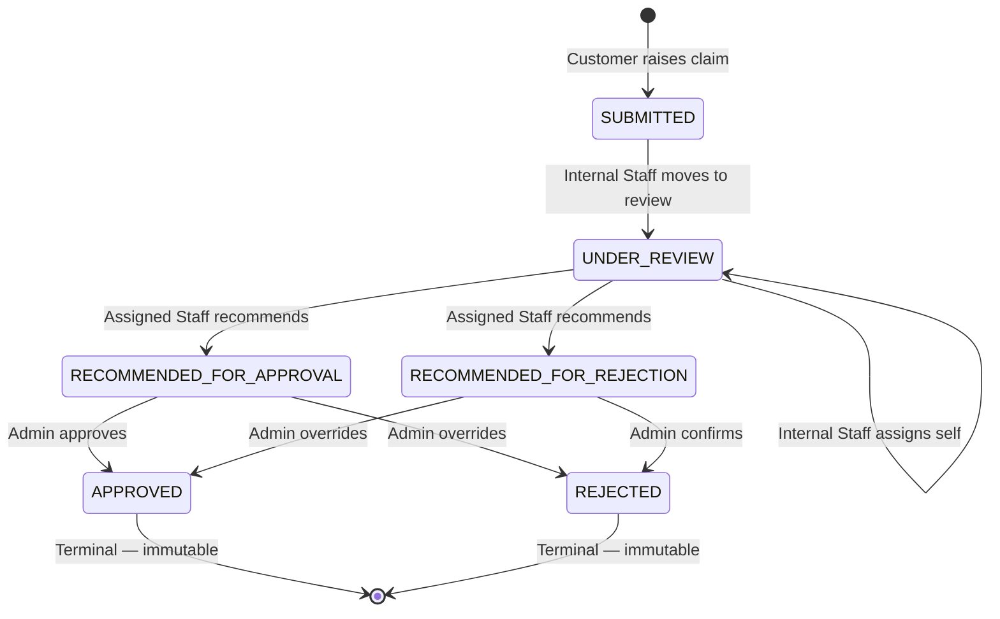

> Managing the complete insurance claim lifecycle: customer submission, Internal Staff investigation, Admin final decision.

---

## Purpose
This document explains the API for managing Insurance Claims. It covers the state-machine transitions a claim goes through, document upload, and the role-specific endpoints that enforce segregation of duties.

---

## Overview
- **Customer Submission**: Customers file claims against active policies and upload supporting documents.
- **Internal Staff Processing**: Staff move claims to review, assign themselves, investigate, and recommend approval or rejection.
- **Admin Decision**: Admins review staff recommendations and make the final, binding decision.
- **Cloud Storage**: Claim documents are uploaded to Cloudinary. The database stores metadata and URLs only.

---

## Business Context
Claims processing is the highest-risk financial operation in the system. The maker-checker design enforces separation of duties: a customer submits, Internal Staff investigates, and Admin approves. This prevents any single actor from pushing a payout through alone.

---

## Claim State Machine


---

## API Documentation

### 1. Raise Claim
| Field | Value |
|---|---|
| Purpose | Submits a new claim against an active policy, with supporting document files. |
| Method | POST |
| URL | `/api/claims/raise` |
| Auth Required | Yes (Customer) |
| Request Body | `multipart/form-data`: `claimData` (JSON: `policyId`, `claimAmount`, `claimReason`, `incidentDate`) + `files` |
| Response | `ApiResponseDTO` with `ClaimResponseDTO` (claimNumber, status=SUBMITTED) |
| Validation | Policy must be ACTIVE and owned by caller. `claimAmount` must be positive and ≤ remaining coverage. `incidentDate` must be within policy start and end dates. At least one file required. |
| Possible Errors | `400 Policy not active`, `400 Exceeds coverage limit`, `400 Incident date out of bounds` |
| Business Logic | Uploads files to Cloudinary, saves `Claim` (status=SUBMITTED, claimNumber=`CLM-XXXXXXXX`), saves `ClaimDocument` records, inserts initial `ClaimStatusHistory`. |
| Frontend Screen | Raise Claim Page |

**Claim JSON fields:**
```json
{
  "policyId": 42,
  "claimAmount": 50000.00,
  "claimReason": "Hospitalization due to surgery",
  "incidentDate": "2025-08-10"
}
```

### 2. Get My Claims
| Field | Value |
|---|---|
| Purpose | Returns all claims filed by the authenticated customer. |
| Method | GET |
| URL | `/api/claims/my-claims` |
| Auth Required | Yes (Customer) |
| Response | List of `ClaimResponseDTO` |
| Business Logic | Fetches claims where `claim.policy.customer.user.email == authenticated user`. |
| Frontend Screen | Customer Dashboard |

### 3. Get Claim by ID
| Field | Value |
|---|---|
| Purpose | Returns full claim details including attached document URLs. |
| Method | GET |
| URL | `/api/claims/{claimId}` |
| Auth Required | Yes |
| Response | `ClaimResponseDTO` with embedded document list |
| Validation | Customer can only view their own claims. Internal Staff can view claims matching their `productSpeciality`. Admin can view any. |
| Possible Errors | `403 Forbidden`, `404 Not Found` |
| Frontend Screen | Claim Details Page |

### 4. Get Claim Status History
| Field | Value |
|---|---|
| Purpose | Returns the full chronological audit trail of status changes for a claim. |
| Method | GET |
| URL | `/api/claims/{claimId}/history` |
| Auth Required | Yes |
| Response | List of `ClaimStatusHistoryResponseDTO` (previousStatus, newStatus, remarks, updatedBy, updatedDate) |
| Frontend Screen | Claim Timeline UI |

### 5. Get All Claims (Internal Staff / Admin)
| Field | Value |
|---|---|
| Purpose | Returns all claims in the system, filtered by the staff member's product speciality or admin-level access. |
| Method | GET |
| URL | `/api/claims` |
| Auth Required | Yes (Admin, Internal Staff) |
| Query Params | `status`, `customerId`, `minClaimAmount`, `maxClaimAmount`, `page`, `size` |
| Response | Paginated list of `ClaimResponseDTO` |
| Business Logic | Internal Staff only see claims for policies of their `productSpeciality`. Admin sees all claims. |
| Frontend Screen | Staff/Admin Claim Dashboard |

### 6. Move Claim to Under Review (Internal Staff)
| Field | Value |
|---|---|
| Purpose | Moves a SUBMITTED claim into UNDER_REVIEW, indicating active investigation has begun. |
| Method | PATCH |
| URL | `/api/claims/{claimId}/under-review` |
| Auth Required | Yes (Internal Staff) |
| Request Body | None |
| Response | Updated `ClaimResponseDTO` |
| Validation | Claim must be in SUBMITTED status. Staff's `productSpeciality` must match the claim's policy product type. |
| Possible Errors | `400 Invalid state transition`, `403 Speciality mismatch` |
| Business Logic | Sets `claim.claimStatus = UNDER_REVIEW`, inserts `ClaimStatusHistory`. |
| Frontend Screen | Staff Claim Panel |

### 7. Assign Claim to Self (Internal Staff)
| Field | Value |
|---|---|
| Purpose | Assigns the claim to the authenticated Internal Staff member as the investigator. |
| Method | PATCH |
| URL | `/api/claims/{claimId}/assign` |
| Auth Required | Yes (Internal Staff) |
| Request Body | None |
| Response | Updated `ClaimResponseDTO` |
| Validation | Claim must be in UNDER_REVIEW status. |
| Possible Errors | `400 Invalid state transition` |
| Business Logic | Sets `claim.assignedStaff = authenticated staff user`, inserts `ClaimStatusHistory`. Does NOT change claim status. |
| Frontend Screen | Staff Claim Panel |

### 8. Submit Recommendation (Internal Staff)
| Field | Value |
|---|---|
| Purpose | The assigned Internal Staff member submits a formal recommendation to approve or reject the claim. |
| Method | PATCH |
| URL | `/api/claims/{claimId}/review` |
| Auth Required | Yes (Internal Staff) |
| Request Body | `{ "decision": "RECOMMENDED_FOR_APPROVAL", "staffRemarks": "Documents verified and complete." }` |
| Response | Updated `ClaimResponseDTO` |
| Validation | Caller must be the assigned staff for this claim. Claim must be in UNDER_REVIEW status. |
| Possible Errors | `403 Not the assigned staff`, `400 Invalid state transition` |
| Business Logic | Sets `claim.claimStatus` to `RECOMMENDED_FOR_APPROVAL` or `RECOMMENDED_FOR_REJECTION`. Saves `staffRemarks`. Inserts `ClaimStatusHistory`. |
| Frontend Screen | Staff Recommendation Modal |

### 9. Make Final Decision (Admin)
| Field | Value |
|---|---|
| Purpose | Admin makes the final, binding decision to approve or reject a claim. |
| Method | PATCH |
| URL | `/api/claims/{claimId}/final-decision` |
| Auth Required | Yes (Admin) |
| Request Body | `{ "decision": "APPROVED", "adminRemarks": "Payout authorized." }` |
| Response | Updated `ClaimResponseDTO` |
| Validation | Claim must be in `RECOMMENDED_FOR_APPROVAL` or `RECOMMENDED_FOR_REJECTION` status. |
| Possible Errors | `400 Invalid state transition` |
| Business Logic | Sets `claim.claimStatus` to `APPROVED` or `REJECTED`. Saves `adminRemarks`. Inserts `ClaimStatusHistory`. Terminal state — no further updates allowed. |
| Frontend Screen | Admin Approval Queue |

### 10. Upload Additional Documents (Customer)
| Field | Value |
|---|---|
| Purpose | Uploads additional evidence documents to an existing claim. |
| Method | POST |
| URL | `/api/document/upload/{claimId}` |
| Auth Required | Yes (Customer) |
| Request Body | `multipart/form-data`: `files` (list of files) |
| Response | `ApiResponseDTO` with list of `ClaimDocumentResponseDTO` |
| Validation | Files must be valid type (PDF/Image). |
| Business Logic | Uploads each file to Cloudinary (`insurance_claims` folder). Saves `ClaimDocument` records (name, documentType, documentReference URL, publicId). |
| Frontend Screen | Claim Details Page — Additional Upload |

---

## Business Rules
| Rule | Reason |
|---|---|
| Claim amount ≤ remaining coverage | Prevents paying out more than the policy sum assured. |
| Incident date within policy period | Ensures the incident occurred while coverage was in force. |
| Staff speciality matching | Only domain experts review relevant claims (e.g., motor staff reviews car accident claims). |
| Maker-checker (Staff recommends, Admin decides) | No single actor can both investigate and authorize a financial payout. |
| Append-only status history | Provides an undisputed audit trail for every state change. |

---

## Design Decisions
1. **Why separate `assign` and `under-review` endpoints?**
   Moving to UNDER_REVIEW signals that active investigation has started (any staff with the right speciality can do this). Assigning is a separate action where a specific staff member takes personal ownership. Separating them allows a supervisor to move a claim to UNDER_REVIEW before the investigator self-assigns.
2. **Why no direct Admin action from SUBMITTED?**
   The state machine strictly requires a staff investigation step before Admin can act. This enforces the segregation-of-duties principle and prevents Admins from bypassing the investigation phase.
3. **Why Cloudinary for documents?**
   Offloads heavy binary storage from the relational database. The DB stores only the secure URL and public ID. This reduces database load and provides CDN delivery for files.

---

## Backend Implementation
- **Controllers**: `ClaimController.java`, `ClaimDocumentController.java`
- **Services**: `ClaimServiceImpl.java`, `ClaimDocumentServiceImpl.java`, `CloudinaryServiceImpl.java`
- **Entities**: `Claim`, `ClaimDocument`, `ClaimStatusHistory`
- **Enums**: `ClaimStatus`

---

## Interview Notes
1. **Q: How is the claim state machine enforced?**
   **A:** The service layer explicitly checks `claim.claimStatus` before allowing any update. If the status is not in the expected state, a `BadRequestException` is thrown. JPA `@Version` on the `Claim` entity also prevents two staff members from updating the same claim simultaneously.
2. **Q: Explain the Maker-Checker principle used here.**
   **A:** Internal Staff recommend (maker), Admin decides (checker). No single person can both investigate and authorize a financial payout. This is a standard insurance/banking anti-fraud requirement.
3. **Q: How does RBAC apply when fetching a claim by ID?**
   **A:** If the caller is a Customer, the service verifies the claim belongs to their policy. If Internal Staff, it checks their `productSpeciality` matches the claim's policy product type. Admin bypasses all ownership checks.
4. **Q: How do you calculate remaining coverage?**
   **A:** `remainingCoverage = policy.selectedCoverage - sum(claimAmount for all claims NOT in REJECTED status)`.
5. **Q: How is concurrent assignment prevented?**
   **A:** The `Claim` entity uses JPA `@Version` for optimistic locking. If two staff members try to assign the same claim at the same time, the second transaction fails with an `OptimisticLockException`.

---

## Related Documents
- `Policy_API.md`
- `../02_Business_Domain/Claim_Workflow.md`
