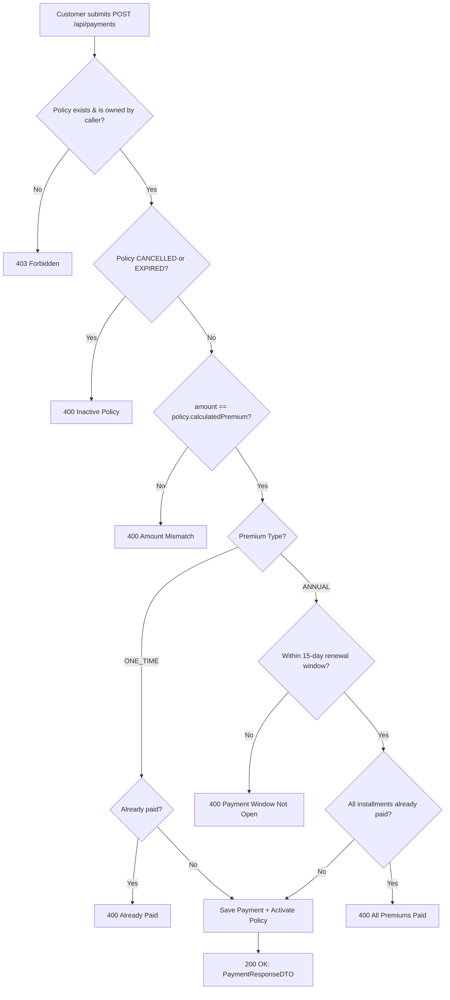

> Recording premium payments and tracking the financial ledger for policies.

---

## Purpose
This document explains the Payment API — the endpoints for recording, validating, and retrieving premium payments linked to insurance policies.

---

## Overview
- **Payment Recording**: Validates and records a payment installment against a policy.
- **Policy Activation**: The first successful payment on a `PENDING_PAYMENT` policy sets it to `ACTIVE`.
- **Annual Renewals**: For `ANNUAL` premium type, subsequent payments are recorded within a 15-day window before each due date.
- **Transaction History**: Customers and Staff/Admins can view payment records.

---

## Business Context
Actual credit card processing is handled externally (frontend payment gateway). The backend records and validates the resulting payment outcome. The strict amount match check ensures no policy is activated with an incorrect payment.

---

## Feature Flow

---

## API Documentation

### 1. Record Premium Payment
| Field | Value |
|---|---|
| Purpose | Records a premium payment installment. Activates the policy on first successful payment. |
| Method | POST |
| URL | `/api/payments` |
| Auth Required | Yes (Customer, Internal Staff) |
| Request Body | `{ "policyId": 42, "amount": 15000.00, "paymentMode": "UPI" }` |
| Response | `ApiResponseDTO` with `PaymentResponseDTO` |
| Validation | Amount must exactly equal `policy.calculatedPremium`. Policy must be owned by caller (if Customer). |
| Possible Errors | `400 Amount mismatch`, `400 Policy not active`, `400 Already paid`, `403 Forbidden` |
| Business Logic | Validates amount, saves `PremiumPayment` with unique `transactionReference`. Updates `policy.totalPremiumPaid`. Sets `policy.policyStatus = ACTIVE` on first success. |
| Frontend Screen | Policy Payment Page |

**PaymentMode values:** `UPI`, `CARD`, `NET_BANKING`, `CASH`

### 2. Get My Payments
| Field | Value |
|---|---|
| Purpose | Returns all payments made by the authenticated customer. |
| Method | GET |
| URL | `/api/payments/my-payments` |
| Auth Required | Yes (Customer) |
| Response | `ApiResponseDTO` with list of `PaymentResponseDTO` |
| Business Logic | Fetches all payments for policies owned by the authenticated customer. |
| Frontend Screen | Billing History Page |

### 3. Get Payments for My Policy
| Field | Value |
|---|---|
| Purpose | Returns all payments for a specific policy owned by the authenticated customer. |
| Method | GET |
| URL | `/api/payments/my-policies/{policyId}` |
| Auth Required | Yes (Customer) |
| Response | List of `PaymentResponseDTO` |
| Validation | Policy must belong to authenticated customer. |
| Possible Errors | `403 Forbidden`, `404 Not Found` |
| Frontend Screen | Policy Details Page |

### 4. Get Payments by Policy (Staff/Admin)
| Field | Value |
|---|---|
| Purpose | Returns all payments for any policy, accessible by Staff and Admin. |
| Method | GET |
| URL | `/api/payments/policy/{policyId}` |
| Auth Required | Yes (Admin, Internal Staff) |
| Response | List of `PaymentResponseDTO` |
| Possible Errors | `403 Forbidden` |
| Frontend Screen | Staff/Admin Policy View |

### 5. Get Payment by ID
| Field | Value |
|---|---|
| Purpose | Returns details of a specific payment record. |
| Method | GET |
| URL | `/api/payments/{paymentId}` |
| Auth Required | Yes |
| Response | `ApiResponseDTO` with `PaymentResponseDTO` |
| Validation | Customer can only view payments for their own policies. Staff/Admin can view any. |
| Possible Errors | `403 Forbidden`, `404 Not Found` |

### 6. Get All Payments (Staff/Admin)
| Field | Value |
|---|---|
| Purpose | Returns all payment records system-wide with filters. |
| Method | GET |
| URL | `/api/payments/page` |
| Auth Required | Yes (Admin, Internal Staff) |
| Query Params | `page`, `size`, `sortBy`, `sortDirection`, `policyId`, `status` |
| Response | Paginated `PaymentResponseDTO` |
| Frontend Screen | Admin Payment Ledger |

---

## Business Rules
| Rule | Reason |
|---|---|
| Amount must exactly match `calculatedPremium` | Prevents underpayment or overpayment edge cases. |
| Payment links to `policyId` (not `quoteId`) | The policy is created first (from the quote). Payment records go against the policy. |
| One-Time premium: only one SUCCESS payment | After a one-time payment, the full coverage is active and no further payments accepted. |
| Annual premium: 15-day window | Renewals open 15 days before each due date to give customers time to pay without a coverage gap. |
| Unique `transactionReference` | Prevents duplicate payment submissions. |

---

## Design Decisions
1. **Why link payments to `policyId` and not `quoteId`?**
   The Quote is consumed and marked USED when the Policy is created. After that point, the Policy is the binding contract. All payments are recorded against it.
2. **Why strict amount matching instead of allowing partial payments?**
   The system does not support partial payments. The full calculated premium is the installment amount. This avoids complex partial-payment tracking and edge cases in coverage calculation.

---

## Backend Implementation
- **Controller**: `PremiumPaymentController.java`
- **Service**: `PremiumPaymentServiceImpl.java`
- **Repository**: `PremiumPaymentRepository.java`

---

## Interview Notes
1. **Q: How would you secure this endpoint in a production system?**
   **A:** Implement a Webhook listener. Instead of trusting the client to send payment success, the backend would wait for a server-to-server callback from the payment provider (Stripe/Razorpay) containing a cryptographically signed payload.
2. **Q: What happens if a payment is submitted twice for a one-time premium?**
   **A:** The service checks whether an existing `SUCCESS` payment already exists for the policy. If so, a `BadRequestException` is thrown with an "Already Paid" message.
3. **Q: How is the 15-day renewal window enforced?**
   **A:** The service calculates the next due date based on the policy's `startDate` and how many `SUCCESS` payments have already been recorded. A payment is only accepted if the current date is within 15 days of the next due date.

---

## Related Documents
- `Policy_API.md`
- `../02_Business_Domain/Payment_Workflow.md`
