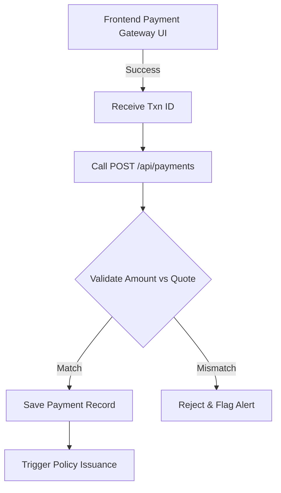

</Agent System Instructions>
<Payment API>
> Securely processing and recording financial transactions for policies.

---

## Purpose
This document details the Payment API, managing the recording and retrieval of transactions tied to policy purchases or renewals.

---

## Overview
- **Payment Processing**: Validates and records payments linked to quotes/policies.
- **Transaction History**: Allows users to view their payment history.
- **Policy Linkage**: Links specific payments to policy IDs.

---

## Business Context
While actual credit card processing is mocked or handled by a 3rd party gateway (like Stripe/Razorpay) on the frontend, the backend must strictly validate the resulting transaction IDs, amounts, and statuses to ensure policies are only issued upon verified funds.

---

## Feature Flow

---

## API Documentation

### 1. Record Payment
| Field | Value |
|---|---|
| Purpose | Records a successful payment transaction. Usually called internally by Policy purchase flow, or explicitly via this endpoint for renewals. |
| Method | POST |
| URL | `/api/payments` |
| Auth Required | Yes |
| Request Body | `{ "quoteId": "123", "amount": 15000.00, "transactionId": "TXN999", "paymentMethod": "CREDIT_CARD" }` |
| Response | `ApiResponseDTO` with Payment ID |
| Validation | Amount must exactly equal the quote's calculated premium. |
| Possible Errors | `400 Amount mismatch`, `400 Invalid Quote` |
| Business Logic | Verifies quote, saves payment record, returns success state for policy issuance. |
| Frontend Screen | Checkout Processing |

### 2. Get My Payments
| Field | Value |
|---|---|
| Purpose | Fetch transaction history for the logged-in customer. |
| Method | GET |
| URL | `/api/payments/my-payments` |
| Auth Required | Yes (Customer) |
| Request Body | None |
| Response | List of payment records |
| Validation | JWT validation |
| Possible Errors | `401 Unauthorized` |
| Business Logic | Queries Payment repository by `userId`. |
| Frontend Screen | Billing History Page |

### 3. Get Payments by Policy
| Field | Value |
|---|---|
| Purpose | Fetch all payments associated with a specific policy. |
| Method | GET |
| URL | `/api/payments/policy/{policyId}` |
| Auth Required | Yes |
| Request Body | None |
| Response | List of payment records |
| Validation | Must own policy or be Admin/Staff. |
| Possible Errors | `403 Forbidden` |
| Business Logic | Queries by `policyId`. |
| Frontend Screen | Policy Details Page |

---

## Design Decisions
1. **Why mock the payment gateway?**
   As a capstone project, real financial transactions aren't feasible. We assume the frontend handles the 3rd-party gateway and sends a verifiable `transactionId` to this API. In production, this would involve a webhook from the payment provider to prevent client-side spoofing.
2. **Strict Amount Validation:**
   The exact match requirement (not approximate) prevents edge cases where rounding differences might leave a policy partially unpaid.

---

## Interview Notes
1. **Q: How would you secure this endpoint in a real-world scenario?**
   **A:** I would implement a Webhook listener. Instead of trusting the client to send the payment success, the backend would wait for a server-to-server callback from Stripe/Razorpay containing a cryptographically signed payload confirming the payment.
2. **Q: Why tie payments to Quotes rather than Policies initially?**
   **A:** Because the policy doesn't exist until the payment is successful. The Quote holds the promised amount and configuration; the payment fulfills it, which triggers the creation of the Policy.

---

## Related Documents
- `Policy_API.md`
</Payment API>
