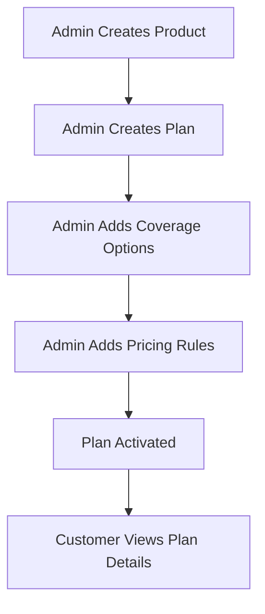

</Agent System Instructions>
<Plan API>
> Structuring the insurance offerings: managing coverage plans and their configurable options.

---

## Purpose
This document details the Plan API, handling the creation, retrieval, and management of Insurance Plans and their associated Coverage Options.

---

## Overview
- **Admin Management**: Creation of plans (often via a multi-step wizard) and toggling their active status.
- **Public Retrieval**: Fetching active plans within a specific product category.
- **Coverage Options**: Managing the granular benefits attached to a specific plan.

---

## Business Context
Plans are the specific packages customers buy (e.g., "Gold Health Plan"). They belong to a broad Product category (e.g., "Health"). Plans define the base limits and terms, while Coverage Options define specific features (e.g., "Dental Cover", "Room Rent Limit").

---

## Feature Flow

---

## API Documentation

### 1. Create Plan (Admin)
| Field | Value |
|---|---|
| Purpose | Creates a new plan under an existing product. |
| Method | POST |
| URL | `/api/admin/plans` |
| Auth Required | Yes (Admin) |
| Request Body | `{ "productId": 1, "name": "Gold", "description": "Premium coverage", "minAge": 18, "maxAge": 65, "policyTermMonths": 12 }` |
| Response | `ApiResponseDTO` with Plan ID |
| Validation | Valid Product ID, Age range validation (`minAge < maxAge`). |
| Possible Errors | `404 Product Not Found`, `400 Validation Error` |
| Business Logic | Saves Plan entity, links to Product. |
| Frontend Screen | Admin Plan Wizard (Step 1) |

### 2. Get Active Plans by Product
| Field | Value |
|---|---|
| Purpose | Retrieves all ACTIVE plans for a specific product category to display to customers. |
| Method | GET |
| URL | `/api/plans/{productId}/active` |
| Auth Required | No (Public) |
| Request Body | None |
| Response | List of active plans |
| Validation | Valid Product ID |
| Possible Errors | `404 Product Not Found` |
| Business Logic | Queries `findByProductIdAndStatus(id, ACTIVE)`. |
| Frontend Screen | Product Browse Page |

### 3. Get Plan Details
| Field | Value |
|---|---|
| Purpose | Fetches full plan details including Coverage Options. |
| Method | GET |
| URL | `/api/plans/{planId}` |
| Auth Required | No (Public) |
| Request Body | None |
| Response | Plan details + Coverage array |
| Validation | Valid Plan ID |
| Possible Errors | `404 Not Found` |
| Business Logic | Joins Plan and CoverageOption entities. |
| Frontend Screen | Plan Details Page |

### 4. Toggle Plan Status (Admin)
| Field | Value |
|---|---|
| Purpose | Activates or Deactivates a plan. |
| Method | PATCH |
| URL | `/api/admin/plans/{id}/toggle-status` |
| Auth Required | Yes (Admin) |
| Request Body | None |
| Response | Updated Plan Status |
| Validation | Admin role check |
| Possible Errors | `404 Not Found` |
| Business Logic | Flips status between ACTIVE and INACTIVE. |
| Frontend Screen | Admin Plan Management |

### 5. Manage Coverage Options (Admin)
| Field | Value |
|---|---|
| Purpose | CRUD endpoints for defining benefits of a plan. |
| Method | POST, PUT, DELETE |
| URL | `/api/admin/plans/{planId}/coverage` |
| Auth Required | Yes (Admin) |
| Request Body | `{ "coverageName": "Dental", "coverageAmount": 5000 }` |
| Response | Updated Coverage List |
| Validation | Must not exceed Plan total limits. |
| Possible Errors | `400 Invalid Coverage Limit` |
| Business Logic | Updates the one-to-many relationship of CoverageOptions. |
| Frontend Screen | Admin Plan Wizard (Step 2) |

---

## Design Decisions
1. **Why is `/active` public but `/toggle` secured?**
   Customers need to view available plans without logging in (for SEO and marketing), but only admins can control what is sold.
2. **One-to-Many Coverage Options:**
   Instead of a flat table with boolean flags (e.g., `hasDental`, `hasVision`), using a separate `CoverageOption` entity allows dynamic creation of benefits without altering the database schema.

---

## Interview Notes
1. **Q: How are plans related to products in the database?**
   **A:** It's a Many-to-One relationship. Many plans (Gold, Silver) map to one Product (Health).
2. **Q: What happens to existing policies if a plan is deactivated?**
   **A:** Existing policies remain active. Deactivating a plan only prevents *new* quotes and purchases from being generated for that plan.

---

## Related Documents
- `Product_API.md`
- `Pricing_API.md`
</Plan API>
