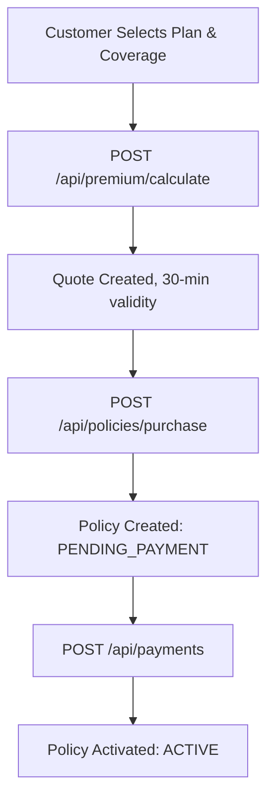

> The core engine for issuing, managing, and cancelling insurance policies.

---

## Purpose
This document explains the API endpoints for Insurance Policies. It covers the full lifecycle from premium calculation (generating quotes) and policy purchase, to retrieval and cancellation by customers, staff, and admins.

---

## Overview
- **Premium Calculation**: Generates a 30-minute temporary quote based on plan, coverage, duration, and premium type.
- **Purchase Policy**: Converts a valid quote into a policy record in `PENDING_PAYMENT` status.
- **Record Payment**: A separate payment step activates the policy to `ACTIVE`.
- **Customer Access**: View own policies and their details.
- **Admin/Staff Access**: View all policies, cancel policies, or issue policies manually.
- **Cancellation**: Allowed only on policies with no open claims.

---

## Business Context
The policy API is the revenue driver of the system. It handles the conversion of a user's interest (Quote) into a binding contract (Policy). Policy purchase and payment are intentionally separate steps. This allows the frontend to show a breakdown before any funds are committed.

---

## Feature Flow

---

## API Documentation

### 1. Calculate Premium (Quote Generation)
| Field | Value |
|---|---|
| Purpose | Generates a temporary actuarial quote for a plan configuration. |
| Method | POST |
| URL | `/api/premium/calculate` |
| Auth Required | Yes (Customer) |
| Request Body | `{ "planId": 1, "coverageAmount": 500000, "duration": 3, "premiumType": "ANNUAL" }` |
| Response | `ApiResponseDTO` with `PremiumQuote` (basePremium, processingFee, GST, total, quoteId, expiresAt) |
| Validation | Valid planId, valid coverageAmount matching a plan CoverageOption |
| Possible Errors | `404 Plan not found`, `400 No active pricing rule`, `400 Coverage not valid for this plan` |
| Business Logic | Uses `PremiumCalculatorFactory` to select `AnnualPremiumCalculator` or `OneTimePremiumCalculator`. Saves Quote (status=CREATED, TTL=30 min). |
| Frontend Screen | Plan Configuration Page |

### 2. Calculate Premium on behalf of Customer (Admin/Staff)
| Field | Value |
|---|---|
| Purpose | Generates a quote for a specific customer. Used by Admin and Internal Staff. |
| Method | POST |
| URL | `/api/premium/admin/calculate` |
| Auth Required | Yes (Admin, Internal Staff) |
| Request Body | Same as above, plus `customerId` |
| Response | `ApiResponseDTO` with `PremiumQuote` |
| Business Logic | Same calculation logic, quote is linked to specified customer. |

### 3. Purchase Policy
| Field | Value |
|---|---|
| Purpose | Consumes a valid quote and creates a policy in PENDING_PAYMENT status. |
| Method | POST |
| URL | `/api/policies/purchase` |
| Auth Required | Yes (Customer) |
| Request Body | `{ "quoteId": 123, "paymentReferenceId": "optional-ref" }` |
| Response | `ApiResponseDTO` with `PolicyResponseDTO` (policyNumber, status=PENDING_PAYMENT, calculatedPremium) |
| Validation | Quote must exist, status=CREATED, and not expired. Customer profile must be complete. |
| Possible Errors | `400 Quote expired`, `400 Quote already used`, `404 Customer profile not found` |
| Business Logic | Validates quote, snapshots all rates (riskRate, processingFee, GST) onto the Policy record, marks Quote as USED. Policy starts in PENDING_PAYMENT. |
| Frontend Screen | Plan Checkout Page |

### 4. Issue Policy (Staff/Admin — Manual)
| Field | Value |
|---|---|
| Purpose | Allows Staff or Admin to manually issue a policy on behalf of a customer. |
| Method | POST |
| URL | `/api/policies/issue` |
| Auth Required | Yes (Admin, Internal Staff) |
| Request Body | `{ "customerId": 10, "quoteId": 45, "paymentReferenceId": "REF-001" }` |
| Response | `ApiResponseDTO` with `PolicyResponseDTO` |
| Business Logic | Same quote-based creation as purchase, but issued by a staff actor. |
| Frontend Screen | Admin/Staff Dashboard |

### 5. Get My Policies
| Field | Value |
|---|---|
| Purpose | Returns all policies for the authenticated customer. |
| Method | GET |
| URL | `/api/policies/my-policies` |
| Auth Required | Yes (Customer) |
| Query Params | `page`, `size`, `sortBy`, `sortDirection`, `status` (optional filter) |
| Response | `ApiResponseDTO` with paginated `PolicyResponseDTO` list |
| Possible Errors | `401 Unauthorized` |
| Business Logic | Filters policies by `customer.user.email == authenticated user`. |
| Frontend Screen | Customer Dashboard |

### 6. Get Policy by ID
| Field | Value |
|---|---|
| Purpose | Returns full details of a specific policy, including remaining coverage calculation. |
| Method | GET |
| URL | `/api/policies/{policyId}` |
| Auth Required | Yes |
| Response | `ApiResponseDTO` with full `PolicyResponseDTO` |
| Validation | Customer can only view their own policies. Staff/Admin can view any. |
| Possible Errors | `403 Forbidden`, `404 Not Found` |
| Business Logic | Remaining coverage = `selectedCoverage - sum of non-rejected claims`. |
| Frontend Screen | Policy Details Page |

### 7. Get Policies by Customer (Staff/Admin)
| Field | Value |
|---|---|
| Purpose | Returns all policies for a specific customer ID. |
| Method | GET |
| URL | `/api/policies/customer/{customerId}` |
| Auth Required | Yes (Admin, Internal Staff) |
| Query Params | `page`, `size`, `sortBy`, `sortDirection` |
| Response | Paginated `PolicyResponseDTO` list |
| Business Logic | Fetches all policies linked to that customer. |
| Frontend Screen | Staff/Admin Customer View |

### 8. Get All Policies (Staff/Admin)
| Field | Value |
|---|---|
| Purpose | Returns all policies system-wide, with optional filters. |
| Method | GET |
| URL | `/api/policies` |
| Auth Required | Yes (Admin, Internal Staff) |
| Query Params | `page`, `size`, `sortBy`, `sortDirection`, `status`, `customerId`, `planId` |
| Response | Paginated `PolicyResponseDTO` list |
| Business Logic | Full policy ledger view. |
| Frontend Screen | Admin Policy Management |

### 9. Get Claims for a Policy
| Field | Value |
|---|---|
| Purpose | Lists all claims filed against a specific policy. |
| Method | GET |
| URL | `/api/policies/{policyId}/claims` |
| Auth Required | Yes |
| Response | List of `ClaimResponseDTO` |
| Validation | Customer can only view claims on their own policy. |
| Possible Errors | `403 Forbidden`, `404 Not Found` |

### 10. Cancel Policy
| Field | Value |
|---|---|
| Purpose | Cancels an active policy. Only allowed when no open claims exist. |
| Method | PATCH |
| URL | `/api/policies/{policyId}/cancel` |
| Auth Required | Yes (Admin, Internal Staff) |
| Response | `ApiResponseDTO` with updated `PolicyResponseDTO` |
| Validation | Policy must be ACTIVE. No open (SUBMITTED or UNDER_REVIEW) claims. |
| Possible Errors | `400 Policy has open claims`, `400 Policy is not active` |
| Business Logic | Sets `policyStatus = CANCELLED`. |
| Frontend Screen | Admin/Staff Policy Panel |

---

## Business Rules
| Rule | Reason |
|---|---|
| Two-Step Purchase (Quote then Payment) | Separates the rate agreement (Quote) from the financial transaction (Payment). |
| Quote Expiry (30 min) | Prevents customers from holding a favorable rate when pricing rules change. |
| Rate Snapshotting | Rates at purchase time are locked onto the Policy record, even if PricingRule changes later. |
| No Cancellation with Open Claims | Prevents removing coverage while a claim is being adjudicated. |

---

## Design Decisions
1. **Why separate purchase and payment endpoints?**
   The purchase step creates the Policy in `PENDING_PAYMENT`, recording all agreed-upon rates. The payment step confirms funds are received and activates the policy. This ensures the rate is never applied without a recorded payment.
2. **Why use the Strategy Pattern for Premium Calculation?**
   `AnnualPremiumCalculator` and `OneTimePremiumCalculator` implement different mathematical models. Using a strategy allows adding new premium types without modifying the core service, following the Open-Closed Principle.

---

## Backend Implementation
- **Controllers**: `PolicyController.java`, `PremiumCalculationController.java`
- **Services**: `PolicyService.java`, `PremiumCalculationService.java`
- **Strategy**: `PremiumCalculator`, `AnnualPremiumCalculator`, `OneTimePremiumCalculator`, `PremiumCalculatorFactory`

---

## Interview Notes
1. **Q: How does the system ensure the user pays the correct amount?**
   **A:** The `calculatedPremium` is stored on the Policy at purchase time. When a payment is submitted, the service compares `payment.amount` against `policy.calculatedPremium`. Any mismatch throws a `BadRequestException`.
2. **Q: Explain the Strategy pattern used here.**
   **A:** The `PremiumCalculatorFactory` resolves either `AnnualPremiumCalculator` or `OneTimePremiumCalculator` based on the `premiumType` in the request. Both implement the `PremiumCalculator` interface with a `calculatePremium()` method.
3. **Q: How are expired quotes handled?**
   **A:** The Quote entity has an `expiresAt` timestamp. The purchase service checks `expiresAt` and throws a `BadRequestException` if the quote has expired. The quote status is also set to `EXPIRED` by a scheduler (or checked inline).
4. **Q: Why does the purchase endpoint create a PENDING_PAYMENT policy instead of an ACTIVE one?**
   **A:** Because no payment has been taken yet. The Quote represents an agreement on price; the Policy in PENDING_PAYMENT represents a pending contract. The contract only becomes ACTIVE when the first payment is successfully recorded.

---

## Related Documents
- `Payment_API.md`
- `../02_Business_Domain/Policy_Workflow.md`
- `../02_Business_Domain/Premium_Calculation.md`
