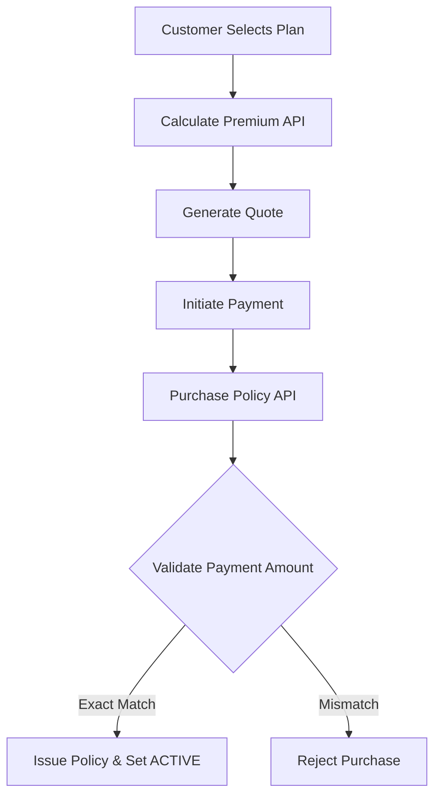
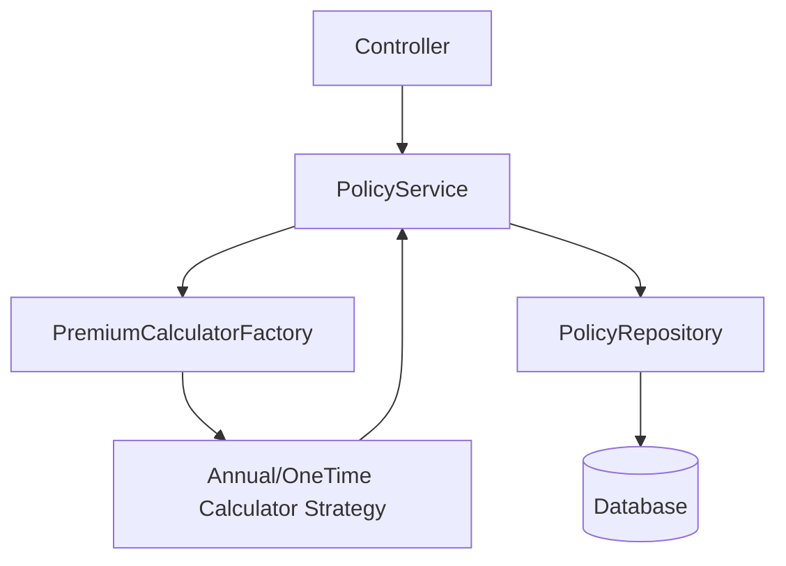
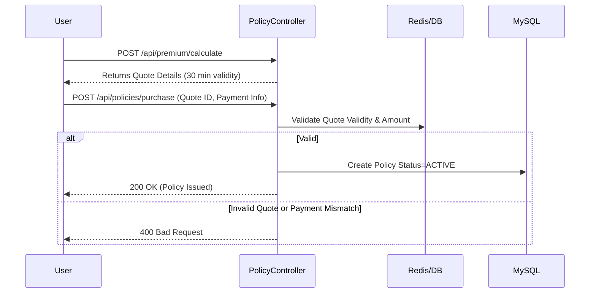

</Agent System Instructions>
<Policy API>
> The core engine for issuing, managing, and cancelling insurance policies across customers and administrators.

---

## Purpose
This document outlines the API endpoints related to Insurance Policies. It covers the entire lifecycle from premium calculation (generating quotes) and policy purchase, to policy retrieval and cancellation by both customers and internal staff/admins.

---

## Overview
- **Premium Calculation**: Generates temporary quotes based on plan details and applicant age.
- **Purchase Policy**: Converts a quote into an active policy with verified payment.
- **Customer Access**: Fetching active and historical policies.
- **Admin/Staff Access**: Comprehensive viewing and manual policy issuance.
- **Cancellation**: Secure endpoints for terminating active policies.

---

## Business Context
The policy API is the revenue driver of the system. It handles the critical conversion of a user's interest (Quote) into a binding contract (Policy). Strict validation ensures that the exact calculated premium is paid, and that policies correctly transition between states (PENDING_PAYMENT → ACTIVE → CANCELLED).

---

## Feature Flow

---

## System Flow

---

## Sequence Diagram

---

## API Documentation

### 1. Calculate Premium (Quote Generation)
| Field | Value |
|---|---|
| Purpose | Generates a quote for a specific plan based on user parameters. |
| Method | POST |
| URL | `/api/premium/calculate` |
| Auth Required | Yes |
| Request Body | `{ "planId": 1, "applicantAge": 30, "premiumType": "ANNUAL", "coverageAmount": 500000 }` |
| Response | `ApiResponseDTO` with quote details, calculated premium, and `quoteId` |
| Validation | Valid plan ID, age within plan limits |
| Possible Errors | `404 Plan not found`, `400 Age out of bounds` |
| Business Logic | Uses `PremiumCalculatorFactory` to select the strategy, applies base rate, age multiplier, and taxes. Saves temporary quote. |
| Frontend Screen | Plan Configuration Page |

### 2. Purchase Policy
| Field | Value |
|---|---|
| Purpose | Finalizes purchase by converting a quote to a policy. |
| Method | POST |
| URL | `/api/policies/purchase` |
| Auth Required | Yes |
| Request Body | `{ "quoteId": "12345", "paymentReference": "PAY-999", "amountPaid": 12000.00 }` |
| Response | `ApiResponseDTO` with generated Policy ID and status |
| Validation | Amount paid must EXACTLY match quote amount. |
| Possible Errors | `400 Payment mismatch`, `400 Quote expired/used` |
| Business Logic | Validates quote. Creates Policy entity. Marks quote as USED. |
| Frontend Screen | Checkout Page |

### 3. Get My Policies
| Field | Value |
|---|---|
| Purpose | Fetches all policies belonging to the logged-in customer. |
| Method | GET |
| URL | `/api/policies/my-policies` |
| Auth Required | Yes (Customer) |
| Request Body | None |
| Response | `ApiResponseDTO` containing list of policies |
| Validation | JWT validation |
| Possible Errors | `401 Unauthorized` |
| Business Logic | Extracts user ID from JWT, fetches matching records. |
| Frontend Screen | Customer Dashboard |

### 4. Get Policy by ID
| Field | Value |
|---|---|
| Purpose | Retrieves full details of a specific policy. |
| Method | GET |
| URL | `/api/policies/{id}` |
| Auth Required | Yes |
| Request Body | None |
| Response | `ApiResponseDTO` with policy details, coverage, history |
| Validation | User must own policy OR be Admin/Staff. |
| Possible Errors | `403 Forbidden`, `404 Not Found` |
| Business Logic | RBAC check on policy ownership. |
| Frontend Screen | Policy Details Page |

### 5. Cancel Policy
| Field | Value |
|---|---|
| Purpose | Cancels an active policy. |
| Method | PATCH |
| URL | `/api/policies/{id}/cancel` |
| Auth Required | Yes |
| Request Body | `{ "reason": "No longer needed" }` |
| Response | `ApiResponseDTO` |
| Validation | Policy must be ACTIVE. Must be owner or admin. |
| Possible Errors | `400 Policy already cancelled` |
| Business Logic | Updates status to CANCELLED, calculates refund if applicable (based on business rules). |
| Frontend Screen | Policy Details Page |

### 6. Admin Issue Policy (Manual)
| Field | Value |
|---|---|
| Purpose | Allows admin to bypass payment flow and manually issue a policy (e.g., corporate bulk sales). |
| Method | POST |
| URL | `/api/admin/policies/issue` |
| Auth Required | Yes (Admin) |
| Request Body | `{ "userId": 10, "planId": 5, "premiumType": "ONE_TIME" }` |
| Response | `ApiResponseDTO` |
| Validation | Valid user and plan. |
| Possible Errors | `403 Forbidden` |
| Business Logic | Creates policy directly in ACTIVE status. |
| Frontend Screen | Admin Dashboard |

### 7. View All Policies (Admin)
| Field | Value |
|---|---|
| Purpose | Fetch all policies system-wide with pagination. |
| Method | GET |
| URL | `/api/admin/policies` |
| Auth Required | Yes (Admin) |
| Request Body | None (Query Params: page, size) |
| Response | Paginated `ApiResponseDTO` |
| Validation | Admin role check. |
| Possible Errors | `403 Forbidden` |
| Business Logic | Fetches paginated records. |
| Frontend Screen | Admin Policy Management |

### 8. View Policies (Staff)
| Field | Value |
|---|---|
| Purpose | Fetch policies for staff review, specifically for claim validation context. |
| Method | GET |
| URL | `/api/staff/policies` |
| Auth Required | Yes (Staff) |
| Request Body | None |
| Response | `ApiResponseDTO` |
| Validation | Staff role check. |
| Possible Errors | `403 Forbidden` |
| Business Logic | Read-only access to policies. |
| Frontend Screen | Staff Dashboard |

---

## Backend Implementation
- **Controllers**: `PolicyController.java`, `AdminPolicyController.java`
- **Services**: `PolicyService.java`, `PremiumCalculatorService.java`
- **Design Pattern**: Strategy Pattern for `PremiumCalculator` (Annual vs. One-Time).

---

## Business Rules
| Rule | Reason |
|---|---|
| Payment Exact Match | Prevents underpayment or overpayment edge cases during policy creation. |
| Quote Expiry | 30-minute validity ensures users don't hold favorable rates if pricing rules change. |
| Strategy Pattern | Different premium types (Annual vs One-Time) require different mathematical models and tax applications. |

---

## Design Decisions
1. **Why separate quote generation and purchase endpoints?**
   Ensures the calculation is cleanly separated from the financial transaction, allowing the frontend to show a breakdown before commitment.
2. **Why use the Strategy Pattern for Premium Calculation?**
   It allows the system to easily add new payment models (e.g., Monthly, Quarterly) without modifying the core service, respecting the Open-Closed Principle.

---

## Interview Notes
1. **Q: How does the system ensure the user pays the correct amount?**
   **A:** The `/purchase` endpoint compares the provided payment amount directly against the backend-stored Quote value. If there is even a cent difference, the transaction is rejected.
2. **Q: Explain the Strategy pattern used here.**
   **A:** We use a `PremiumCalculatorFactory` to instantiate either `AnnualPremiumCalculator` or `OneTimePremiumCalculator` based on the request. Both implement the `PremiumCalculator` interface.
3. **Q: How are expired quotes handled?**
   **A:** Quotes have a TTL. When querying a quote ID during purchase, if it doesn't exist or is marked EXPIRED, the transaction fails.
4. **Q: How is authorization handled for viewing a policy?**
   **A:** The service layer extracts the authenticated user's ID. If the role is CUSTOMER, it ensures `policy.getUserId() == authUserId`. Admins bypass this check.

---

## Future Enhancements
- Automated renewal crons for ANNUAL premium policies.
</Policy API>
