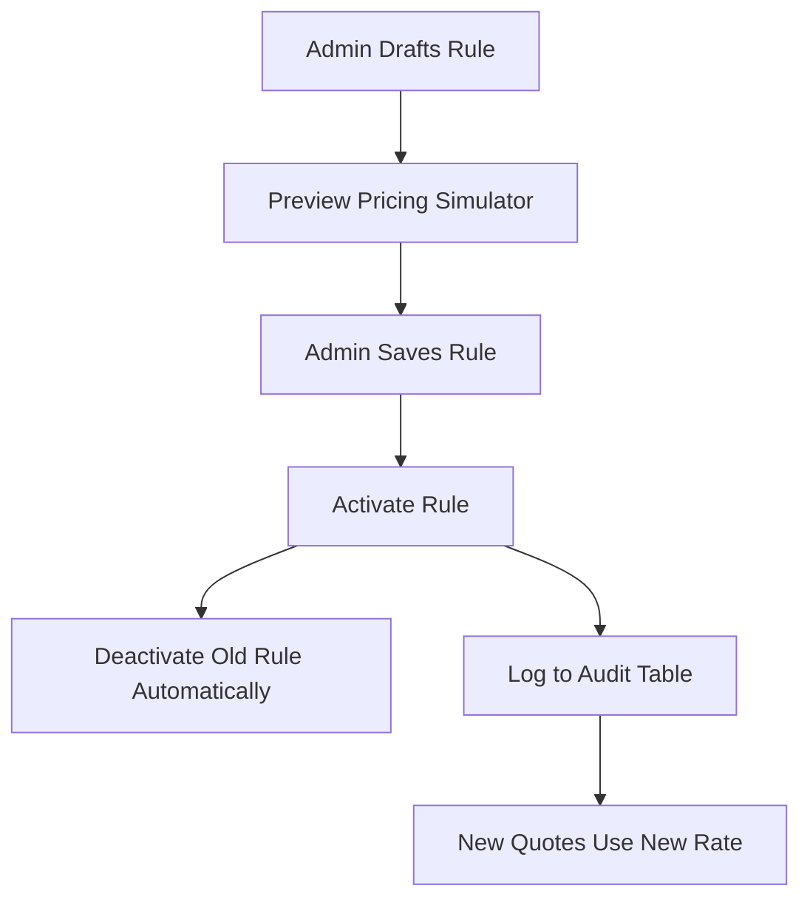

</Agent System Instructions>
<Pricing API>
> The financial rules engine dictating base rates, multipliers, and taxes for plan premiums.

---

## Purpose
This document details the Pricing Rules API. It allows administrators to dynamically configure the base premium rates and age-based multipliers for plans, without requiring code deployments.

---

## Overview
- **Rule Creation**: Admins define Base Rate, Age Multipliers, and Tax parameters.
- **Rule Activation**: Only one active rule per plan at a time.
- **Audit Logging**: Every pricing change is audited for compliance.
- **Preview Tool**: Simulate premiums before activating a rule.

---

## Business Context
Insurance pricing changes constantly based on risk models. Hardcoding prices is unacceptable. This dynamic pricing engine ensures actuaries (admins) can update rates instantly. Because pricing changes affect financial reporting, every change requires strict audit logging.

---

## Feature Flow

---

## API Documentation

### 1. Create Pricing Rule (Admin)
| Field | Value |
|---|---|
| Purpose | Define a new pricing configuration for a plan. |
| Method | POST |
| URL | `/api/admin/pricing-rules` |
| Auth Required | Yes (Admin) |
| Request Body | `{ "planId": 1, "basePremium": 5000, "ageMultiplier": 1.05, "taxRate": 0.18 }` |
| Response | `ApiResponseDTO` with Rule ID (Status INACTIVE) |
| Validation | Non-negative amounts. Valid Plan ID. |
| Possible Errors | `400 Validation Error` |
| Business Logic | Saves new rule. Defaults to INACTIVE. |
| Frontend Screen | Admin Pricing Engine |

### 2. Get Rules by Plan
| Field | Value |
|---|---|
| Purpose | Fetch all historical and active rules for a plan. |
| Method | GET |
| URL | `/api/admin/pricing-rules/{planId}` |
| Auth Required | Yes (Admin) |
| Request Body | None |
| Response | List of rules |
| Validation | Admin check |
| Possible Errors | `404 Plan Not Found` |
| Business Logic | Queries rules by plan ID, ordered by created date desc. |
| Frontend Screen | Admin Plan Details |

### 3. Activate Pricing Rule
| Field | Value |
|---|---|
| Purpose | Sets a rule as the active calculation model. |
| Method | PATCH |
| URL | `/api/admin/pricing-rules/{id}/activate` |
| Auth Required | Yes (Admin) |
| Request Body | None |
| Response | Updated Rule |
| Validation | Rule must exist. |
| Possible Errors | `404 Not Found` |
| Business Logic | Finds currently active rule for the plan, deactivates it, sets new rule to ACTIVE, logs change to Audit. |
| Frontend Screen | Admin Pricing Engine |

### 4. Deactivate Pricing Rule
| Field | Value |
|---|---|
| Purpose | Turns off a pricing rule. |
| Method | PATCH |
| URL | `/api/admin/pricing-rules/{id}/deactivate` |
| Auth Required | Yes (Admin) |
| Request Body | None |
| Response | Updated Rule |
| Validation | Must not leave plan without an active rule (business warning). |
| Possible Errors | `404 Not Found` |
| Business Logic | Status = INACTIVE. Logs to audit. |
| Frontend Screen | Admin Pricing Engine |

### 5. Preview Pricing Rule
| Field | Value |
|---|---|
| Purpose | Allows admin to simulate a premium calculation using a drafted rule before saving. |
| Method | POST |
| URL | `/api/admin/pricing-rules/preview` |
| Auth Required | Yes (Admin) |
| Request Body | Rule JSON + Mock Applicant Age |
| Response | Calculated Premium Amount |
| Validation | Math boundaries |
| Possible Errors | `400 Invalid inputs` |
| Business Logic | Runs calculation logic without saving to DB. |
| Frontend Screen | Pricing Simulator Modal |

### 6. Get Audit Log
| Field | Value |
|---|---|
| Purpose | Fetch the history of changes for a pricing rule. |
| Method | GET |
| URL | `/api/admin/pricing-rules/{id}/audit-log` |
| Auth Required | Yes (Admin) |
| Request Body | None |
| Response | List of audit events (Action, Timestamp, Admin Email) |
| Validation | Admin check |
| Possible Errors | `403 Forbidden` |
| Business Logic | Queries `PricingAudit` table. |
| Frontend Screen | Audit History Panel |

---

## Design Decisions
1. **Why not just update the Plan entity directly?**
   Pricing must have a history. If a quote was generated yesterday and purchased today, we must know exactly what rules applied. Separate PricingRule entities mapped to Plans allow for historical tracking.
2. **Pricing Audit Table:**
   Compliance requirement. We track exactly who (Admin Email) changed the price and when, preventing unauthorized tampering with financial formulas.

---

## Interview Notes
1. **Q: How do you ensure only one pricing rule is active at a time for a plan?**
   **A:** In the Service layer, when activating a rule, we first execute a query to find the currently active rule for that `planId`, set its status to INACTIVE, and then set the new rule to ACTIVE within a `@Transactional` block to ensure atomicity.
2. **Q: How does the system calculate premiums?**
   **A:** The `PremiumCalculatorService` fetches the ACTIVE `PricingRule` for the requested plan and applies the math: `(BasePremium + (Age * AgeMultiplier)) * (1 + TaxRate)`.
3. **Q: Why is the Preview endpoint a POST?**
   **A:** Because it accepts a complex JSON payload representing the draft rule parameters, which is better suited for a request body than query strings in a GET.

---

## Related Documents
- `Plan_API.md`
- `Policy_API.md`
</Pricing API>
