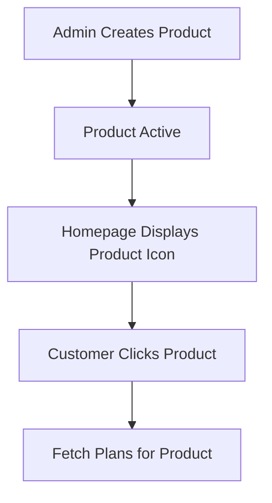

> The top-level categories defining the insurance business lines.

---

## Purpose
This document covers the Product API, which manages the broad categories of insurance offered by the company (e.g., Health, Motor, Life).

---

## Overview
- **Category Management**: Admins create top-level product lines.
- **Status Toggling**: Hiding entire business lines from the public.
- **Public Directory**: Fetching available products for the homepage.

---

## Business Context
Products sit at the top of the hierarchy. If the company decides to enter a new market (e.g., "Travel Insurance"), the admin creates a Product. Inside that Product, they create Plans.

---

## Feature Flow

---

## API Documentation

### 1. Create Product (Admin)
| Field | Value |
|---|---|
| Purpose | Creates a new broad insurance category. |
| Method | POST |
| URL | `/api/admin/products` |
| Auth Required | Yes (Admin) |
| Request Body | `{ "name": "HEALTH", "description": "Medical coverage", "iconUrl": "health.png" }` |
| Response | `ApiResponseDTO` with Product ID |
| Validation | Name must be unique and match `ProductType` enum. |
| Possible Errors | `400 Validation`, `409 Duplicate Name` |
| Business Logic | Saves to `products` table. |
| Frontend Screen | Admin Categories |

### 2. Get Active Products
| Field | Value |
|---|---|
| Purpose | Fetch all active categories for the customer homepage. |
| Method | GET |
| URL | `/api/products/active` |
| Auth Required | No (Public) |
| Request Body | None |
| Response | List of Products |
| Validation | None |
| Possible Errors | None |
| Business Logic | Queries `findByStatus(ACTIVE)`. |
| Frontend Screen | Public Homepage / Services Page |

### 3. Get Product by ID
| Field | Value |
|---|---|
| Purpose | Fetch specific category details. |
| Method | GET |
| URL | `/api/products/{id}` |
| Auth Required | No (Public) |
| Request Body | None |
| Response | Product details |
| Validation | Valid ID |
| Possible Errors | `404 Not Found` |
| Business Logic | Standard fetch by ID. |
| Frontend Screen | Product Landing Page |

### 4. Toggle Product Status (Admin)
| Field | Value |
|---|---|
| Purpose | Turns a whole business line on or off. |
| Method | PATCH |
| URL | `/api/admin/products/{id}/toggle-status` |
| Auth Required | Yes (Admin) |
| Request Body | None |
| Response | Updated status |
| Validation | Admin role check |
| Possible Errors | `404 Not Found` |
| Business Logic | Updates status. *Note: Does not automatically deactivate underlying plans, handled via business logic layer.* |
| Frontend Screen | Admin Categories |

---

## Design Decisions
1. **Enum Alignment:**
   The Product names strictly map to the `ProductType` enum (`HEALTH`, `MOTOR`, etc.) in the backend to ensure consistency and prevent typos in business logic routing.
2. **Separation from Plans:**
   Decoupling the broad category (Product) from the specific offering (Plan) allows the UI to render clean navigation menus and landing pages without loading hundreds of pricing configurations.

---

## Interview Notes
1. **Q: What is the relationship between Products, Plans, and Pricing?**
   **A:** One Product (Health) has Many Plans (Gold, Silver). One Plan has Many PricingRules, but only ONE active PricingRule at any given time.
2. **Q: If a Product is set to INACTIVE, can users still buy its plans?**
   **A:** No. The frontend hides the Product, and backend validation during the Quote generation phase checks if the parent Product of a Plan is ACTIVE.

---

## Related Documents
- `Plan_API.md`
