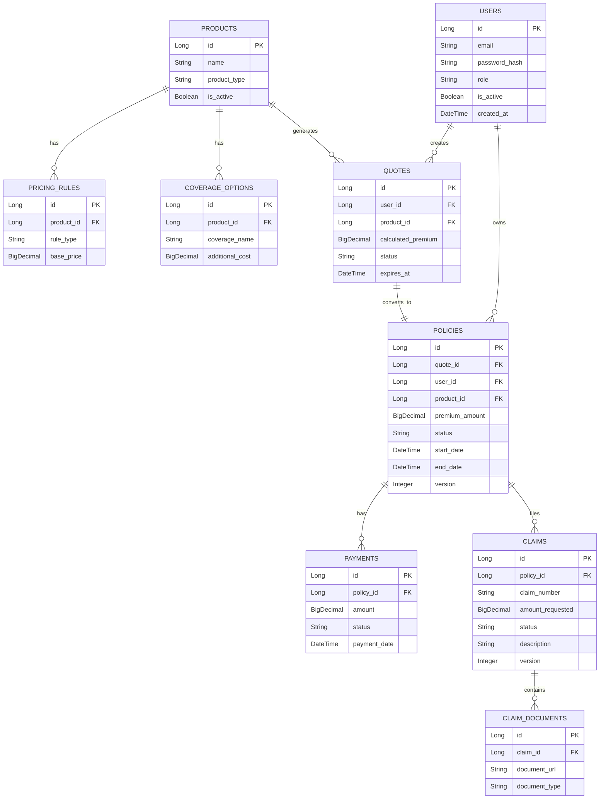

> Comprehensive map of the InsuranceFlow data model.

---

## Purpose
This document provides a visual representation and explanation of the database schema for the InsuranceFlow system. It helps developers and DBAs understand how the 17 tables relate to each other to support the business processes.

---

## Overview
- Maps the 16 core entities and 17 tables of the `insurance_db` database.
- Uses MySQL 8 with Hibernate `ddl-auto=update`.
- Divided into four logical groupings: Identity/Access, Catalog/Pricing, Sales, and Claims.
- Demonstrates key relationships driving policy and claim management.

---

## Business Context
The database design directly reflects the insurance lifecycle: users browse products, generate quotes, purchase policies, and file claims. Proper relational mapping ensures data integrity (e.g., a claim cannot exist without a valid policy).

---

## How to Read This Diagram
- **Boxes** represent database tables.
- **Lines** represent foreign key relationships.
- **Crow's Foot Notation**:
  - `||--o{` : One-to-Many (One record in the first table can have zero or more related records in the second table).
  - `||--||` : One-to-One (One record in the first table maps exactly to one record in the second table).
- **Primary Keys** are marked with `PK`.
- **Foreign Keys** are marked with `FK`.

---

## Architecture Diagram (if applicable)

---

## Database Design

### Identity and Access
- **Users Table**: Central identity store. Stores `ROLE_ADMIN`, `ROLE_INTERNAL_STAFF`, and `ROLE_CUSTOMER`.

### Catalog and Pricing
- **Products, Pricing Rules, Coverage Options**: Normalized to allow flexible pricing without altering core product definitions.

### Sales (Quotes & Policies)
- **Quotes**: Single-use estimates valid for 30 minutes.
- **Policies**: The core business contract.
- **Payments**: Records financial transactions linked to policies.

### Claims
- **Claims**: Tracks requests for payouts against a policy.
- **Claim Documents**: Stores references to Cloudinary URLs for uploaded proof.

---

## Design Decisions
- **Why `@Version` (optimistic locking) on Policy and Claim?**  
  To prevent lost updates if multiple internal staff attempt to update the same policy status or claim approval simultaneously. It ensures data consistency without expensive database locks.
- **Why no FK on `pricing_audit_logs`?**  
  Audit logs often outlive the entities they track. A strict foreign key would prevent the deletion of old pricing rules, leading to data bloat.
- **Why pricing snapshot on policy?**  
  Insurance is a legal contract. If a product's base price changes in the `products` table, existing policies MUST retain the exact price they were sold at.

---

## Interview Notes
1. **What tool did you use for ORM, and how does it map to MySQL?**  
   We used Hibernate (Spring Data JPA) with `ddl-auto=update` for schema management.
2. **Explain Optimistic Locking in your database.**  
   We added an `@Version` column to `Policies` and `Claims`. If two users edit the same record, the second save throws an `OptimisticLockException` because the version number has advanced.
3. **How do you handle prices changing over time?**  
   We snapshot the calculated premium into the `Policies` and `Quotes` tables at the time of creation, rather than dynamically joining to the live pricing tables.
4. **Why are claims related to policies and not users?**  
   A claim is inherently against a specific insurance contract (policy). The user is inferred through the policy ownership.
5. **How did you store claim documents?**  
   The database only stores the Cloudinary URL and document type in `claim_documents`. The actual binary file is offloaded to cloud storage.

---

## Related Documents
- `../04_Database/Table_Descriptions.md`
- `../04_Database/Entity_Relationships.md`
