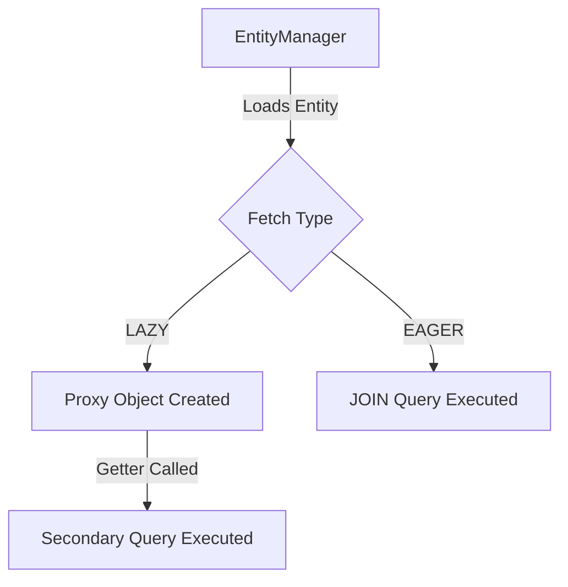

> Deep dive into Hibernate entity mappings and database cascades.

---

## Purpose
This document details the relational mappings defined in the JPA entities, explaining why specific cardinality, cascade types, and fetch strategies were selected for the InsuranceFlow system.

---

## Overview
- Explains 1:1, 1:N, and N:1 relationships in the core domain.
- Details Cascade behaviors (e.g., cascading saves from Claims to ClaimDocuments).
- Discusses Fetch Types (EAGER vs LAZY) and their performance implications.

---

## Business Context
Properly mapped entity relationships ensure that business objects behave correctly when loaded from or saved to the database. For example, if a user's account is deleted, we need strict rules on what happens to their policies and claims to maintain legal compliance.

---

## System Flow

---

## Backend Implementation

### Relationship Mappings

| Entity | Related Entity | Type | Cascade | Fetch | Why |
|--------|----------------|------|---------|-------|-----|
| User | Policy | 1:N | NONE | LAZY | Users can have many policies. We don't want to load all policies every time we check a user's role. |
| User | Quote | 1:N | NONE | LAZY | Quotes are high-volume; eager loading would cause memory issues. |
| Quote | Policy | 1:1 | NONE | LAZY | A quote converts to one policy. Soft links are preferred for historical tracking. |
| Product | PricingRule | 1:N | ALL | LAZY | Pricing rules are parts of a product. If a product is removed (rare), rules go with it. |
| Policy | Claim | 1:N | NONE | LAZY | A policy can have multiple claims. Loaded on demand when viewing a policy's claim history. |
| Claim | ClaimDocument | 1:N | ALL, orphanRemoval | LAZY | Documents belong strictly to a claim. If a claim is deleted, documents must be removed. |
| Policy | Payment | 1:N | PERSIST | LAZY | Payments are added to policies over time. |

---

## Database Design
The application predominantly uses `FetchType.LAZY` for collections (`@OneToMany`, `@ManyToMany`) to prevent N+1 select problems and excessive memory consumption during standard queries. Single-point relationships (`@ManyToOne`, `@OneToOne`) are carefully evaluated.

---

## Design Decisions
- **Why are certain relationships marked for LAZY conversion?**  
  In JPA, `@ManyToOne` is EAGER by default. We explicitly define `fetch = FetchType.LAZY` on relationships like `Claim -> Policy` because loading a list of claims would otherwise trigger a secondary query to fetch the Policy for every single claim, causing significant performance degradation (N+1 problem).
- **Why `CascadeType.ALL` for ClaimDocuments but `NONE` for User Policies?**  
  Claim documents are a composition of a Claim; they have no independent existence. Policies, however, are legal records. If a User entity is soft-deleted, their Policies must remain intact in the database for auditing and regulatory purposes.

---

## Interview Notes
1. **What is the N+1 problem and how did you avoid it?**  
   It occurs when an initial query loads N entities, and the ORM executes N additional queries to load their eager associations. I avoided it by defaulting to LAZY fetching and using `JOIN FETCH` in JPQL or EntityGraphs when I needed the related data.
2. **Difference between `CascadeType.REMOVE` and `orphanRemoval=true`?**  
   `CascadeType.REMOVE` deletes child entities when the parent is deleted. `orphanRemoval=true` deletes child entities when they are removed from the parent's collection, even if the parent isn't deleted. Used on ClaimDocuments.
3. **Why did you use soft deletes instead of cascades for Users?**  
   Insurance regulations require retaining financial data. Instead of cascading a delete to Policies, we set `is_active = false` on the User.

---

## Related Documents
- `../04_Database/ER_Diagram.md`
- `../04_Database/Constraints.md`
