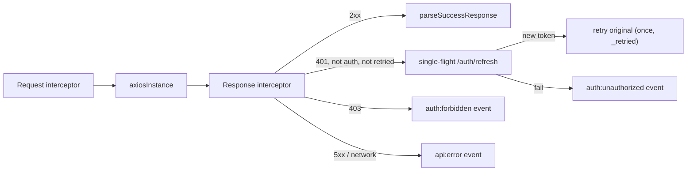

# Frontend API Integration

> How the SPA talks to the backend: the single Axios instance, its interceptors, the single-flight 401 refresh, the adapter that normalizes the API envelope, the service modules, and the shared error utilities.

## Purpose

Documents the complete API integration layer of `insurance-policy-claim-management-app-ui`. Engineers use this to know where to add an endpoint call, how errors and sessions are handled globally, and why the architecture (in-memory token + single-flight refresh) is the way it is. Implementation detail for the API section of [`../01_System_Architecture/Frontend_Architecture.md`](../01_System_Architecture/Frontend_Architecture.md).

## Overview

All HTTP flows through **one** Axios instance created in `src/api/axiosInstance.js` with `baseURL = import.meta.env.VITE_API_BASE_URL` (`.env.example` sets `/api`; in dev the Vite server proxies `/api` to the backend at `VITE_API_PROXY_TARGET`, e.g. `http://localhost:8081` — see [`Routing.md`](Routing.md) and `vite.config.js`). Layers:

```
page/service → services/*.js → axiosInstance (interceptors) → backend
                                    │
                        apiAdapter (parseSuccessResponse / parseErrorResponse)
```

- Request interceptor: NProgress, `FormData` handling, Bearer header.
- Response interceptor: envelope normalization, single-flight refresh on 401, one retry, window-event dispatch.
- `apiAdapter.js`: envelope parsing.
- `services/*.js`: one module per resource.
- `src/utils/{errorHandler,apiResponse,notificationService}.js`: shared error utilities.

Backend endpoint contracts: [`../03_API/API_Flow.md`](../03_API/API_Flow.md).

## Business Context

The backend returns a uniform envelope — `ApiResponseDTO<T>` for single results and `PageResponseDTO<T>` for pages, plus `ErrorResponseDTO` / `ValidationErrorResponseDTO` on failure. The frontend centralizes parsing so services never see `response.data.data`. Centralizing auth also matters: a long-lived session means the access token rotates every ~15 minutes (JWT expiry, see the Fact Sheet), so every request must tolerate a token that may have just expired — hence the automatic silent refresh.

## Technical Design

### Axios instance and interceptors



**Request interceptor** (`axiosInstance.interceptors.request.use`):

1. `startProgress()` — NProgress with an active-request counter and a minimum visible duration (300 ms), so concurrent requests do not flick the bar.
2. If `config.data instanceof FormData`, deletes `config.headers['Content-Type']` so the browser sets the multipart boundary itself.
3. If a token exists, sets `Authorization: Bearer <token>` from the in-memory `tokenStore`.

**Response interceptor** (`axiosInstance.interceptors.response.use`):

- **Success:** `finishProgress()` then return `parseSuccessResponse(response)`.
- **Error:** `finishProgress()`, then classify by `error.response?.status`:
  - `401` on a protected, non-auth call not yet retried → mark `originalRequest._retried = true`, await the single-flight refresh, store the new token, dispatch `auth:token-refreshed` (`detail: newToken`), and replay `axiosInstance(originalRequest)`. If the refresh rejects, the error is returned (`auth:unauthorized` was already dispatched inside the refresh helper).
  - `401` otherwise (auth calls, already-retried, or refresh failure) → `clearToken()`, remove `ss_user`, dispatch `auth:unauthorized`.
  - `403` → dispatch `auth:forbidden`.
  - `>= 500` or no response (network) → dispatch `api:error` with the parsed message.
  - All failures reject with `parseErrorResponse(error)` so callers get a normalized error.

### Single-flight refresh

```js
let pendingRefreshPromise = null;
const refreshAccessToken = () => {
  if (pendingRefreshPromise) return pendingRefreshPromise;
  pendingRefreshPromise = axios
    .post(`${BASE_URL}/auth/refresh`, null, { withCredentials: true })
    .then((response) => response.data?.data?.accessToken)
    .catch(() => {
      clearToken();
      localStorage.removeItem('ss_user');
      window.dispatchEvent(new CustomEvent('auth:unauthorized'));
      return Promise.reject(new Error('Refresh token invalid'));
    })
    .finally(() => { pendingRefreshPromise = null; });
  return pendingRefreshPromise;
};
```

- **One shared promise.** When several requests 401 simultaneously (for example, a dashboard firing parallel stat calls), they all `await` the *same* refresh instead of hammering `/auth/refresh` with N parallel calls. Only one refresh round-trip happens.
- **One retry.** The `_retried` flag on the original config guarantees each request is replayed at most once; a second 401 (token still bad) falls through to `auth:unauthorized`.
- **Failure handling.** A failed refresh clears the token and user marker, dispatches `auth:unauthorized` (which `GlobalApiHandler` turns into forced logout + redirect to `/login` with `state.from`), and rejects — so the awaiting requests fail with their original error.
- It is issued via a **bare `axios`** call (not `axiosInstance`) so it never recurses into the interceptor, and with `withCredentials: true` to send the HttpOnly refresh cookie.

### Why the access token is in memory

The token lives only in `src/api/tokenStore.js` (module-scope `let accessToken`). Storing it in `localStorage`/`sessionStorage` would expose it to any XSS payload that can read storage. Because the backend persists the long-lived credential in an HttpOnly `refresh_token` cookie (rotated on every use, 7-day TTL — see [`../01_System_Architecture/Security_Architecture.md`](../01_System_Architecture/Security_Architecture.md)), the app can silently re-issue access tokens on boot (`AuthContext.restoreSession`) and on 401, so the in-memory design costs nothing in UX. Trade-off accepted: an access token never survives a reload — by design, since the refresh cookie restores it.

### Envelope adapter (`src/api/apiAdapter.js`)

- **`parseSuccessResponse(response)`**
  - Detects a paginated payload (`payload.data` has both `content` and `pageNumber`) and returns `{ success, message, data: content, pagination: { pageNumber, pageSize, totalRecords, totalPages, lastPage, sortingType } }` plus backward-compat aliases (`content`, `totalElements`, `totalRecords`, `totalPages`, `pageNumber`).
  - For an array payload, returns the array decorated with `success`/`message`/`data`/`timeStamp`.
  - Otherwise returns `{ success, message, data, timeStamp }` with the single object's fields copied to the top level for backward compatibility.
- **`parseErrorResponse(error)`** returns `{ success:false, message, errorType, statusCode, fieldErrors, timeStamp }` from the `ErrorResponseDTO`/`ValidationErrorResponseDTO`; falls back to `NETWORK_ERROR` with a 500 status for network failures.

`src/api/apiTypes.js` documents the DTO shapes (`ApiResponseDTO`, `PageResponseDTO`, `ErrorResponseDTO`, `ValidationErrorResponseDTO`) as JSDoc typedefs.

### Service modules (`src/services/*.js`)

One module per resource; every function uses `axiosInstance` and returns the already-normalized response.

| Module | Main exported functions |
|---|---|
| `authService.js` | `login` (decodes JWT into user object), `register`, `verifyOtpApi`, `resendOtpApi`, `forgotPasswordApi`, `resetPasswordApi`, `refreshSession`, `logout` |
| `userService.js` | `getAllUsers` (paged), `getUserById`, `createStaff`, `activateUser`, `deactivateUser` |
| `customerService.js` | `getProfile`, `createProfile`, `updateProfile`, `getAllCustomersPaginated`, `getAllCustomers`, `getCustomerById` |
| `productService.js` | `getAllProducts`/`getActiveProducts`, `getAllProductsPaginated`, `getProductById`, `createProduct`, `updateProduct`, `activateProduct`, `deactivateProduct` |
| `planService.js` | `getAllPlansPaginated`, `getAllPlans`/`getActivePlans`, `getPlansByProduct`, `getPlanById`, `createPlan` (wizard), `updatePlan`, `activatePlan`, `deactivatePlan`, `regenerateCoverageOptions`, `updatePricingRule` |
| `coverageOptionService.js` | `createCoverageOption`/`configureCoverageOptions`, `getCoverageOptions`, `updateCoverageOption`, `activateCoverageOption`, `deactivateCoverageOption`, `deleteCoverageOption` |
| `pricingRuleService.js` | `createPricingRule`, `previewPricingRule`, `activatePricingRule`, `deactivatePricingRule`, `getAllPricingRulesForPlan`, `getActivePricingRuleForPlan`, `getPricingRuleHistory`, `deletePricingRule` |
| `quoteService.js` | `generateQuote` (customer), `generateQuoteAsAdmin` |
| `policyService.js` | `getMyPolicies`, `getAllPoliciesPaginated`, `getPolicyById`, `getPoliciesByCustomerId`, `getClaimsByPolicy`, `issuePolicy`, `cancelPolicy`, `purchasePolicy` |
| `paymentService.js` | `getAllPaymentsPaginated`, `recordPayment`, `getMyPayments`, `getPaymentsByMyPolicy`, `getPaymentsByPolicyId` |
| `claimService.js` | `getAllClaimsPaginated`, `getClaimById`, `getClaimHistory`, `getMyClaims`, `raiseClaim` (multipart), `uploadDocuments`, `assignClaim`, `markUnderReview`, `reviewClaim`, `approveClaim`, `rejectClaim` |
| `claimDocumentService.js` | `uploadClaimDocuments` (multipart, customer) |
| `dashboardService.js` | `getAdminStats` (`Promise.allSettled` aggregation of stat endpoints) |
| `publicService.js` | `getPlatformStats` |

### Error handling utilities

- **`src/utils/apiResponse.js`** — `extractData`, `extractList`, `extractMessage`, `extractSuccess`, `extractErrorMessage`, `extractValidationErrors`; defensive accessors over the envelope.
- **`src/utils/errorHandler.js`** — `handleApiError(error, defaultMessage)`: if `extractValidationErrors` returns an object, returns `{ isValidationError: true, messages }` so fields can be highlighted *without* a toast; otherwise `notify.error(error, defaultMessage)` and returns `{ isValidationError: false }`.
- **`src/utils/notificationService.js`** — singleton `notify` (`success/error/warning/info`) over `react-hot-toast`, preferring the backend message. Rendered by `GlobalToaster`.

Events are consumed by `GlobalApiHandler` (see [`State_Management.md`](State_Management.md)).

## Workflow

1. A page calls a service function (e.g. `policyService.getMyPolicies({ page, size })`).
2. The service calls `axiosInstance`; the request interceptor starts NProgress and attaches the Bearer token (or removes `Content-Type` for `FormData`).
3. The backend returns the envelope; the response interceptor normalizes it and the page renders `response.data` (or `response.pagination` for paged lists).
4. On a 401 the instance single-flight-refreshes and retries once; on a 403 the user is sent to `/unauthorized`; on 5xx/network the user sees a toast.
5. On refresh failure the session ends: `auth:unauthorized` → `GlobalApiHandler` forced logout + redirect.

## Code References

| Concern | File (repo-root-relative path) |
|---|---|
| Axios instance + interceptors | `insurance-policy-claim-management-app-ui/src/api/axiosInstance.js` |
| In-memory token store | `insurance-policy-claim-management-app-ui/src/api/tokenStore.js` |
| Envelope adapter | `insurance-policy-claim-management-app-ui/src/api/apiAdapter.js` |
| DTO typedefs | `insurance-policy-claim-management-app-ui/src/api/apiTypes.js` |
| Service modules | `insurance-policy-claim-management-app-ui/src/services/*.js` |
| Error helpers | `insurance-policy-claim-management-app-ui/src/utils/{apiResponse,errorHandler,notificationService}.js` |
| Base URL / proxy config | `insurance-policy-claim-management-app-ui/vite.config.js`, `insurance-policy-claim-management-app-ui/.env.example` |

## Diagrams

- Interceptor flow and single-flight refresh diagram above.
- API flows end-to-end: [`../03_API/API_Flow.md`](../03_API/API_Flow.md).

## Best Practices

- Always go through a `services/*.js` function; never call `axiosInstance` directly from a page.
- Treat the adapter output as final — do not parse `response.data.data` again in components.
- Keep `_retried` single-shot and the refresh single-flight; never loop retries.
- Use `FormData` without a hard-coded `Content-Type` so the browser sets the multipart boundary.

## Future Improvements

- Generate service modules from the OpenAPI contract instead of hand-writing them.
- Move the duplicate upload helpers (`claimService.uploadDocuments` vs `claimDocumentService.uploadClaimDocuments`) into one canonical service.
- See `../10_Evaluation/Future_Enhancements.md`.

## See Also

- [`../03_API/API_Flow.md`](../03_API/API_Flow.md) — API flows and payloads.
- [`State_Management.md`](State_Management.md) — event consumption and session state.
- [`Protected_Routes.md`](Protected_Routes.md) — what `auth:unauthorized` triggers.
- [`../01_System_Architecture/Frontend_Architecture.md`](../01_System_Architecture/Frontend_Architecture.md) — system overview.
