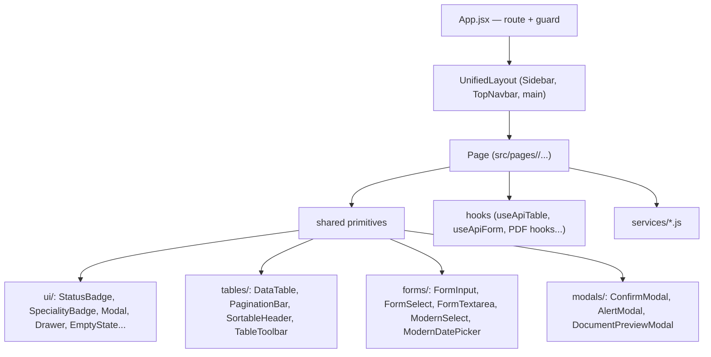

# Frontend Component Architecture

> Inventory of the shared, layout, and page components in `insurance-policy-claim-management-app-ui`, plus the composition and prop conventions that keep them consistent.

## Purpose

Gives engineers the component map of the React SPA: which building blocks exist, what each family is for, how pages compose with the layout, and how the same components are reused across roles (for example, admin and staff sharing list/detail pages). Detail for [`../01_System_Architecture/Frontend_Architecture.md`](../01_System_Architecture/Frontend_Architecture.md).

## Overview

Components live under `src/components/`, organized by role: `common/`, `ui/`, `forms/`, `tables/`, `modals/`, `navigation/`, `layouts/`, `dashboard/`, `claims/`, `admin/`, `auth/`, `customer/`. Pages live under `src/pages/{auth,admin,staff,customer,shared}` and are wired in `src/App.jsx` (see [`Routing.md`](Routing.md)). `src/common/BentoCard.jsx` sits outside `components/` as a shared dashboard card.

Composition is intentionally simple: **guard → layout → page**, where the layout renders the routed page through an `<Outlet/>` and pages are assembled from the shared primitives (`DataTable`, `StatusBadge`, `Modal`, form fields, hooks).

## Business Context

Reuse is what keeps three portals maintainable. Admin and staff both list and view policies, claims, customers, and payments; customer detail drawers and claim review drawers differ only in the actions exposed. By sharing list/detail components and styling through CSS variables, the UI avoids three divergent implementations of the same table.

## Technical Design

### Composition pattern

A page therefore declares: `useApiTable` for its list data, `DataTable` + `PaginationBar` + `PageHeader` for the layout of the list, `StatusBadge` for status cells, `Modal`/`Drawer` for detail views, and a service module for API calls.

### Shared / common components

| Component | File | Responsibility |
|---|---|---|
| `GlobalApiHandler` | `components/common/GlobalApiHandler.jsx` | Consumes `auth:unauthorized`, `auth:forbidden`, `api:error` events; forced logout, redirects, toasts. Renders `null`. |
| `GlobalToaster` | `components/common/GlobalToaster.jsx` | One `react-hot-toast` `<Toaster>` (top-right, frosted glass). |
| `LoadingSpinner` | `components/common/LoadingSpinner.jsx` | Centered Bootstrap spinner using `var(--ip-brand)`, optional label. |
| `PageHeader` | `components/common/PageHeader.jsx` | Title, subtitle, optional back button and header action slot. |
| `PageTransition` | `components/common/PageTransition.jsx` | Framer Motion fade/slide wrapper (imported where motion is wanted). |
| `Stepper` | `components/common/Stepper.jsx` | Step circles + connectors with completed/active styling (purchase flow). |
| `ExportButton` | `components/common/ExportButton.jsx` | CSV export; optionally calls a `fetchAll` to export all rows, not just the page. |
| `ThemeToggle` | `components/common/ThemeToggle.jsx` | Light/dark toggle using `ThemeContext`. |
| `BentoCard` | `src/common/BentoCard.jsx` | Dashboard card with icon, title, optional "View all" link and children. |

### UI primitives

| Component | File | Responsibility |
|---|---|---|
| `StatusBadge` | `components/ui/StatusBadge.jsx` | Pill badge mapping every domain status (`ACTIVE`, `SUBMITTED`, `UNDER_REVIEW`, `RECOMMENDED_FOR_APPROVAL`, `RECOMMENDED_FOR_REJECTION`, `APPROVED`, `REJECTED`, `PENDING_PAYMENT`, `CANCELLED`, `EXPIRED`, `SUCCESS`, `FAILED`, `INACTIVE`, …) to a color/icon via CSS variables. |
| `SpecialityBadge` | `components/ui/SpecialityBadge.jsx` | Staff speciality pill (`HEALTH`, `LIFE`, `MOTOR`, `TRAVEL`, `INSURANCE`, `ALL`) with per-speciality colors. |
| `Modal` | `components/ui/Modal.jsx` | Generic modal with title + footer slot. |
| `Drawer` | `components/ui/Drawer.jsx` | Slide-in detail drawer (used by claim detail pages, width ~900px). |
| `EmptyState` | `components/ui/EmptyState.jsx` | Icon + message empty placeholder. |
| `ErrorAlert` | `components/ui/ErrorAlert.jsx` | Dismissible error alert. |
| `FilterChips` / `FilterPanel` | `components/ui/FilterChips.jsx` / `FilterPanel.jsx` | Filter toolbar UI for tables. |
| `LoadingButton` | `components/ui/LoadingButton.jsx` | Button with inline spinner + loading label. |
| `CopyToClipboard` | `components/ui/CopyToClipboard.jsx` | Copy button for reference values. |

### Tables

| Component | File | Responsibility |
|---|---|---|
| `DataTable` | `components/tables/DataTable.jsx` | Column-spec-driven table. Stale-while-loading: keeps prior rows dimmed while refreshing; first load renders headers + inline spinner (no full-page loader); empty state when no rows. Rows are clickable/`onKeyDown`-activatable. |
| `PaginationBar` | `components/tables/PaginationBar.jsx` | Page controls bound to `useApiTable`/`usePagination` state. |
| `SortableHeader` | `components/tables/SortableHeader.jsx` | Click-to-sort column header. |
| `TableToolbar` | `components/tables/TableToolbar.jsx` | Search/filter/export toolbar for lists. |

### Forms

| Component | File | Responsibility |
|---|---|---|
| `FormInput` / `FormSelect` / `FormTextarea` | `components/forms/` | Bootstrap form fields with label + error handling. |
| `ModernSelect` | `components/forms/ModernSelect.jsx` | Rich select with main/sub text (used for policy pickers). |
| `ModernDatePicker` | `components/forms/ModernDatePicker.jsx` | Date input with min/max constraints (claim incident date). |

### Modals

| Component | File | Responsibility |
|---|---|---|
| `ConfirmModal` | `components/modals/ConfirmModal.jsx` | Yes/No confirmation. |
| `AlertModal` | `components/modals/AlertModal.jsx` | Informational alert dialog. |
| `DocumentPreviewModal` | `components/modals/DocumentPreviewModal.jsx` | Previews a claim document (Cloudinary URL) in a modal. |

### Domain components

| Component | File | Responsibility |
|---|---|---|
| `ClaimHistoryTimeline` | `components/claims/ClaimHistoryTimeline.jsx` | Timestamped claim status history timeline. |
| `StatTile` / `QuickAction` | `components/dashboard/StatTile.jsx` / `QuickAction.jsx` | Dashboard stat card / quick-action button. |
| `PremiumBreakdownCard` | `components/customer/PremiumBreakdownCard.jsx` | Premium breakdown (base, processing fee, GST, total). |
| `QuoteCountdownTimer` | `components/customer/QuoteCountdownTimer.jsx` | Counts down to quote expiry; calls `onExpire`. |
| `CoverageOptionsManager` / `PricingRuleManager` / `PricingRulePanel` / `PricingRuleHistoryModal` | `components/admin/` | Admin plan/coverage/pricing-rule management panels. |
| `ResendOtp` | `components/auth/ResendOtp.jsx` | Resend OTP with cooldown; also used as a modal trigger for unverified logins. |

### Layout components

`Sidebar`, `TopNavbar`, and `UnifiedLayout` (a.k.a. `MainLayout`) are documented in [`Layout.md`](Layout.md). `AuthLoading` (an inline centered spinner in `src/App.jsx`), `GlobalToaster`, and `GlobalApiHandler` complete the shell.

### Page components by area

| Area | Pages (`src/pages/...`) |
|---|---|
| Auth | `LandingPage.jsx`; `auth/Login.jsx`, `Register.jsx`, `ForgotPassword.jsx`, `VerifyOtp.jsx` |
| Shared | `shared/NotFound.jsx`, `Unauthorized.jsx` |
| Admin | `admin/AdminDashboard.jsx`; `users/{UserListPage,CreateStaffPage,UserDetailPage}`; `customers/{CustomerListPage,CustomerDetailPage}`; `products/{ProductListPage,CreateProductPage,EditProductPage,ProductDetailPage}`; `plans/{PlanListPage,CreatePlanPage,EditPlanPage,PlanDetailPage}`; `policies/{PolicyListPage,PolicyDetailPage,IssuePolicyPage}`; `claims/{ClaimListPage,ClaimDetailPage}`; `payments/PaymentListPage.jsx` |
| Staff | `staff/StaffDashboard.jsx`; `customers/{StaffCustomerListPage,StaffCustomerDetailPage}`; `policies/{StaffPolicyListPage,StaffPolicyDetailPage,StaffIssuePolicyPage}`; `claims/{StaffClaimListPage,StaffClaimDetailPage}`; `payments/{StaffPaymentListPage,StaffRecordPaymentPage}` |
| Customer | `customer/CustomerDashboard.jsx`; `profile/{ProfilePage,EditProfilePage}`; `products/CustomerProductListPage.jsx`; `plans/CustomerPlanListPage.jsx`; `policies/{PurchasePolicyPage,CustomerPolicyListPage,CustomerPolicyDetailPage}`; `payments/{CustomerPaymentHistoryPage,RecordPaymentPage}`; `claims/{CustomerClaimListPage,RaiseClaimPage,ClaimDetailsPage,UploadDocumentsPage}` |

### Reuse across roles

- **Shared detail pages.** `ProfilePage` and `EditProfilePage` are mounted under both `/staff/profile` and `/customer/profile`. The claim-detail pattern is shared between `StaffClaimDetailPage` and `ClaimDetailPage` (Drawer + `ClaimHistoryTimeline` + `DocumentPreviewModal`), differing only in actions: staff `Start Review` / `Add Recommendation`, admin `Final Decision`.
- **Shared primitives.** Admin and staff list pages all use `DataTable` + `PaginationBar` + `useApiTable`; customer-facing lists use cards + `useClientPagination`.
- **Shared customer components in staff screens.** `StaffIssuePolicyPage` reuses `PremiumBreakdownCard` and `QuoteCountdownTimer` from the customer purchase flow for the admin quote.

### Prop conventions

- Presentational components take plain props and read styling from CSS variables (`var(--ip-*)`); they do not fetch data themselves.
- `DataTable` takes `{ columns, data, loading, onRowClick, emptyIcon, emptyMessage, compact }`; columns are `{ header, accessor, cell?, minWidth? }`.
- `StatusBadge` takes a single `status`; `SpecialityBadge` takes `speciality` + optional `size`/`className`.
- Modal-like components expose `isOpen`/`onClose`; `Drawer` mirrors that API.
- Pages own data-fetching (through hooks) and pass plain values down; child components never import services.

## Workflow

1. A new list page: import `PageHeader`, `DataTable`, `PaginationBar`, `useApiTable`, a service function — no new table code required.
2. A new detail view: reuse `Drawer`/`Modal`, `StatusBadge`, and domain components like `ClaimHistoryTimeline`.
3. A new dashboard: compose `BentoCard`, `StatTile`, and `QuickAction`.

## Code References

| Concern | File (repo-root-relative path) |
|---|---|
| Component folders | `insurance-policy-claim-management-app-ui/src/components/{common,ui,forms,tables,modals,navigation,layouts,dashboard,claims,admin,auth,customer}` |
| Shared card | `insurance-policy-claim-management-app-ui/src/common/BentoCard.jsx` |
| Pages | `insurance-policy-claim-management-app-ui/src/pages/{auth,admin,staff,customer,shared}` |
| Route wiring | `insurance-policy-claim-management-app-ui/src/App.jsx` |

## Diagrams

- Composition diagram above; application-level diagram in [`../01_System_Architecture/Frontend_Architecture.md`](../01_System_Architecture/Frontend_Architecture.md).

## Best Practices

- Keep pages thin: let hooks fetch and primitives render; pages only assemble.
- Style through CSS variables so the role theme re-skins every shared component automatically.
- When a new page looks like an existing one in another role, extend the shared pattern instead of duplicating it.

## Future Improvements

- Promote the most reused fragments (e.g. a `ClaimReviewPanel`) into first-class shared components as admin/staff pages grow.
- See `../10_Evaluation/Future_Enhancements.md`.

## See Also

- [`Layout.md`](Layout.md) — the shell components.
- [`Custom_Hooks.md`](Custom_Hooks.md) — the behavior layer behind pages.
- [`Routing.md`](Routing.md) — which pages are mounted where.
- [`../01_System_Architecture/Frontend_Architecture.md`](../01_System_Architecture/Frontend_Architecture.md) — system overview.
