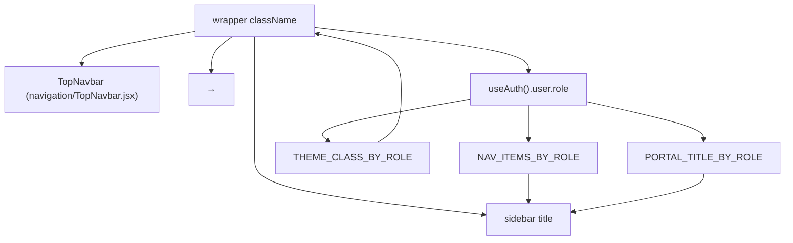

# Frontend Layout System

> How the authenticated app shell is composed: `UnifiedLayout` (a.k.a. `MainLayout`) combining `Sidebar` and `TopNavbar`, with role-driven navigation, portal titles, breadcrumbs, and the role theme applied at the wrapper.

## Purpose

Explains the layout layer of `insurance-policy-claim-management-app-ui` — the single authenticated shell shared by all `/admin/*`, `/staff/*`, and `/customer/*` pages. It documents the role-driven navigation model, responsive sidebar behavior, breadcrumb/top-bar behavior, and exactly where the role accent theme is applied. Implementation detail for [`../01_System_Architecture/Frontend_Architecture.md`](../01_System_Architecture/Frontend_Architecture.md).

## Overview

`src/components/layouts/UnifiedLayout.jsx` exports `MainLayout`, used once in `src/App.jsx` as the parent of the three role route blocks:

```
<Route element={<MainLayout><Outlet/></MainLayout>}>
```

It renders, in order: a `Sidebar`, a `TopNavbar`, and `<main className="ip-content">` that hosts the routed `Outlet`. Everything the user sees after login lives in this shell, so navigation, theming, and chrome are configured in exactly one place. The component derives three role-driven tables from `useAuth()`:

- `NAV_ITEMS_BY_ROLE` — the sidebar links per role.
- `THEME_CLASS_BY_ROLE` — the role accent theme class (`theme-admin`, `theme-staff`, `theme-customer`).
- `PORTAL_TITLE_BY_ROLE` — the portal name shown in the sidebar brand (`Admin Panel`, `Staff Console`, `Customer Portal`).

## Business Context

Each actor works in a purpose-built workspace. The layout reinforces the separation of duties enforced by routing and the backend: a customer only ever sees the Explore/Account menu of the Customer Portal, a staff member the Manage/Actions menu of the Staff Console, and an admin the Management/Catalog/Operations menu of the Admin Panel. The accent color further disambiguates the workspace at a glance.

## Technical Design

### Component composition



The wrapper carries the role theme class and page background:

```jsx
<div className={themeClass} style={{ minHeight: "100vh", backgroundColor: "var(--ip-bg)" }}>
```

Because the CSS role blocks (`theme-admin`, `theme-staff`, `theme-customer`) are defined in `src/index.css` and re-declare `--ip-brand` and friends, *every descendant* of this wrapper picks up the role accent — buttons, links, badges, focus rings — through the existing `var(--ip-*)` tokens. That is the single application point for role theming (see [`Component_Architecture.md`](Component_Architecture.md) and the theming summary in [`UI_Workflows.md`](UI_Workflows.md)).

### Navigation items by role

`NAV_ITEMS_BY_ROLE` is an object keyed by role constant (`ROLE_ADMIN`, `ROLE_INTERNAL_STAFF`, `ROLE_CUSTOMER` from `src/utils/roles.js`). Each item is `{ to, icon, label, end?, section? }`; `section` groups links under a small uppercase heading in the sidebar.

**Admin — `ROLE_ADMIN` (sections: Management / Catalog / Operations)**

| Section | Label | Icon | Route |
|---|---|---|---|
| — | Dashboard | `bi-speedometer2` | `/admin/dashboard` (end) |
| Management | Users | `bi-people` | `/admin/users` |
| — | Customers | `bi-person-badge` | `/admin/customers` |
| Catalog | Products | `bi-box-seam` | `/admin/products` |
| — | Plans | `bi-layers` | `/admin/plans` |
| Operations | Policies | `bi-file-earmark-text` | `/admin/policies` |
| — | Claims | `bi-shield-exclamation` | `/admin/claims` |
| — | Payments | `bi-credit-card` | `/admin/payments` |

**Staff — `ROLE_INTERNAL_STAFF` (sections: Manage / Actions)**

| Section | Label | Icon | Route |
|---|---|---|---|
| — | Dashboard | `bi-speedometer2` | `/staff/dashboard` (end) |
| Manage | Customers | `bi-people` | `/staff/customers` |
| — | Policies | `bi-file-earmark-text` | `/staff/policies` |
| — | Claims | `bi-shield-exclamation` | `/staff/claims` |
| — | Payments | `bi-credit-card` | `/staff/payments` |
| Actions | Issue Policy | `bi-file-earmark-plus` | `/staff/issue-policy` |

**Customer — `ROLE_CUSTOMER` (sections: Explore / Account)**

| Section | Label | Icon | Route |
|---|---|---|---|
| — | Dashboard | `bi-speedometer2` | `/customer/dashboard` (end) |
| Account | My Profile | `bi-person-circle` | `/customer/profile` |
| Explore | Insurance Products | `bi-box-seam` | `/customer/products` |
| — | My Policies | `bi-file-earmark-text` | `/customer/policies` |
| — | Payment History | `bi-credit-card` | `/customer/payments` |
| — | My Claims | `bi-shield-exclamation` | `/customer/claims` |

### Sidebar behavior

`Sidebar` receives `navItems`, `isOpen`, `setIsOpen`, `isCollapsed`, `setIsCollapsed`, and `title`. It renders a brand header (logo + portal name), the nav list, and a user footer with logout.

- **Desktop collapse.** A toggle button (`d-none d-md-flex`) collapses the sidebar from the full width (`--ip-sidebar-width: 260px`) to the icon rail (`--ip-sidebar-collapsed: 68px`); the main area gets the `sidebar-collapsed` modifier class so it reflows. Collapsed mode hides labels, section headings, the portal name, and the user details.
- **Mobile overlay.** Below the `md` breakpoint the sidebar is hidden off-canvas; the top bar hamburger (`d-md-none`) opens it with the `mobile-open` class plus a full-screen `ip-sidebar-overlay` that closes it on tap. Clicking any nav link closes the overlay.
- **Active state.** Each link is a `NavLink`; `end` is set on Dashboard links so only the dashboard highlights at its exact path.
- **Staff speciality filtering.** The nav filters items that declare a `speciality` against the signed-in staff member's `productSpeciality` (only items matching the staff speciality or `ALL` are shown). No current item declares one, so today all staff items render.
- **User footer.** Shows an avatar initial, name, email, and — for staff — a `SpecialityBadge`. Logout calls `useAuth().logout()`, toasts, and navigates to `/login` (see [`Protected_Routes.md`](Protected_Routes.md) for the `isLoggingOut` marker flow).

### TopNavbar behavior

`TopNavbar` receives `onMenuClick` and `breadcrumb`. It renders:

- **Left:** a mobile hamburger, desktop back/forward buttons (`navigate(-1)` / `navigate(1)`), and a breadcrumb. The breadcrumb is passed in by `MainLayout` as `<Role> Portal` (e.g. `Staff Portal`, derived from the user role); if absent it is computed from the current `location.pathname` segments, each de-hyphenated and title-cased.
- **Right:** a theme toggle (uses `ThemeContext`, switches `data-theme`/`data-bs-theme`; icon swaps sun/moon), a divider, and the signed-in user's avatar initial, name, and role.

### Responsive summary

| Breakpoint | Sidebar | Content |
|---|---|---|
| `< md` | Hidden; opened as overlay via hamburger; back-arrow closes | Full-width `ip-content` |
| `>= md` | Fixed rail; collapse/expand toggle | Reflows with `sidebar-collapsed` |

The role theme class is applied on the same wrapper at every breakpoint, so the accent is consistent across desktop and mobile.

## Workflow

1. `App.jsx` mounts `MainLayout` around the protected route block.
2. `MainLayout` reads the user's role, resolves `NAV_ITEMS_BY_ROLE`, `THEME_CLASS_BY_ROLE`, and `PORTAL_TITLE_BY_ROLE`, and renders `Sidebar` + `TopNavbar` + `<main className="ip-content">` with the routed page in the outlet.
3. On mobile the hamburger toggles `sidebarOpen` (overlay); on desktop the chevron toggles `sidebarCollapsed` (icon rail).
4. Navigating a link closes the mobile overlay and the `NavLink` active state updates; the top bar breadcrumb reflects the role or current path.

## Code References

| Concern | File (repo-root-relative path) |
|---|---|
| Layout shell + role tables | `insurance-policy-claim-management-app-ui/src/components/layouts/UnifiedLayout.jsx` |
| Sidebar (collapse + overlay) | `insurance-policy-claim-management-app-ui/src/components/navigation/Sidebar.jsx` |
| TopNavbar (breadcrumb + theme toggle) | `insurance-policy-claim-management-app-ui/src/components/navigation/TopNavbar.jsx` |
| Role theme CSS blocks | `insurance-policy-claim-management-app-ui/src/index.css` (`.theme-admin`, `.theme-staff`, `.theme-customer`) |
| Role constants | `insurance-policy-claim-management-app-ui/src/utils/roles.js` |
| Theme state | `insurance-policy-claim-management-app-ui/src/context/ThemeContext.jsx` |
| Route mounting of the layout | `insurance-policy-claim-management-app-ui/src/App.jsx` |

## Diagrams

- Inline composition diagram above.
- Application structure with layout placement: [`../01_System_Architecture/Frontend_Architecture.md`](../01_System_Architecture/Frontend_Architecture.md).

## Best Practices

- Centralize chrome in one layout so a new page automatically inherits navigation, breadcrumb, and role theme.
- Drive the menu and theme from the single user-role value rather than from the URL, keeping them consistent with routing.
- Keep `NAV_ITEMS_BY_ROLE` data-driven (route + icon + label + section) so adding a menu entry does not touch `Sidebar` markup.

## Future Improvements

- Per-role nested layouts if admin/staff/customer chrome diverges.
- Persist the collapsed state per role (`localStorage`) for a nicer long-session experience.
- See `../10_Evaluation/Future_Enhancements.md`.

## See Also

- [`Routing.md`](Routing.md) — how the layout wraps the route tree.
- [`Component_Architecture.md`](Component_Architecture.md) — the full component inventory.
- [`UI_Workflows.md`](UI_Workflows.md) — theming and design-token summary.
- [`../01_System_Architecture/Frontend_Architecture.md`](../01_System_Architecture/Frontend_Architecture.md) — system overview.
