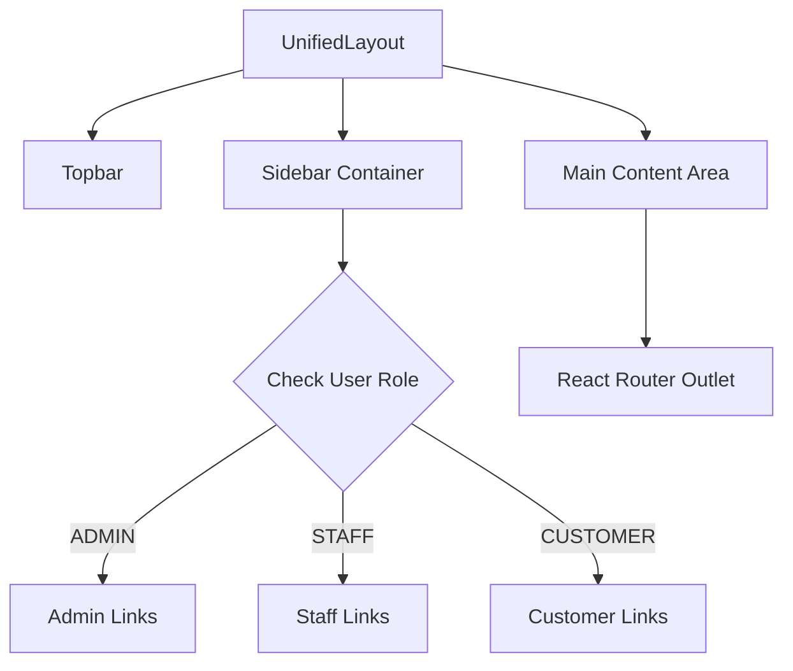

# Layout
> Unified, responsive layout architecture with role-based theming.

---

## Purpose
This document explains the `UnifiedLayout` component, which serves as the structural shell for all authenticated pages in the application.

---

## Overview
- A single wrapper component (`UnifiedLayout`) handles the Sidebar, Topbar, and Main Content area.
- Sidebar navigation links change dynamically based on the user's role.
- Includes a global Dark/Light mode toggle.
- Applies subtle CSS theme differences based on the role to visually distinguish environments.

---

## Layout Architecture Diagram

---

## UnifiedLayout Wrapper
The `UnifiedLayout` is applied via React Router's nested routing. 
It uses CSS Grid/Flexbox to maintain a fixed sidebar on desktop and a collapsible offcanvas menu on mobile.

## Sidebar Navigation per Role
The sidebar reads the user's role from `AuthContext` and renders the appropriate link configuration.
- **Admin**: Dashboard, User Management, System Settings.
- **Staff**: Dashboard, Policy Underwriting, Claim Processing.
- **Customer**: Dashboard, My Policies, File a Claim, Get a Quote.

## Dark/Light Mode Toggle
Located in the Topbar, it triggers the `toggleTheme` function from `ThemeContext`. This updates a `data-bs-theme` attribute on the HTML `<body>` tag, which Bootstrap 5 uses to apply CSS variables for dark mode.

## Role Theming
To provide visual context, the layout applies subtle accent classes based on the user's role.

| Role | Theme Accent Color | Primary Usage |
|------|--------------------|---------------|
| `ROLE_ADMIN` | Blue (`primary`) | Sidebar highlights, active links |
| `ROLE_INTERNAL_STAFF` | Violet (`indigo` / custom) | Sidebar highlights, active links |
| `ROLE_CUSTOMER` | Teal (`info` / custom) | Sidebar highlights, active links |

---

## Design Decisions

| Decision | Reason | Trade-offs |
|----------|--------|------------|
| **Unified Layout vs Separate Layouts** | Code reuse. The structural HTML (header, sidebar, main area) is identical for all roles; only the link data changes. | `UnifiedLayout` needs to contain conditional logic to render the correct links. |
| **CSS Variables for Theming** | Allows instant switching between light/dark mode without reloading stylesheets. | Requires understanding CSS variable scope. |
| **Offcanvas Mobile Sidebar** | Standard responsive pattern. Saves screen space on mobile devices. | Requires Bootstrap JS or custom state to manage the open/close toggle. |

---

## Interview Notes

1. **How is the layout applied to multiple pages without repeating code?**
   Using React Router's nested routes. The layout component renders an `<Outlet />`, which acts as a placeholder where child route components are injected.
2. **How does dark mode work in this application?**
   By toggling a `data-bs-theme` attribute on the body tag. Bootstrap 5 uses CSS variables tied to this attribute to switch colors application-wide.
3. **Why use a single UnifiedLayout instead of AdminLayout, StaffLayout, etc.?**
   To adhere to DRY principles. The HTML structure is the same; only the data (sidebar links) differs. We can pass the links as a prop or determine them via Context within the layout.

---

## Related Documents
- [Component Architecture](Component_Architecture.md)
- [Routing](Routing.md)
