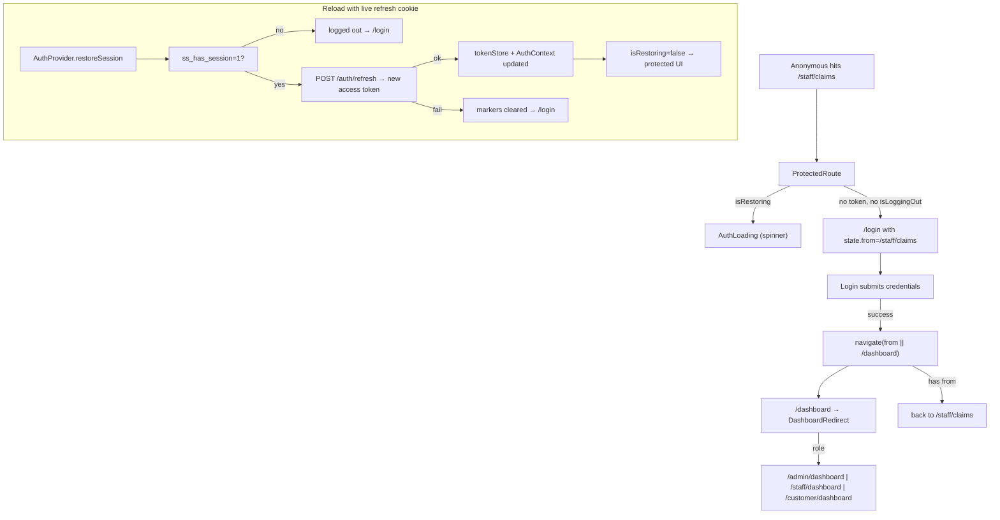
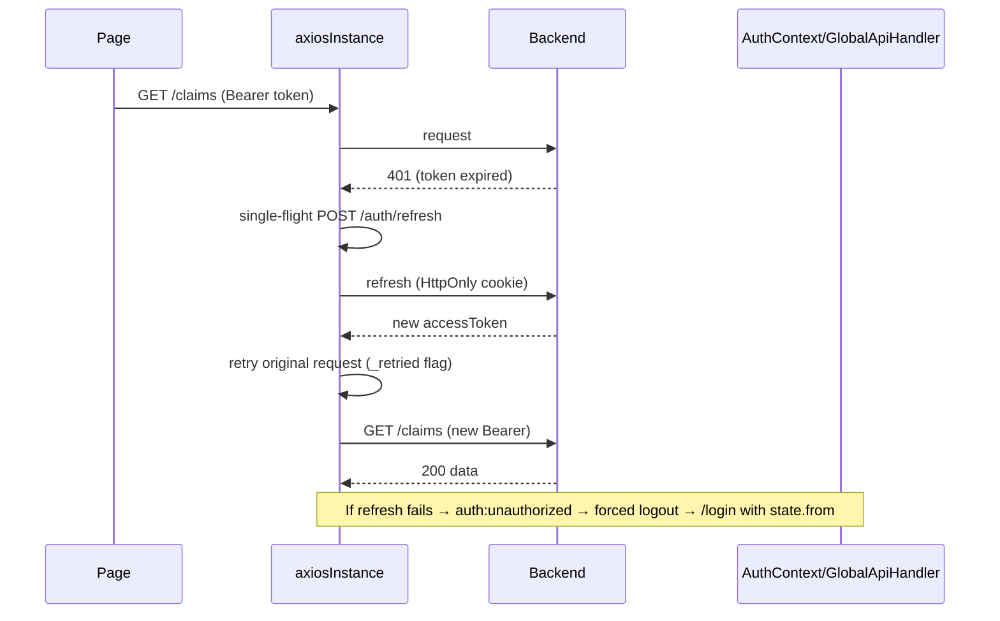

# Frontend Protected Routes & Guards

> The authoritative behavior spec for `AuthLoading`, `ProtectedRoute`, `GuestRoute`, `RoleProtectedRoute`, and `DashboardRedirect`, including the silent-restore and token-refresh navigation flows.

## Purpose

Precisely defines what each guard in `src/App.jsx` does and why, so that any change to route protection is made against a documented baseline. Read this before touching auth redirects. The full route table is in [`Routing.md`](Routing.md).

## Overview

`src/App.jsx` defines four guard components plus an inline `AuthLoading` spinner. They rely on `AuthContext` state (`isAuthenticated`, `isRestoring`, `user`, `logout`) and, for logout-vs-expiry distinction, a `localStorage` marker named `isLoggingOut`.

| Guard | Decides | On success | On failure |
|---|---|---|---|
| `AuthLoading` | renders while `isRestoring` | — | — |
| `ProtectedRoute` | is a session present? | `<Outlet/>` | `/login` with `state.from` (or plain `/login` when `isLoggingOut`) |
| `GuestRoute` | is the visitor anonymous? | `<Outlet/>` | the user's role dashboard |
| `RoleProtectedRoute({ allowedRole })` | does the user hold `allowedRole`? | `<Outlet/>` | own dashboard or `/unauthorized` |
| `DashboardRedirect` | what is the user's role? | role home | `/customer/dashboard` (fallback) |

## Business Context

Guards implement separation of duties in the UI. They mirror the backend's role enforcement: even if a user crafts a `/admin/...` URL, the frontend will not mount the page. On top of that they make the session feel seamless — a reload while logged in silently restores the session instead of dumping the user on a login form.

## Technical Design

### `AuthLoading`

A full-viewport centered Bootstrap spinner (`aria-label="Restoring session"`) rendered whenever `isRestoring` is true. It prevents the protected page from flashing before `AuthContext.restoreSession()` completes the silent `POST /auth/refresh`.

### `ProtectedRoute`

```jsx
const { isAuthenticated, isRestoring } = useAuth();
if (isRestoring) return <AuthLoading />;
if (!isAuthenticated) {
  const isLoggingOut = localStorage.getItem("isLoggingOut");
  if (isLoggingOut) {
    localStorage.removeItem("isLoggingOut");
    return <Navigate to="/login" replace />;
  }
  return <Navigate to="/login" state={{ from: location }} replace />;
}
return <Outlet />;
```

Behavior, precisely:

1. If the session is still being restored, show `AuthLoading` (no redirect yet — the token may appear any moment).
2. If no token: check the `isLoggingOut` marker.
   - **Marker present** (user pressed Logout): remove it and navigate to `/login` **without** `state.from`, so a re-login never bounces back into the app the user just left.
   - **Marker absent** (session simply absent/expired): navigate to `/login` with `state={{ from: location }}`. `Login` reads `location.state?.from?.pathname` after a successful sign-in and returns the user to where they were headed.
3. Otherwise render the protected `<Outlet/>`.

### `GuestRoute`

```jsx
if (isRestoring) return <AuthLoading />;
if (isAuthenticated && user) {
  if (user.role === ROLES.ADMIN) return <Navigate to="/admin/dashboard" replace />;
  if (user.role === ROLES.INTERNAL_STAFF) return <Navigate to="/staff/dashboard" replace />;
  if (user.role === ROLES.CUSTOMER) return <Navigate to="/customer/dashboard" replace />;
}
return <Outlet />;
```

Guards public pages (`/`, `/login`, `/register`, `/forgot-password`, `/verify-otp`). An authenticated visitor is immediately bounced to their role dashboard instead of being allowed to open login/register again.

### `RoleProtectedRoute({ allowedRole })`

```jsx
if (!isAuthenticated) return <Navigate to="/login" replace />;
if (user?.role !== allowedRole) {
  if (user?.role === "ADMIN") return <Navigate to="/admin/dashboard" replace />;
  if (user?.role === "INTERNAL_STAFF") return <Navigate to="/staff/dashboard" replace />;
  if (user?.role === "CUSTOMER") return <Navigate to="/customer/dashboard" replace />;
  return <Navigate to="/unauthorized" replace />;
}
return <Outlet />;
```

Enforces one role per route block. A mismatched role is sent to that user's own dashboard (better UX than a bare error); only an unrecognized role falls through to `/unauthorized`. Because it sits inside `ProtectedRoute`, an anonymous hit is handled there first (→ `/login`).

### `DashboardRedirect`

Maps the shared `/dashboard` path to the role home: `ROLE_ADMIN` → `/admin/dashboard`, `ROLE_INTERNAL_STAFF` → `/staff/dashboard`, anything else → `/customer/dashboard`. This is also where the `ROLE_HOME` value of `/dashboard` used by `Login` converges.

### End-to-end navigation flow



### Expired access token during a request



When the access token expires mid-session, the first 401 is not a logout: the interceptor performs a **single-flight refresh** (one shared promise for all concurrent 401s) and replays the original request once with the new token. Only when the refresh itself fails is the session treated as dead (`auth:unauthorized` → forced logout + redirect). Detail: [`API_Integration.md`](API_Integration.md).

## Workflow

1. Anonymous navigation to a protected URL → `ProtectedRoute` redirects to `/login` preserving `state.from`.
2. Login succeeds → navigate back to `from` (or `/dashboard`), which `DashboardRedirect` resolves per role.
3. A reload while the refresh cookie is alive → `restoreSession` refreshes the token silently, `isRestoring` clears, and the protected UI mounts without a login form.
4. Access token expires during use → transparent single-flight refresh + one retry; on refresh failure, forced logout and redirect.
5. Explicit Logout → `isLoggingOut` marker → plain `/login` (no `from` replay).

## Code References

| Concern | File (repo-root-relative path) |
|---|---|
| Guard implementations + route tree | `insurance-policy-claim-management-app-ui/src/App.jsx` |
| Auth state driving guards | `insurance-policy-claim-management-app-ui/src/context/AuthContext.jsx` |
| Login `state.from` handling | `insurance-policy-claim-management-app-ui/src/pages/auth/Login.jsx` |
| Logout marker set/consumed | `insurance-policy-claim-management-app-ui/src/context/AuthContext.jsx` (`logout`), `insurance-policy-claim-management-app-ui/src/App.jsx` (`ProtectedRoute`) |
| Single-flight refresh | `insurance-policy-claim-management-app-ui/src/api/axiosInstance.js` |

## Diagrams

- Navigation flow and token-refresh sequence diagrams above.

## Best Practices

- Preserve `state.from` for expiry redirects so deep links survive login; suppress it on explicit logout via `isLoggingOut`.
- Never block on `isRestoring` after deciding "no session": restore first, decide second.
- Keep role decisions on the `user.role` value, not on the URL, so a forged URL is inert.

## Future Improvements

- A 401-aware error boundary per namespace if guards grow more logic.
- See `../10_Evaluation/Future_Enhancements.md`.

## See Also

- [`Routing.md`](Routing.md) — full route table.
- [`State_Management.md`](State_Management.md) — the state the guards read.
- [`API_Integration.md`](API_Integration.md) — refresh-on-401 mechanics.
- [`../03_API/Authentication_API.md`](../03_API/Authentication_API.md) — the endpoints behind restore/login/logout.
