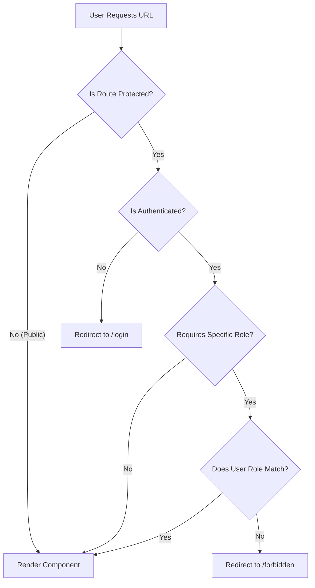

# Protected Routes
> Specialized route guards enforcing authentication, authorization, and guest-only access.

---

## Purpose
This document details the route guard components that wrap application routes. They ensure that users only access pages appropriate for their authentication status and assigned role.

---

## Overview
- **ProtectedRoute**: Requires authentication.
- **GuestRoute**: Requires lack of authentication (for login/register).
- **RoleProtectedRoute**: Requires a specific role.
- **DashboardRedirect**: Smart routing based on role.
- Tightly integrated with Axios interceptors for handling 401/403 errors.

---

## Business Context
Security requires that unauthenticated users cannot view sensitive data (claims, policies), and users with specific roles (e.g., Customer) cannot access administrative functions.

---

## Route Guard Flow Diagram

---

## Guard Components Explained

### 1. ProtectedRoute
- **Logic**: Reads `isAuthenticated` from `AuthContext`.
- **Action**: If `false`, redirects to `/login` using `<Navigate to="/login" replace state={{ from: location }} />`. The `state` preserves the original URL to redirect back after login.
- **Usage**: Wraps all internal application routes.

### 2. GuestRoute
- **Logic**: Reads `isAuthenticated` from `AuthContext`.
- **Action**: If `true`, redirects to `/dashboard`.
- **Usage**: Wraps `/login`, `/register`, `/verify`. Prevents logged-in users from seeing the login page.

### 3. RoleProtectedRoute
- **Logic**: Reads `role` from `AuthContext` and takes a `requiredRole` prop.
- **Action**: If the roles don't match, redirects to `/forbidden`.
- **Usage**: Wraps nested route blocks (e.g., all `/admin/*` routes require `ROLE_ADMIN`).

### 4. DashboardRedirect
- **Logic**: Examines `user.role` from `AuthContext`.
- **Action**: Redirects to `/admin/dashboard`, `/staff/dashboard`, or `/customer/dashboard` respectively.
- **Usage**: Mapped to the `/dashboard` path as a generic entry point.

---

## 401/403 Handling in Axios
While route guards handle client-side navigation, the API might reject requests if the session expires or if the user performs an unauthorized action.
- **401 Unauthorized**: Handled by Axios interceptors. Triggers an event (`auth:unauthorized`) which the `AuthProvider` listens to, clearing state and redirecting to `/login`.
- **403 Forbidden**: Triggers an event (`auth:forbidden`), redirecting the user to `/forbidden`.

---

## Design Decisions

| Decision | Reason | Trade-offs |
|----------|--------|------------|
| **Separate Guard Components** | Modularity. You can compose them (e.g., a route might just need auth, or auth + role). | Slightly more nested component tree. |
| **Redirecting vs Blocking (Blank Screen)** | Better User Experience. Users know exactly what happened (e.g., taken to login if session expired). | Requires careful handling of redirect loops. |
| **Using `replace` in Navigate** | Prevents the protected URL from being added to the browser history, so clicking "Back" doesn't immediately redirect them forward again. | None. Standard practice. |

---

## Interview Notes

1. **Why do we need both `ProtectedRoute` and `RoleProtectedRoute`?**
   Separation of concerns. Authentication (are you logged in?) is distinct from Authorization (are you allowed here?).
2. **How do you handle a user who tries to access a page they shouldn't?**
   They are redirected to a `/forbidden` page, rather than crashing or showing a blank screen.
3. **What is a `GuestRoute` and why is it useful?**
   It prevents authenticated users from accessing pages meant for unauthenticated users, like the login page, redirecting them instead to their dashboard.
4. **How do route guards interact with the API?**
   If the frontend thinks a user is authenticated but the backend returns a 401, the API interceptor catches it, clears the frontend auth state, and the `ProtectedRoute` logic takes over to redirect to login.

---

## Related Documents
- [Routing](Routing.md)
- [API Integration](API_Integration.md)
