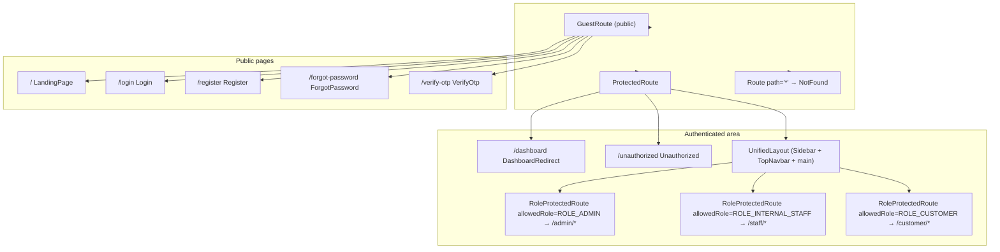

# Frontend Routing

> The authoritative route table of the React SPA: every path, its page component, the guard that protects it, and the role that may access it.

## Purpose

Defines the complete, code-verified route map of `insurance-policy-claim-management-app-ui`. Engineers use this document to find where a page is wired, which guard wraps it, and how redirects behave after login, logout, or session expiry. It is the implementation detail behind the routing section of [`../01_System_Architecture/Frontend_Architecture.md`](../01_System_Architecture/Frontend_Architecture.md).

## Overview

All routes are declared centrally in `src/App.jsx`. There is no lazy loading: every page module is statically imported so navigation is instant (a documented decision — see [`../07_Design_Patterns/Decision_Records.md`](../07_Design_Patterns/Decision_Records.md) ADR-009). The route tree is organized as a small set of guard wrappers:

1. `GuestRoute` — public pages for anonymous visitors.
2. `ProtectedRoute` — any authenticated area; shows a restore spinner while the session is being silently restored, otherwise redirects to `/login`.
3. `RoleProtectedRoute({ allowedRole })` — one block per role namespace (`/admin/*`, `/staff/*`, `/customer/*`).
4. `DashboardRedirect` — resolves the shared `/dashboard` path to the signed-in user's role home.

The layout shell (`UnifiedLayout`) wraps the three role blocks, so every authenticated page renders inside the sidebar + topbar chrome.

## Business Context

Customers, staff, and administrators need separate, unambiguous workspaces. Routing is the first line of separation of duties in the UI: a customer URL never renders a staff page and vice versa, matching the role checks enforced by the backend (see [`../01_System_Architecture/Security_Architecture.md`](../01_System_Architecture/Security_Architecture.md) and [`../03_API/Authentication_API.md`](../03_API/Authentication_API.md)).

## Technical Design

### Guard nesting and layout wrapping

The nesting means each request passes through guard layers in order:

1. A public path matches `GuestRoute`, which lets anonymous users through and bounces already-authenticated users to their role dashboard.
2. Any other path falls into `ProtectedRoute`. While `AuthContext` is restoring the session (`isRestoring === true`) a full-screen `AuthLoading` spinner is rendered. If the session is genuinely absent the user is redirected to `/login` with `state.from` pointing at the page they tried to reach.
3. Inside the protected area the `<Route element={<MainLayout><Outlet/></MainLayout>}>` renders `UnifiedLayout`, which supplies the sidebar, top bar, and `<main className="ip-content">` outlet.
4. Role blocks use `RoleProtectedRoute`. Only a matching role renders the nested pages; a mismatched role is bounced to that user's own dashboard or to `/unauthorized`.
5. `/unauthorized` is a sibling of the layout route inside `ProtectedRoute`, so it renders *without* the app chrome.
6. Any unmatched URL falls through to the catch-all `*` → `NotFound`.

### Route table

Legend — guard: `public` = inside `GuestRoute`; `protected` = inside `ProtectedRoute` (may render without layout); `role:ADMIN|INTERNAL_STAFF|CUSTOMER` = inside `RoleProtectedRoute`.

#### Public / guest routes (no authentication)

| Path | Page component | Guard | Role |
|---|---|---|---|
| `/` | `LandingPage` | `GuestRoute` | public |
| `/login` | `Login` | `GuestRoute` | public |
| `/register` | `Register` | `GuestRoute` | public |
| `/forgot-password` | `ForgotPassword` | `GuestRoute` | public |
| `/verify-otp` | `VerifyOtp` | `GuestRoute` | public |

#### Shared protected routes

| Path | Page component | Guard | Role |
|---|---|---|---|
| `/dashboard` | `DashboardRedirect` (resolves per role) | `ProtectedRoute` | any authenticated |
| `/unauthorized` | `Unauthorized` | `ProtectedRoute` (no layout) | any authenticated |

#### Admin namespace (`/admin/*`, `ROLE_ADMIN`)

| Path | Page component |
|---|---|
| `/admin/dashboard` | `AdminDashboard` |
| `/admin/users` | `UserListPage` |
| `/admin/users/create` | `CreateStaffPage` |
| `/admin/users/:id` | `UserDetailPage` |
| `/admin/customers` | `CustomerListPage` |
| `/admin/customers/:id` | `CustomerDetailPage` |
| `/admin/products` | `ProductListPage` |
| `/admin/products/create` | `CreateProductPage` |
| `/admin/products/edit/:id` | `EditProductPage` |
| `/admin/products/:id` | `ProductDetailPage` |
| `/admin/plans` | `PlanListPage` |
| `/admin/plans/create` | `CreatePlanPage` |
| `/admin/plans/edit/:id` | `EditPlanPage` |
| `/admin/plans/:id` | `PlanDetailPage` |
| `/admin/policies` | `PolicyListPage` |
| `/admin/policies/:id` | `PolicyDetailPage` |
| `/admin/policies/issue` | `IssuePolicyPage` |
| `/admin/claims` | `ClaimListPage` |
| `/admin/claims/:id` | `ClaimDetailPage` |
| `/admin/payments` | `PaymentListPage` |

All admin routes are wrapped by `<RoleProtectedRoute allowedRole={ROLES.ADMIN}/>`.

#### Staff namespace (`/staff/*`, `ROLE_INTERNAL_STAFF`)

| Path | Page component |
|---|---|
| `/staff/dashboard` | `StaffDashboard` |
| `/staff/customers` | `StaffCustomerListPage` |
| `/staff/customers/:id` | `StaffCustomerDetailPage` |
| `/staff/profile` | `ProfilePage` (shared with customer) |
| `/staff/profile/edit` | `EditProfilePage` (shared with customer) |
| `/staff/policies` | `StaffPolicyListPage` |
| `/staff/policies/:policyId` | `StaffPolicyDetailPage` |
| `/staff/claims` | `StaffClaimListPage` |
| `/staff/claims/:id` | `StaffClaimDetailPage` |
| `/staff/issue-policy` | `StaffIssuePolicyPage` |
| `/staff/payments` | `StaffPaymentListPage` |
| `/staff/payments/pay/:policyId` | `StaffRecordPaymentPage` |

All staff routes are wrapped by `<RoleProtectedRoute allowedRole={ROLES.INTERNAL_STAFF}/>`.

#### Customer namespace (`/customer/*`, `ROLE_CUSTOMER`)

| Path | Page component |
|---|---|
| `/customer/dashboard` | `CustomerDashboard` |
| `/customer/profile` | `ProfilePage` (shared with staff) |
| `/customer/profile/edit` | `EditProfilePage` (shared with staff) |
| `/customer/products` | `CustomerProductListPage` |
| `/customer/products/:productId/plans` | `CustomerPlanListPage` (scoped to product) |
| `/customer/plans` | `CustomerPlanListPage` (all active plans) |
| `/customer/purchase-policy/:planId` | `PurchasePolicyPage` |
| `/customer/policies` | `CustomerPolicyListPage` |
| `/customer/policies/:policyId` | `CustomerPolicyDetailPage` |
| `/customer/payments` | `CustomerPaymentHistoryPage` |
| `/customer/payments/pay/:policyId` | `RecordPaymentPage` |
| `/customer/claims` | `CustomerClaimListPage` |
| `/customer/claims/raise` | `RaiseClaimPage` |
| `/customer/claims/upload/:claimId` | `UploadDocumentsPage` |
| `/customer/claims/:claimId` | `ClaimDetailsPage` |

All customer routes are wrapped by `<RoleProtectedRoute allowedRole={ROLES.CUSTOMER}/>`.

#### Catch-all

| Path | Page component | Guard |
|---|---|---|
| `*` | `NotFound` | none (always matches) |

### Redirect behavior details

- **`state.from` after login.** `ProtectedRoute` redirects unauthenticated visitors with `<Navigate to="/login" state={{ from: location }} replace/>`. `Login` reads `location.state?.from?.pathname` and navigates there after a successful sign-in, falling back to `ROLE_HOME[user.role]` (which is `/dashboard`, itself resolved by `DashboardRedirect`). See [`Protected_Routes.md`](Protected_Routes.md).
- **`isLoggingOut` marker.** `AuthContext.logout()` sets `localStorage.isLoggingOut = "true"` before clearing the session. `ProtectedRoute` checks this marker: when present it removes it and redirects to `/login` *without* `state.from`, so a freshly logged-out user is never sent back into the app by a stale `from`. `GlobalApiHandler` calls `logout(true)` on session expiry, which skips the marker so the expired-session path still preserves `state.from`.
- **`AuthLoading`.** A centered Bootstrap spinner rendered whenever `isRestoring` is true, preventing protected pages from flashing before the silent session restore (`POST /auth/refresh`) completes.
- **`DashboardRedirect`.** The `/dashboard` route renders `<Navigate>` to `/admin/dashboard`, `/staff/dashboard`, or `/customer/dashboard` based on the signed-in user's role.

## Workflow

1. A user opens `/staff/policies`. `ProtectedRoute` runs: if `isRestoring`, the `AuthLoading` spinner shows; once restored, if no token exists the user is sent to `/login` with `state.from = { pathname: "/staff/policies" }`.
2. After login, `Login` reads `state.from` and navigates back to `/staff/policies`. If the user's role is not `ROLE_INTERNAL_STAFF`, `RoleProtectedRoute` redirects to that user's own dashboard or `/unauthorized`.
3. The matched page renders inside `UnifiedLayout`. Any unknown URL renders `NotFound`.

## Code References

| Concern | File (repo-root-relative path) |
|---|---|
| Central route table and all guards | `insurance-policy-claim-management-app-ui/src/App.jsx` |
| Provider bootstrap order | `insurance-policy-claim-management-app-ui/src/main.jsx` |
| Auth state feeding guards | `insurance-policy-claim-management-app-ui/src/context/AuthContext.jsx` |
| Role constants | `insurance-policy-claim-management-app-ui/src/utils/roles.js` |
| Layout shell | `insurance-policy-claim-management-app-ui/src/components/layouts/UnifiedLayout.jsx` |

## Diagrams

- Inline guard-nesting Mermaid diagram above.
- Full application-structure diagram: [`../01_System_Architecture/Frontend_Architecture.md`](../01_System_Architecture/Frontend_Architecture.md).
- Guard flow including session restore and token refresh: [`Protected_Routes.md`](Protected_Routes.md).

## Best Practices

- Keep the whole route table in one file so the access map is auditable at a glance; add new pages here, never in ad-hoc `Routes` blocks.
- Enforce roles with one `RoleProtectedRoute` block per namespace rather than per-page checks.
- Preserve intent (`state.from`) on auth redirects so deep links work after login, except during explicit logout (`isLoggingOut`).
- Statically import pages: the app deliberately trades bundle size for instant navigation.

## Future Improvements

- Route-level code splitting once the route count grows (flagged in `../01_System_Architecture/Frontend_Architecture.md`).
- A nested route layout per role namespace if the admin/staff/customer shells diverge further.
- See `../10_Evaluation/Future_Enhancements.md`.

## See Also

- [`../01_System_Architecture/Frontend_Architecture.md`](../01_System_Architecture/Frontend_Architecture.md) — system overview.
- [`Protected_Routes.md`](Protected_Routes.md) — authoritative guard behavior.
- [`Layout.md`](Layout.md) — the layout that wraps these routes.
- [`../03_API/Authentication_API.md`](../03_API/Authentication_API.md) — login/refresh/logout endpoints behind this routing.
