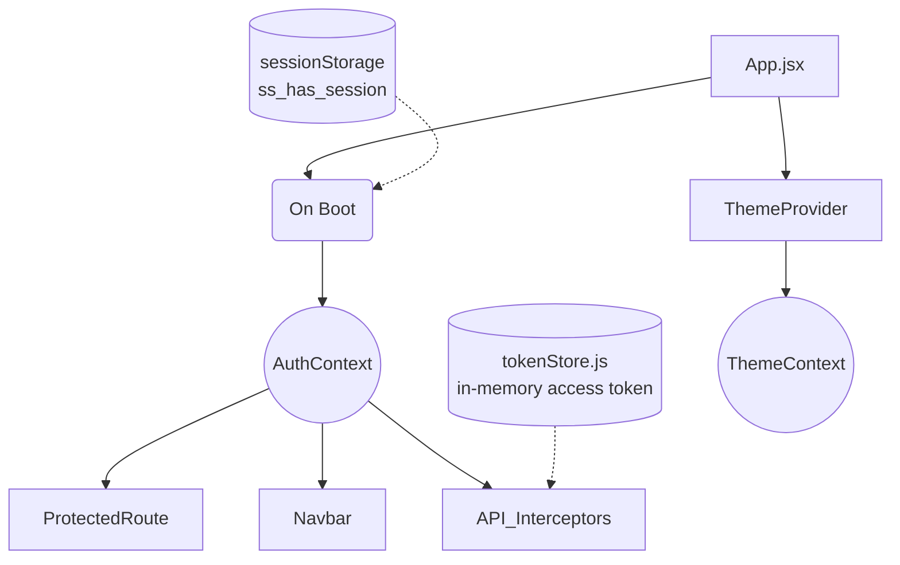

# State Management
> Context-driven state for auth and themes, with transient in-memory token storage.

---

## Purpose
This document outlines how global state is managed across the frontend application, specifically focusing on user authentication, authorization, and UI themes.

---

## Overview
- Uses React Context API for global state (`AuthContext`, `ThemeContext`).
- Avoids complex libraries like Redux or Zustand for simplicity.
- Implements secure token storage (Access token in memory, Refresh token in HttpOnly cookie).
- Session restoration uses `sessionStorage` flags to trigger silent refreshes on boot.

---

## Business Context
The application needs to know *who* is logged in and *what* their role is to render the correct UI (e.g., Admin dashboard vs Customer dashboard). It also needs to support light/dark modes based on user preference.

---

## State Architecture Diagram

---

## Context Explanations

### AuthContext
Stores the current authenticated user's information.
- **State**: `user` object (email, name), `role` string, `isAuthenticated` boolean, `isLoading` boolean.
- **Functions**: `login(userData, token)`, `logout()`, `updateUser(data)`.
- **Initialization**: On mount, checks for session flags to attempt a token refresh.

### ThemeContext
Manages the application's visual theme (light/dark).
- **State**: `theme` ('light' or 'dark').
- **Functions**: `toggleTheme()`.
- Persists user preference to `localStorage`.

### tokenStore
A simple utility (`tokenStore.js`) to hold the JWT access token in a JavaScript variable.
- **Why**: Storing JWTs in `localStorage` makes them vulnerable to XSS. In-memory storage is safer.
- **Flags**: `sessionStorage` is used to store non-sensitive flags (`ss_has_session`, `ss_user_role`) to survive page reloads and trigger a silent refresh.

---

## Session Restoration Flow

1. User opens/reloads the app.
2. `AuthProvider` mounts.
3. Checks `sessionStorage.getItem('ss_has_session')`.
4. If true, calls the `/auth/refresh` API endpoint.
5. If successful, backend issues a new short-lived access token (stored in memory) and sets a new refresh token cookie. `AuthContext` populates `user` state.
6. If failed, clears session flags and leaves the user unauthenticated.

---

## Design Decisions

| Decision | Reason | Trade-offs |
|----------|--------|------------|
| **React Context vs Redux/Zustand** | The global state needs (auth, theme) are minimal. Context is built-in and sufficient for this scale. | Context can cause unnecessary re-renders if state changes frequently, but auth/theme change rarely. |
| **In-memory Access Token** | Prevents XSS attacks from stealing the token. | Token is lost on page reload, requiring a silent refresh mechanism. |
| **sessionStorage flags** | Needed to know *if* we should try to refresh the token on reload without storing the sensitive token itself. | Small overhead to sync state with session storage. |

---

## Interview Notes

1. **Why not use Redux for state management?**
   For an application of this scale where global state is primarily just the current user and UI theme, Redux adds unnecessary boilerplate. React Context is sufficient and built-in.
2. **Why store the access token in memory instead of `localStorage`?**
   `localStorage` is accessible via JavaScript, making it vulnerable to Cross-Site Scripting (XSS). In-memory variables are lost on reload but are secure from XSS.
3. **If the token is in memory, how does the user stay logged in when they refresh the page?**
   We use a long-lived HttpOnly refresh token cookie. On page load, the frontend checks a flag in `sessionStorage` and, if present, makes a call to the refresh endpoint to get a new access token.
4. **What does `ThemeContext` do?**
   It provides the current theme (light/dark) and a toggle function to all components, allowing for consistent styling and easy switching.
5. **How do components access the user state?**
   Using a custom hook like `useAuth()` which wraps `useContext(AuthContext)`.

---

## Related Documents
- [API Integration](API_Integration.md)
- [Routing](Routing.md)
