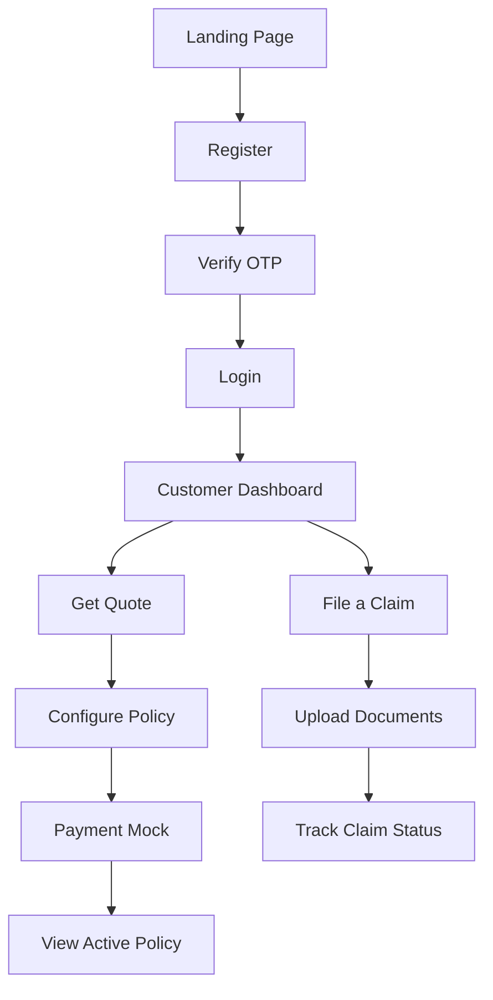

# UI Workflows
> User journeys and screen-by-screen flows for core business processes.

---

## Purpose
This document maps out the specific user journeys through the application interface, detailing how users navigate to accomplish key tasks.

---

## Overview
- Defines step-by-step flows for Customers, Staff, and Admins.
- Highlights the complex "Purchase Policy" wizard flow.
- Explains the purpose of key pages within these flows.

---

## Customer UI Journey Diagram

---

## Staff & Admin UI Journeys

### Staff Journey
1. **Login** -> Redirected to `Staff Dashboard`.
2. **Review Claims**: Navigate to `Claims Queue` -> Click specific claim -> `Claim Detail Modal` -> Approve/Reject with notes.
3. **Support**: Navigate to `Policies` -> Search for customer email -> View policy details.

### Admin Journey
1. **Login** -> Redirected to `Admin Dashboard`.
2. **User Management**: Navigate to `Users` -> View paginated table -> Change user roles / Disable accounts.
3. **System Overview**: View high-level metrics on the dashboard (Total Revenue, Active Policies).

---

## Key Pages Description

| Page | Role | Purpose |
|------|------|---------|
| `Dashboard` | All | Role-specific landing page. Shows summary metrics and quick actions. |
| `PurchasePolicyPage` | Customer | A multi-step wizard to buy insurance. |
| `MyPolicies` | Customer | Lists user's policies. Allows downloading certificates. |
| `ClaimReviewQueue` | Staff | A filtered data table showing only `SUBMITTED` or `UNDER_REVIEW` claims. |
| `UserManagement` | Admin | Full CRUD interface for all users in the system. |

---

## The Purchase Policy Flow
This is the most complex UI workflow in the frontend.

1. **Step 1: Product Selection**: User selects Health, Auto, Life, etc.
2. **Step 2: Coverage Details**: User inputs age, coverage amount required, and selects duration (ONE_TIME vs ANNUAL).
3. **Step 3: Quote Generation**: Frontend calls `/api/policies/quote`. Displays the calculated premium.
4. **Step 4: Confirmation**: User accepts the quote.
5. **Step 5: Payment (Mock)**: User enters mock payment details. The exact premium amount must be passed.
6. **Step 6: Activation**: Frontend calls `/api/policies/purchase`. On success, redirects to success screen with confetti/receipt.

---

## Design Decisions

| Decision | Reason | Trade-offs |
|----------|--------|------------|
| **Multi-step wizard for purchase** | Reduces cognitive load. Asking for all details on one long page causes form abandonment. | Requires managing form state across multiple components/steps. |
| **Role-specific dashboards** | Admins don't need "File a Claim" buttons. Customers don't need "Pending Reviews" tables. | Requires maintaining three distinct dashboard components. |
| **Mock Payment Screen** | Simulates a real-world flow (Stripe/PayPal integration) for demonstration purposes. | Not real payment processing. |

---

## Interview Notes

1. **How is state managed across the multi-step policy purchase wizard?**
   Typically using a parent component that holds the overall form state (`useApiForm` or local state), passing down state and `nextStep` functions to child step components.
2. **Why do we have different dashboards for different roles instead of one dashboard that hides/shows elements?**
   If a dashboard has too many conditional renders (`if admin show X else show Y`), the code becomes unreadable. Separate components per role are cleaner.
3. **What happens if a user abandons the purchase flow at Step 3 (Quote)?**
   The quote is usually stateless on the frontend (just data on screen). If they leave, the state is lost. The backend might store quotes temporarily, but the frontend treats it as a volatile session.

---

## Related Documents
- [Component Architecture](Component_Architecture.md)
- [Routing](Routing.md)
