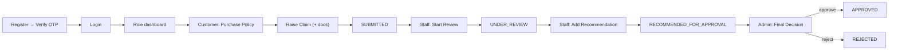

# Frontend UI Workflows

> The end-to-end user journeys of the application UI, organized by role, with the page inventory, the design tokens behind every screen, and links to annotated screenshots.

## Purpose

Provides a walk-through of the key screens and flows that the application's users actually perform — from landing to login to claim resolution — with the supporting components, hooks, and services each screen uses. The companion to [`Routing.md`](Routing.md) (what URL maps where) and [`Component_Architecture.md`](Component_Architecture.md) (what building blocks exist).

## Overview

The UI serves three personas through three role-scoped namespaces (`/admin`, `/staff`, `/customer`), each themed with its own accent color, plus a shared guest area (`/`, `/login`, `/register`, `/forgot-password`, `/verify-otp`). Screenshots live under `screenshots/<role>/*.png` and are referenced inline below.

## Business Context

The journeys mirror the business processes documented in [`../02_Business_Domain`](../02_Business_Domain/): customers browse and buy policies and raise claims; staff review customers and claims; admins manage the product catalog and make final claim decisions. The UI workflows below are the human-facing realization of [`../03_API/API_Flow.md`](../03_API/API_Flow.md) and [`../02_Business_Domain/Claim_Workflow.md`](../02_Business_Domain/Claim_Workflow.md).

## Technical Design

### Design tokens (shared)

Defined in `src/index.css` and applied globally; each role namespace adds a theme class that switches the accent (see [`Layout.md`](Layout.md)).

| Token | Value | Use |
|---|---|---|
| `--ip-brand` | `#2563eb` | admin accent, default buttons/links |
| `--ip-brand-rgb` | `37 99 235` | `rgb()` accents |
| `--ip-bg` / `--ip-surface` | `#f1f5f9` / `#ffffff` (light) | page background / cards |
| `--ip-text` / `--ip-text-muted` | `#1e293b` / `#64748b` | body text / secondary text |
| `--ip-border` | `#e2e8f0` | hairline borders |
| `--ip-sidebar-width` / `--ip-sidebar-collapsed-width` | `260px` / `68px` | responsive sidebar |
| `.theme-admin` | `--ip-brand: #2563eb` | admin accent (blue) |
| `.theme-staff` | `--ip-brand: #7c3aed` | staff accent (violet) |
| `.theme-customer` | `--ip-brand: #0d9488` | customer accent (teal) |
| `.theme-dark` / `[data-theme='dark']` | inverted surfaces | dark mode via `ThemeContext` |

> Note: some older documents list legacy accents (e.g. cobalt/sky) — the implemented values are those above.

### Key building blocks per screen

- **Page scaffolding**: `PageHeader` (title/breadcrumb/actions), `PageTransition` (route enter animation), `Stepper` (multi-step wizards).
- **Forms**: `FormInput`, `FormSelect`, `FormTextarea`, `ModernDatePicker`, `ModernSelect`; validation errors surface inline via `handleApiError` (field-level, no toast).
- **Tables**: `DataTable` + `PaginationBar` + `SortableHeader` + `TableToolbar`, fed by `useApiTable` or client-side `useClientPagination`.
- **Feedback**: `GlobalToaster` (top-right), `GlobalApiHandler` (global error/session events), `LoadingSpinner`, `ErrorAlert`, `EmptyState`.
- **Documents**: `DocumentPreviewModal`, `ExportButton` with the `hooks/PdfDownload` PDF hooks, `ClaimHistoryTimeline`.

## Workflow

### A. Guest & Authentication

1. **Landing** (`/`, `screenshots/landing.png`): public page calling `publicService.getPlatformStats()`; CTA links to `/register` and `/login`.
2. **Register** (`screenshots/auth/register.png`): `authService.register`; after success, redirects to `VerifyOtp`.
3. **Verify OTP** (`/verify-otp`): user enters the emailed OTP; `verifyOtpApi` confirms the account (covers post-registration and post-password-reset cases).
4. **Login** (`screenshots/auth/login.png`): `authService.login` decodes the JWT into the user object; on success `navigate(state.from || ROLE_HOME)`, where `/dashboard` is resolved per role by `DashboardRedirect` (see [`Protected_Routes.md`](Protected_Routes.md)).
5. **Forgot password** (`/forgot-password`): two-step flow — `forgotPasswordApi` sends OTP, then `resetPasswordApi` sets the new password.

### B. Customer workflows (`/customer/*`, theme teal)

1. **Dashboard** (`screenshots/customer/customer-dashboard.png`): `StatTile` + `QuickAction` grid; my-policy and my-claim summary via `policyService.getMyPolicies` / `claimService.getMyClaims`.
2. **Purchase Policy** (`/customer/policies/.../purchase`, `screenshots/customer/purchase-policy.png`): a 5-step `Stepper`:
   - **Coverage** — pick a product, then selected coverage options.
   - **Duration** — choose the policy duration (year/month) against the duration model in [`../02_Business_Domain/Duration_Model.md`](../02_Business_Domain/Duration_Model.md).
   - **Quote** — `quoteService.generateQuote`; `PremiumBreakdownCard` shows the premium breakdown (base, coverage add-ons, duration factor, discount); `QuoteCountdownTimer` enforces quote expiry.
   - **Payment** — payment details form; `paymentService.recordPayment`.
   - **Policy** — success screen with the issued policy number; `policyService.purchasePolicy`.
3. **My Policies** (`/customer/policies`, `screenshots/customer/policy-list.png`): `getMyPolicies` paged table; row actions open policy detail (`/customer/policies/:id`, `screenshots/customer/policy-details.png`) with `getPolicyById`, premium breakdown, and **Download PDF** (`usePolicyPdf`).
4. **Raise a Claim** (`/customer/claims/new`, `screenshots/customer/raise-claim.png`): pick a policy (only active/eligible), a claim type, incident details, and upload documents via the `PRODUCT_DOCUMENT_CATEGORIES` mapping (`claimDocumentService.uploadClaimDocuments`, multipart). A **claim cannot be raised against a cancelled policy** — enforced in the UI and the backend.
5. **My Claims** (`/customer/claims`, `screenshots/customer/claims-list.png`): list from `getMyClaims`; detail shows the `ClaimHistoryTimeline` (every state change with actor + timestamp) and **Download PDF** (`useClaimPdf`).
6. **Profile** (`/customer/profile`): `customerService.getProfile`/`updateProfile`.

### C. Staff workflows (`/staff/*`, theme violet)

1. **Dashboard** (`screenshots/staff/staff-dashboard.png`): pending-claim queue, customers, policies stats.
2. **Customer management** (`/staff/customers`, `screenshots/staff/customer-list.png`): `getAllCustomersPaginated`; detail (`screenshots/staff/customer-details.png`) shows the customer's policies and claims.
3. **Policy management** (`/staff/policies`, `screenshots/staff/policy-list.png`): all-policies table; detail (`screenshots/staff/policy-details.png`) with **Cancel Policy** (`cancelPolicy`).
4. **Issue a policy** (`/staff/policies/issue`, `screenshots/staff/issue-policy.png`): pick customer → pick plan → optional quote → **Issue** (`policyService.issuePolicy`); replaces the old buy-on-behalf-of flow.
5. **Claim review** (`/staff/claims`, `screenshots/staff/claims-list.png`): queue of `SUBMITTED` claims; detail (`screenshots/staff/claim-details.png`) with `getClaimHistory`, document previews, and the actions **Start Review** (`markUnderReview`) and **Add Recommendation** (`reviewClaim`), which transitions the claim to `RECOMMENDED_FOR_APPROVAL`. Only staff moves a claim forward; the final decision is the admin's.

### D. Admin workflows (`/admin/*`, theme blue)

1. **Dashboard** (`screenshots/admin/admin-dashboard.png`): `dashboardService.getAdminStats` (parallel `getAdminStats` aggregation).
2. **Catalog management**:
   - Products (`screenshots/admin/products-list.png`): create/edit/activate/deactivate via `productService`.
   - Plans (`screenshots/admin/plans-list.png`): create plan wizard, coverage options, pricing rules, `regenerateCoverageOptions`.
3. **Users** (`screenshots/admin/user-list.png`): `userService.createStaff`, `activateUser`, `deactivateUser`.
4. **Policy management** (`screenshots/admin/policy-list.png`): `getAllPoliciesPaginated`.
5. **Payments** (`screenshots/admin/payments-list.png`): `paymentService.getAllPaymentsPaginated`.
6. **Claims** (`screenshots/admin/claims-list.png`): the full claim queue; detail view exposes the **final decision** — **Approve** (`approveClaim`) or **Reject** (`rejectClaim`, with a reason) — via `PATCH /claims/{id}/final-decision`, completing the [`Claim_Workflow`](../02_Business_Domain/Claim_Workflow.md). Approved claims proceed to payment/refund; rejected claims are closed.

### Lifecycle summary

## Code References

| Concern | File (repo-root-relative path) |
|---|---|
| All route/page wiring | `insurance-policy-claim-management-app-ui/src/App.jsx` |
| Layout + nav per role | `insurance-policy-claim-management-app-ui/src/components/layouts/UnifiedLayout.jsx` |
| Pages | `insurance-policy-claim-management-app-ui/src/pages/{auth,landing,customer,staff,admin}/` |
| Wizards and steppers | `insurance-policy-claim-management-app-ui/src/common/Stepper.jsx`, `PurchasePolicyPage.jsx`, `StaffIssuePolicyPage.jsx` |
| Design tokens / themes | `insurance-policy-claim-management-app-ui/src/index.css` |
| PDF exports | `insurance-policy-claim-management-app-ui/src/hooks/PdfDownload/*.js` |
| Screenshots | `screenshots/{landing,auth,customer,staff,admin}/*.png` |

## Diagrams

- End-to-end claim lifecycle diagram above.

## Best Practices

- Keep role screens to their own namespace and theme; never mix accents across namespaces.
- Use `Stepper` + `handleApiError` for wizard-style forms; surface server validation inline per field, toasts only for whole-request failures.
- Every destructive action (cancel policy, reject claim, deactivate) goes through `ConfirmModal` before dispatch.

## Future Improvements

- Onboarding tour for the first login per role.
- See `../10_Evaluation/Future_Enhancements.md`.

## See Also

- [`Routing.md`](Routing.md) — exact URLs per role.
- [`Component_Architecture.md`](Component_Architecture.md) — building blocks.
- [`State_Management.md`](State_Management.md) — form state, toast, session.
- [`../02_Business_Domain/Claim_Workflow.md`](../02_Business_Domain/Claim_Workflow.md) — the state machine the UI drives.
- [`../03_API/API_Flow.md`](../03_API/API_Flow.md) — endpoints behind each workflow.
